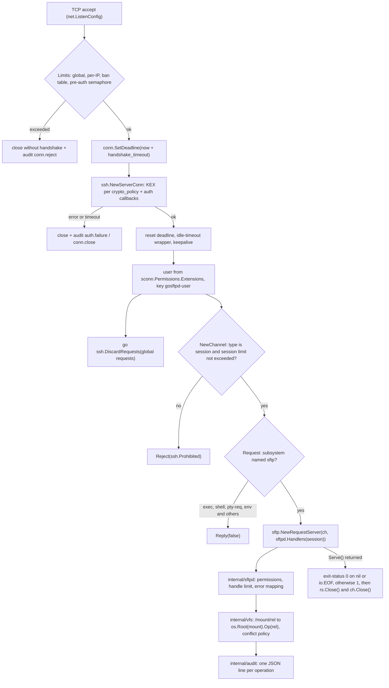
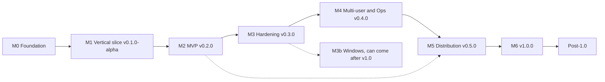

# Go-SFTP-Server: Roadmap

> **Document status:** first revision, dated 2026-10-07. The document is based on an audit of the repository and on research into the ecosystem, verified against the module sources and the Go vulnerability database.
> **Project owner:** [@o-kolomoiets](https://github.com/o-kolomoiets). All items marked "owner decision" are collected in [§13](#13-decisions-for-the-owner).
> **Working names:** module path `github.com/o-kolomoiets/go-sftp-server`, binary `gosftpd`. Both names are subject to the owner's approval (D2 in §13).

## TL;DR

Right now the repository is an abandoned 2023 scaffold of 16 files and about 216 lines of Go. It does not compile, because four `.go` files are empty. If you add a `package` line to the empty files, the binary immediately crashes on a hardcoded key path. If you fix the key and config paths, the server accepts TCP connections, discards them without closing them, and does not perform the SSH handshake. The SFTP layer is written against an API that does not exist in `github.com/pkg/sftp`. The `golang.org/x/crypto` dependency is pinned to a version from 2021-12-15 and is affected by 23 known advisories in the `ssh/*` packages. None of the README's promises is kept. So the proposal is not to fix the code but to **rebuild the project on the right primitives**: `golang.org/x/crypto/ssh` v0.57.0, `github.com/pkg/sftp` v1.13.11 (`RequestServer`) and `os.Root`, with Go 1.26.5 as the minimum version. The project's niche: **"a rootless SFTP drop-box in a single executable, secure by default"**. That means key-only login, directory isolation via `os.Root`, "never silently overwrite", an audit of every action, no root, no DB and no web interface. The order of work is chosen so that a working vertical slice appears as early as possible. The estimate to v1.0 is about 88–127 person-days: 68–99 pd for the milestones, about 0.5 pd per month for maintenance and patch releases, plus a 20% reserve (§5). At a pace of about 12 hours per week, the schedule is roughly as follows: M0 takes 2–3 weeks, the first alpha ships in 2–3 months, MVP v0.2.0 in 4–5.5 months, and v1.0 in 11–16 months. Windows support (track M3b, 4–6 pd) can ship after v1.0.

## How to use this roadmap

- Progress is tracked in [TASKS.md](TASKS.md): it lists the tasks of the current and next milestone with IDs and statuses; the status is updated in the same PR that closes the task. This document remains a plan; checkboxes here are not ticked. Once external contributors appear, tasks move to GitHub issues and [milestones](https://docs.github.com/en/issues/using-labels-and-milestones-to-track-work/about-milestones) (labels `security`, `P0`…`P3`, `good first issue`).
- Once accepted, decisions from §13 are recorded in `docs/adr/` and in the "Status" column of the §13 table.
- `ROADMAP.md` is updated with every release: milestone status, actual effort compared with the estimate, date slippage. If the actual effort deviates from the estimate by more than 30%, the estimates of the following milestones are revised.
- Like the rest of the project, this document is in English (D19, ADR 0006).

## Table of contents

- [How to use this roadmap](#how-to-use-this-roadmap)
- [Next steps (first two weeks)](#next-steps-first-two-weeks)
- [1. Vision and positioning](#1-vision-and-positioning)
- [2. Current state (honest audit)](#2-current-state-honest-audit)
- [3. Project principles](#3-project-principles)
- [4. Target architecture](#4-target-architecture)
- [5. Milestones](#5-milestones)
- [6. Specifications of key features](#6-specifications-of-key-features)
- [7. Security](#7-security)
- [8. Testing strategy](#8-testing-strategy)
- [9. CI/CD and releases](#9-cicd-and-releases)
- [10. Documentation and community](#10-documentation-and-community)
- [11. Success metrics](#11-success-metrics)
- [12. Risks and mitigations](#12-risks-and-mitigations)
- [13. Decisions for the owner](#13-decisions-for-the-owner)
- [14. Appendices](#14-appendices)

---

## Next steps (first two weeks)

The tasks are ordered; each takes from 30 minutes to 3 hours, 12–20 hours in total. These steps complete roughly half of M0: build, CI, hygiene. Realistically this takes 1–2 weeks. The rest (CONTRIBUTING, CoC, templates, Makefile, `.golangci.yml`) follows, per the M0 checklist.

- [ ] **1. Make decisions D1–D4, D14, D16, D17 and D19 from §13 (about an hour):** D1 — license, D2 — repository and binary name (first check that `go-sftp-server` and `gosftpd` are free on GitHub, GHCR, in Debian and Homebrew), D3 — niche, D4 — config format, D14 — minimum Go version, D16 — DCO or CLA, D17 — time budget, D19 — documentation language. If in doubt, take the recommendations from §13: Apache-2.0, `go-sftp-server` / `gosftpd`, drop-box, TOML, Go 1.26.5, DCO, 12 h per week, English. Record the choices in `docs/adr/0001-foundation.md`.
- [ ] **2. Rename the repository** on GitHub to `go-sftp-server` (GitHub redirects old links). Then run `go mod edit -module github.com/o-kolomoiets/go-sftp-server -go=1.26.5`.
- [ ] **3. Delete the old code:** `git rm -r main.go cmd/server pkg`. No file is worth carrying over: see the per-file verdicts in §2.2.
- [ ] **4. Create the skeleton.** The `main` function in `cmd/gosftpd/main.go` is a single line, `os.Exit(cli.Run(context.Background(), os.Args))`; signals are handled by `serve` via `signal.NotifyContext`. Add `internal/version/version.go` with the variables `Version`, `Commit`, `Date` and a fallback via `runtime/debug.ReadBuildInfo`, plus `internal/cli/` with a `gosftpd version` command built on `github.com/spf13/cobra` v1.10.2. Then `go get github.com/spf13/cobra@v1.10.2 && go mod tidy`: this drops the old `pkg/sftp` v1.13.5 and x/crypto from `go.mod`. Check: `go build ./... && go vet ./... && go mod tidy -diff`.
- [ ] **5. Repository hygiene.** Add `.gitattributes` with the line `* text=auto eol=lf` and run `git add --renormalize .`: README, `.gitignore` and `folders.json` are currently stored with CRLF. Add to `.gitignore`: `/gosftpd`, `/bin/`, `/dist/`, `/out/`, `/coverage/`, `*_key`, `*.pem`, `config.local.toml`, `/gosftpd.toml` (created by `gosftpd init`), `/share/` (the zero-config directory) and a newline after the final `.idea/` line (`*.out` and `.idea/` are already there); do **not** ignore the `testdata/fuzz` directory. Add `.editorconfig`.
- [ ] **6. Temporary honest README (in English, D19):** status "pre-alpha, does not work", a paragraph about the plans, a link to `ROADMAP.md`, the license. Fix the typo "A a minimal".
- [ ] **7. Minimal CI** in `.github/workflows/ci.yml`, with `permissions: contents: read`. Job `lint`: `test -z "$(gofmt -l .)"` (`gofmt -l` itself always exits with code 0), `go vet ./...`, `go mod tidy -diff`, golangci-lint v2.14.0 via `golangci/golangci-lint-action` (it bundles staticcheck v0.8.1 and gosec v2.29.0; until the `.golangci.yml` from §9.2 is added, it runs with default settings). Job `test`: `go test -race ./...` on `1.26.x` and `1.27.x`. Job `min-go` (`go-version-file: go.mod`, only `go build ./... && go vet ./...`). Job `vuln`: `golang/govulncheck-action@v1`. Job `ci-ok` (`needs: [lint, test, min-go, vuln]`, `if: always()`) fails if any of them failed or was canceled (§9.1). `lint` and `vuln` install Go via `go-version: stable` + `check-latest: true` (§9.1). Locally, the same tools run via the Makefile and `go tool -modfile=tools/go.mod` (§4.5).
- [ ] **8. Dependency updates:** `.github/dependabot.yml` with the ecosystems `gomod` (`directories: ["/", "/tools"]`: `tools/go.mod` is a separate module, and without the second directory Dependabot would not update the tools) and `github-actions`, weekly interval, minor and patch updates grouped.
- [ ] **9. Repository security.** Create `SECURITY.md`: only the latest minor is supported, reports go through GitHub private vulnerability reporting. In Settings, enable private vulnerability reporting, secret scanning with push protection, and CodeQL default setup. Ruleset on `main`: Require a pull request (required approvals: **0**, otherwise the sole maintainer cannot merge their own PRs), required status check `ci-ok` (aggregates `lint`, the `test` matrix, `min-go` and `vuln`, later the remaining jobs from §9.1; GitHub names matrix checks after the matrix values, e.g. `test (1.26.x)`, so a check named `test` would never arrive and would block every PR), Require code scanning results (CodeQL, security alerts "High or higher": CodeQL default setup is a separate check, and `ci-ok` does not aggregate it), block force pushes, require linear history.
- [ ] **10. Spike for M1 (2–3 hours)** in the `spike/m1-handshake` branch; it is not merged into `main` until M1 starts, because M0 does not pull in `x/crypto` and `pkg/sftp`. In `internal/server`, write a call to `ssh.NewServerConn` with a handshake deadline and an in-process test: the server listens on `127.0.0.1:0`, the client calls `ssh.Dial` with `ln.Addr().String()`, opens a channel with `client.OpenChannel("session", nil)`, sends `ch.SendRequest("subsystem", true, ssh.Marshal(struct{ Name string }{"sftp"}))`, creates a client with `sftp.NewClientPipe(ch, halfCloser{ch})` (the wrapper's `Close()` calls `ch.CloseWrite()`), calls `Getwd()`, closes the client and reads `exit-status` from the request channel: after `ssh.Unmarshal` the payload must have `Status == 0`. `Session.Wait()` after `RequestSubsystem` does not work here: it returns "ssh: session not started". On a clean close, `rs.Serve()` returns `io.EOF`. The test will confirm that the `x/crypto` v0.57.0 + `pkg/sftp` v1.13.11 stack builds on Go 1.26.5+.

---

## 1. Vision and positioning

### 1.1 One-sentence pitch

> **gosftpd is a single static binary that turns any directory into a secure SFTP drop-box: key-only login, isolation via `os.Root`, uploads never silently overwrite files, every action goes to the audit log; no root, no database and no web interface.**

### 1.2 Target users (personas)

| # | Persona | Current pain | What they get from gosftpd |
|---|---|---|---|
| U1 | **Homelab / NAS enthusiast**: scanners, phones and backup jobs drop files onto a home server | `atmoz/sftp` (1.03 billion pulls) has stalled: the last substantive commit was in 2024-09, the `latest` tag dates from 2024-07-14. The home directory is owned by root, its top level is not writable, and a bind mount requires `CAP_SYS_ADMIN` | Rootless image of about 15 MB, `docker run ... serve --dir /srv/sftp`, migration from `users.conf` |
| U2 | **Small team receiving files from partners**: payroll sheets, statements, data feeds | A managed endpoint costs money (AWS Transfer Family $0.30/h plus $0.04/GB, about $216 per month for a 24/7 endpoint; Azure Blob SFTP $0.30/h). SFTPGo is too heavy for this task | "Write-only" partner inbox folders that work with WinSCP and rclone temp-file uploads (§6.3), overwrite protection, a webhook on upload completion, audit |
| U3 | **Developer / QA / CI**: needs a real SFTP server in tests | `testcontainers-go` (module `sftp` v0.44.0) starts `atmoz/sftp:latest`, which requires Docker; Go has no SFTP counterpart to `httptest` | `gosftpd serve --ephemeral`, later the Go package `sftptest` (post-1.0) |
| U4 | **Sysadmin tired of `Match` / `ChrootDirectory`** | In OpenSSH, every component of the chroot path must be owned by root and must not be writable by group or others. Users are system accounts, logs go only to syslog | Virtual users in a single TOML file, per-mount permissions, JSON audit |

### 1.3 Niche and alternatives

| | OpenSSH `internal-sftp` + `ChrootDirectory` | SFTPGo v2.7.6 | `atmoz/sftp` | `rclone serve sftp` v1.75.1 | **gosftpd (target)** |
|---|---|---|---|---|---|
| What it is | The OS's sshd | Platform: SFTP, FTP(S), WebDAV, HTTP; S3, GCS, Azure backends; WebAdmin and WebClient | Docker wrapper around OpenSSH | rclone command that serves any rclone backend | Single binary, SFTP only |
| License | BSD-style | AGPL-3.0-only with additional terms under section 7 of the license; main effort goes into the Enterprise edition | MIT | MIT | owner decision (recommendation: Apache-2.0) |
| Root | required (chroot) | not required | container; a bind mount requires `CAP_SYS_ADMIN` | not required | **not required** |
| Users | system accounts | DB (SQLite by default) and web admin | `users.conf` / `SFTP_USERS` | effectively one (several only via `--auth-proxy`) | virtual, in a TOML file |
| Upload conflict | overwrite | overwrite; can be forbidden via the `overwrite` permission (the upload is then rejected); atomicity via `upload_mode`; no rename on conflict | overwrite | overwrite | `rename` / `reject` / `overwrite` / `version` |
| Audit | syslog | extensive | OpenSSH syslog | rclone log | JSON Lines with a stable schema |
| Size | part of the OS | 58 MB binary, default config of 447 lines and 368 keys | alpine image 9.2 MB (compressed) | full rclone | binary ≤ 10 MB, image ≤ 15 MB |
| Activity (as of 2026-10) | OpenSSH 10.6p1 (2026-10) | v2.7.6 (2026-09-18) | stagnant, 195 open issues | active | — |
| Why it does not fit our niche | complex setup, no drop-box semantics | heavy, large web surface (CVEs), AGPL, open-core | stagnation, chroot limitations | not designed for multi-user file intake | young project (this is our risk) |

Apart from SFTPGo, the niche of simple SFTP servers in Go is almost empty: the existing projects are abandoned (`taruti/sftpd` had its last push in 2019, `s3-sftp-proxy` in 2022, `sftpplease` in 2023, and `pterodactyl/sftp-server` is archived). So there is room. But the low star counts of these projects show that "yet another SFTP server" without a sharp, verifiable thesis will not take off. Our thesis is technical. Neither `pkg/sftp` v1, nor `pkg/sftp/v2` alpha, nor SFTPGo uses `os.Root`. And naive Go solutions are insecure (verified during the research, reproducible in a minute): `sftp.NewServer` with `WithServerWorkingDirectory` serves the host's file to the client on `get /etc/hostname`, and `afero.BasePathFs` allows escaping the directory via `../data2` and via a symlink. SFTPGo had three path-related CVEs in 2026, and not all of them in the web part: CVE-2026-30914 (path normalization mismatch between protocols, affects SFTP too), CVE-2026-30915 (sanitization of placeholders in home paths) and CVE-2026-49244 (ZIP download from public shares). All three major clouds now offer managed SFTP: Google's is Cloud FTP (GA since 2026-08-26). So cost is an argument for small teams, not a claim that there are no alternatives.

### 1.4 Explicit non-goals (before 1.0, to be recorded in `docs/adr/0002-non-goals.md`)

| Not doing | Why | Where to send users |
|---|---|---|
| Web UI, share links, admin REST API with RBAC | The main attack surface (CrushFTP CVE-2025-31161, GoAnywhere CVE-2025-10035, MOVEit, SFTPGo web CVEs) | SFTPGo |
| FTP/FTPS, WebDAV, HTTP | Outside the niche | SFTPGo, copyparty |
| S3, GCS, Azure backends | SFTP's `WriteAt` semantics map poorly onto an object store; limited capacity of a single maintainer | `rclone serve sftp`, SFTPGo. We keep the VFS interface so we can return to this after 1.0 |
| Shell, exec, port forwarding, agent forwarding, legacy SCP (`scp -O`), rsync, git | Unnecessary surface. OpenSSH ≥ 9.0 runs `scp` over the SFTP protocol by default. SFTPGo itself removed git and rsync in v2.7.0 as an unnecessary risk | OpenSSH |
| Creation of symlinks and hardlinks by the client | A threat to isolation (SFTPGo's GHSA-fj9v-mxr3-w75w) | — |
| Encryption of data at rest, automatic deletion (retention) of incoming files | Encryption is the job of the volume or file system; otherwise keys and their rotation end up in the process. Retention is the job of a scheduler | LUKS, ZFS native encryption, fscrypt; recipe `docs/recipes/retention.md` (M4): `systemd-tmpfiles` with the line `e /srv/sftp/inbox - - - 30d` or an exec hook on `fs.upload` that moves the file to an archive |
| LDAP, OIDC, MFA in 1.x | Complex. For enterprise scenarios there are SSH certificates (M4) | SSH CA |
| DB, HA, cluster | They contradict the "single binary" principle | — |

---

## 2. Current state (honest audit)

### 2.1 What exists

- 16 files in git, about 216 lines of Go, 7 commits by a single author. The last commit is `6f72083` from 2023-05-28: "Added basic templates for main functionalities".
- License: GPL-3.0. There are no tests, CI, `CONTRIBUTING.md`, roadmap or plans.
- `go.mod`: `module sftp-server`, `go 1.20`, `github.com/pkg/sftp v1.13.5` (2022-03-30), `golang.org/x/crypto v0.0.0-20211215153901-e495a2d5b3d3 // indirect`.

### 2.2 What is broken: a verdict on each file

| File | Problem | Verdict |
|---|---|---|
| `main.go` | `server.Run("/path/to/your/config.json")` is a hardcoded placeholder. staticcheck SA4023: `Run` never returns `nil`, so the program always exits via `log.Fatal` | **DELETE**, replaced by `cmd/gosftpd/main.go` |
| `cmd/server/server.go` | A library package lives in `cmd/`. The listener is hardcoded to `0.0.0.0:55555` | **REWRITE**, moves to `internal/server` and `internal/cli` |
| `pkg/auth/auth.go` | Reads a "private key" from the relative path `path/to/your/private/key`; it is actually the host key. The binary fails immediately with `open path/to/your/private/key: no such file or directory`. There is no user authentication. `GetPrivateKey` is dead code | **REWRITE**, moves to `internal/hostkey` and `internal/auth` |
| `pkg/auth/keys.go`, `pkg/log/log.go`, `pkg/sftp/requests.go`, `pkg/sftp/responses.go` | 0 bytes, hence `expected 'package', found 'EOF'`. The name `log` also clashes with the stdlib package. `requests`/`responses` hint at hand-encoding packets, which `pkg/sftp` already does | **DELETE** |
| `pkg/config/config.go` | Only `folders` exists. No validation, no `DisallowUnknownFields`. Nobody reads the field | **REWRITE**, moves to `internal/config` (TOML) |
| `pkg/config/folders.json` | Placeholders, CRLF, sits inside the package | **DELETE**, replaced by `internal/config/example.toml` |
| `pkg/sftp/handler.go` | A manual `switch req.Method` on the values `"Write"`, `"Read"`, `"Close"`, which `RequestServer` never passes. Comments refer to the nonexistent `RespondWithFileList`, `RespondWithHandle`, `RespondWithData`. The stubs return `nil`, i.e. a silent "success". The package is named `sftp`, just like the imported `github.com/pkg/sftp`. The file handler stores an `authHandler *auth.AuthHandler` field, i.e. the host key | **DELETE**, replaced by `internal/vfs` and `internal/sftpd` |
| `pkg/sftp/sftp_server.go` | `_, err := listener.Accept()` discards the connection without closing it, which leaks an FD. The goroutine is empty; there is no SSH handshake. The loop exits on the very first `Accept` error | **REWRITE** in `internal/server` |
| `go.mod`, `go.sum` | The module path cannot be installed with `go install`. Go 1.20 reached EOL long ago. x/crypto is marked `// indirect` and is vulnerable | **REWRITE** (§4.5) |
| `README.md` | Promises everything that does not work (§2.3). CRLF | **REWRITE** (§10) |
| `LICENSE` | GPL-3.0 | **KEEP** until decision D1 |
| `.gitignore` | CRLF; the last line `.idea/` has no trailing newline (`.idea/` itself is ignored, but the directory got into git before `.gitignore`, hence the commit "Delete .idea directory"); the binary, keys and `dist/` are not ignored | **KEEP + FIX** |

### 2.3 README promises and reality

| README promise | Reality | Addressed in |
|---|---|---|
| SFTP subset: list, upload, download | No SSH handshake at all | M1 |
| Port 55555 | Hardcoded | M1: configurable, default `2022` |
| Directory whitelist that cannot be escaped "under any circumstances" | Nobody reads `config.Folders` | M1 (`os.Root`), M2 (mounts and permissions) |
| Rename on conflict instead of overwrite | Missing | M1 basic, M2 full matrix, M3 `version` mode |
| Logging of all actions | `pkg/log` is empty | M1 (JSON audit), M2 (stable schema) |
| Config in JSON | Only `folders` | M2, TOML format. The JSON promise is deliberately dropped (D4) |
| Simple CLI | No flags | M1 `serve`; M2 `init`, `config`, `user` |
| "Secure coding practices" | 23 advisories in `x/crypto/ssh*` at the current pin, connection leaks | M0–M3 |
| Contribution guidelines | No `CONTRIBUTING.md` | M0 |
| "Demonstration project" | That is true | Replace with a status badge (alpha / beta / stable) |

### 2.4 Known stack pitfalls (verified during research against source code and live clients)

Below are facts about the behavior of `x/crypto` v0.57.0, `pkg/sftp` v1.13.11, the stdlib, GoReleaser/nfpm and real clients (OpenSSH 9.6p1 `sftp`/`scp`, paramiko, rclone). Each item was confirmed by reading the source code or by running a live client. Each pitfall must be covered by a test; where useful, the way to reproduce it is given.

| # | Pitfall | What to do |
|---|---|---|
| T1 | If the session channel is closed without an `exit-status` request, OpenSSH `scp` exits with code 1 even though the file was transferred. `sftp -b` passes in that case. The `pkg/sftp` examples do not send this request | After `rs.Serve()`, call `ch.SendRequest("exit-status", false, ssh.Marshal(struct{ Status uint32 }{code}))`, where `code` = 0 if `Serve()` returned `nil` or `io.EOF`, otherwise 1; then `rs.Close()`. Check: `scp -P 2022 f host:`, then `echo $?` gives 1 if `exit-status` was not sent. `scp` is mandatory in interop |
| T2 | `FSTAT`/`FSETSTAT` on a handle turn into `Stat`/`Setstat` on the `Request.Filepath` of the open request (request-server.go:271-294). The handle is not passed to the handler, and FSETSTAT cannot be told apart from SETSTAT by the path | If an upload was renamed, assign `r.Filepath = finalVirtualPath` inside `Filewrite`. Then `put -p` changes the attributes of the new copy, not of the original. This is undocumented behavior; a regression test pins it down |
| T3 | The OpenSSH `rename` command uses `posix-rename@openssh.com`, which overwrites the target. rclone writes to a temporary `.partial` file and does a posix-rename over the target | The conflict policy covers OPEN, RENAME and posix-rename together (§6.2) |
| T4 | `scp` in SFTP mode opens an existing file with `WRITE+CREAT` without `TRUNC` and truncates the file via `FSETSTAT` | A conflict must not be detected by the `TRUNC` flag |
| T5 | `pkg/sftp` sends `err.Error()` to the client verbatim, e.g. `openat evil/secret: path escapes from parent`. The `sftp.ErrSSHFx*` values by themselves give the texts "failure", "permission denied", "no such file" | An error-mapping layer: a custom type with `Unwrap()` to `sftp.ErrSSHFx*` and a fixed message without paths (§7.4 item 8). Check: create a symlink `evil` pointing outside beforehand, then `get evil/secret`; without mapping, the client's message contains the host path |
| T6 | `Request.Attributes()` ignores the decoding error and can return `nil` | A mandatory nil check |
| T7 | For `SYMLINK`, `Request.Filepath` carries the raw target without cleaning, and `os.Root.Symlink` does not check the target | Symlinks and hardlinks are forbidden (`ErrSSHFxOpUnsupported`) |
| T8 | `os.File.WriteAt` does not work with a file opened with `O_APPEND` | Never open with `O_APPEND`; the `FileWriter` doc warns about this |
| T9 | `statvfs@openssh.com` is advertised by default. `df` in `sftp -b` aborts the batch even when the extension is not advertised: the error "Server does not support statvfs@openssh.com extension" is produced by the client itself (sftp-client.c). The same goes for `ln` and `hardlink@openssh.com` | Do not advertise it until it is implemented; write `-df` in batch files. `sftp.SetSFTPExtensions(...)` writes, without synchronization, a global variable that `RequestServer` reads on every `SSH_FXP_INIT`: call it exactly once via `sync.Once` before the first `NewRequestServer` (in tests, from `TestMain`), otherwise `-race` finds a race. `sftp.SftpServerWorkerCount` is a constant (8) and cannot be tuned. Check: `df` in `sftp -b` aborts the batch |
| T10 | `x/crypto/ssh` has no handshake timeout. The default algorithm lists include `diffie-hellman-group14-sha1`, `hmac-sha1-96`, `ssh-rsa` (SHA-1). `SupportedAlgorithms().MACs` still contains `hmac-sha1`. Unknown algorithm names are silently ignored | `SetDeadline` around `NewServerConn`; explicit algorithm lists only from the `modern`/`compat` profiles, a unit test for the names in the profiles (§7.6, M3) |
| T11 | `PublicKeyCallback` is called even for keys whose possession the client has not proven. Call cache: `maxCachedPubKeys = 1` | The callback is a pure lookup; the identity is taken only from `ServerConn.Permissions` (the lesson of CVE-2024-45337) |
| T12 | `os.Root.Rename` silently overwrites the target, `Root.Link` returns `EEXIST` | No-clobber rename via `Root.Link` + `Root.Remove`, like `process_rename` in OpenSSH `sftp-server` |
| T13 | Opening a FIFO blocks the worker | Open with `O_NONBLOCK`, then `Stat()` and refuse if not `IsRegular()`. Check: `mkfifo share/p`, then `get p`; without `O_NONBLOCK` the worker hangs |
| T14 | `ls -l` shows the host uid/gid (it was `0 0` in a live test) | `sftp.FileInfoUidGid` (virtual uid/gid) or `NameLookupFileLister`: it puts names into the longname for `ls -l`, and the `users-groups-by-id@openssh.com` extension is not needed for this. Check: `ls -l` in `sftp` |
| T15 | paramiko `put()` with `confirm=True` stats the requested path after the upload and fails with `size mismatch` in rename mode. rclone creates a new `(n)` copy on every run | Session-scoped `stat_redirect`, `version` mode, documentation (§6.2) |
| T16 | The `request-server` example from `pkg/sftp` takes the subsystem name as `req.Payload[4:]` (can cause a panic) and serves a single connection | Parse the name with `ssh.Unmarshal`; do not copy the example |
| T17 | A log sink on a `bytes.Buffer` in tests is not goroutine-safe; `-race` catches this on the very first run | A sink with a mutex in tests |
| T18 | In the nfpm snapshot package, the config got owner `root:root` and mode 0640, so the service user cannot read it. Any untracked file in the working tree (`dist/`, generated man pages) yields `vcs.modified=true` and a `+dirty` suffix | postinstall runs `chgrp`; `/dist/` and `/out/` go into `.gitignore`; `go generate` and the before-hook with `go-licenses` write only to `out/` (§9.3) |

---

## 3. Project principles

1. **Secure by default.** Key-only login; passwords are enabled explicitly. Shell, exec and forwarding are forbidden. Creating symlinks and hardlinks is forbidden. The crypto policy is modern. Limits are enabled with sensible values.
2. **A single static binary.** `CGO_ENABLED=0`, no DB, no web and no external processes, except explicitly configured hooks.
3. **Minimal config.** Zero-config via `gosftpd serve --dir ./share` and a single TOML file for multi-user mode. Parsing is strict: an unknown key is an error.
4. **Host paths never reach the client.** All file operations go only through `*os.Root`, and errors are mapped to codes without paths.
5. **Data is never lost silently.** The conflict policy covers OPEN, RENAME, posix-rename and the delete permission as a whole.
6. **Honesty.** The README promises only what is covered by a test or an example.
7. **Compatibility with real clients matters more than the letter of the spec.** Every release is checked with OpenSSH `sftp`/`scp`, paramiko and rclone, and by v1.0 also with WinSCP, FileZilla and Cyberduck.
8. **Few dependencies and fast updates.** No more than 10 direct runtime dependencies, including `golang.org/x/*`; a reachable vulnerability is fixed with a patch release within 7 days (§9.6).
9. **Observability.** One action produces one audit line with a stable schema.
10. **Thin layers.** External libraries sit behind adapters: `pkg/sftp` only in `internal/sftpd`, `x/crypto/ssh` only in `internal/server`, `internal/auth`, `internal/hostkey` and `internal/config` (there, only for `ssh.ParseAuthorizedKey` in `Validate()`).
11. **No public Go API before 1.0.** All code lives in `internal/`. The public contract is the CLI, the config schema, the audit schema, metric names and exit codes.

---

## 4. Target architecture

### 4.1 Request flow



### 4.2 Package layout

```text
go-sftp-server/
├── cmd/gosftpd/main.go          # thin: os.Exit(cli.Run(context.Background(), os.Args))
├── internal/
│   ├── cli/                     # cobra commands: serve, init, config, user, hostkey, healthcheck, version
│   ├── config/                  # types, Default(), Load(), Validate(), CheckFS(), example*.toml (go:embed)
│   ├── hostkey/                 # generation, loading, permission check, fingerprint, known_hosts
│   ├── auth/                    # authorized_keys, PublicKey/Password callbacks, CertChecker, ban table
│   ├── server/                  # listener, limits, handshake, channels, sessions, shutdown, reload
│   ├── sftpd/                   # pkg/sftp adapter: Handlers, error mapping, handle accounting, TransferError
│   ├── vfs/                     # mount table, resolve(), operations via os.Root, conflict policy, permissions
│   ├── audit/                   # event schema on top of log/slog
│   ├── obs/                     # admin listener: /metrics, /healthz, /readyz (M4)
│   ├── hooks/                   # exec and webhook (M4)
│   ├── sandbox/                 # Landlock, sd_notify (M4)
│   ├── testutil/                # AsyncConn, log sink with mutex (tests only)
│   └── version/                 # Version/Commit/Date
├── test/
│   ├── interop/                 # run.sh, *.batch, paramiko/rclone scripts
│   └── bench/                   # docker-compose: OpenSSH internal-sftp vs gosftpd
├── packaging/                   # systemd unit, sysusers, nfpm scripts
├── docs/                        # quickstart, configuration, security, audit-log, adr/, release-checklist ...
├── .github/                     # workflows, dependabot, issue/PR templates, CODEOWNERS
├── Dockerfile  .goreleaser.yaml  .golangci.yml  Makefile  ROADMAP.md  CHANGELOG.md
```

Package dependency graph: `cli → config, server, hostkey, version`; `server → auth, sftpd, vfs, audit, config`; `auth → config`; `sftpd → vfs, audit`; `vfs → config`; from M4 also `server, sftpd → obs, hooks` and `server → sandbox`, `hooks → config`. There are no cycles; `main()` exists only in `cmd/gosftpd`.

### 4.3 Key signatures

```go
// internal/config
func Load(path string) (*Config, error)          // TOML, unknown keys = error
func (c *Config) Validate() error                // static check; errors.Join, key path in every error
func (c *Config) CheckFS() error                 // environment: paths, file permissions and owners (§6.5)

// internal/hostkey
func Load(paths []string) ([]ssh.Signer, error)  // refuse if mode&0o077 != 0
func GenerateEd25519(path string) (ssh.Signer, error)

// internal/auth
func New(users []config.User) (*Authenticator, error)
func (a *Authenticator) PublicKey(ssh.ConnMetadata, ssh.PublicKey) (*ssh.Permissions, error) // pure lookup
func (a *Authenticator) Password(ssh.ConnMetadata, []byte) (*ssh.Permissions, error)         // M3, opt-in
func UserFrom(p *ssh.Permissions) (string, bool) // the only source of identity

// internal/server
func New(cfg *config.Config, deps Deps) (*Server, error)
func (s *Server) Serve(ctx context.Context, ln net.Listener) error
func (s *Server) ServeConn(ctx context.Context, c net.Conn) error // for tests: 127.0.0.1:0 or net.Pipe with testutil.AsyncConn
func (s *Server) Shutdown(ctx context.Context) error

// internal/vfs
func OpenMounts(ms []config.Mount) (*MountTable, error) // os.OpenRoot for each mount
func (t *MountTable) Session(u config.User, log *slog.Logger) *Session

// internal/sftpd
func Handlers(s *vfs.Session, lim Limits, a *audit.Logger) sftp.Handlers
```

The `sftpd.fileHandler` type, a wrapper around `*vfs.Session`, implements `sftp.FileReader`, `sftp.FileWriter` (+`OpenFileWriter`), `sftp.FileCmder` (+`PosixRenameFileCmder`, from M2 `StatVFSFileCmder`), `sftp.FileLister` (+`LstatFileLister`, `RealPathFileLister`, `NameLookupFileLister`). `internal/vfs` does not import `pkg/sftp` and returns its own errors (`vfs.ErrConflict`, `vfs.ErrDenied`, `vfs.ErrUnsupported`), which `internal/sftpd` maps. Inside `internal/vfs` there is a narrow interface with capability flags (`RandomWrite`, `AtomicRename`, `Symlinks`). At first there is a single implementation on `os.Root`; memfs for fault injection and S3 are deferred to post-1.0.

### 4.4 Key technical decisions (mini-ADR)

| # | Decision | Options considered | Choice | Why |
|---|---|---|---|---|
| A1 | SSH layer | `golang.org/x/crypto/ssh` directly; `gliderlabs/ssh` v0.3.8; `charm.land/ssh` v0.4.3 / `wish/v2` | **x/crypto directly** | Direct access to `VerifiedPublicKeyCallback`, `PreAuthConnCallback`, `AuthLogCallback` and the algorithm lists. `gliderlabs/ssh` is not actively developed (last tag 2024-12). `charm.land/ssh` (a fork of gliderlabs) silently sets `NoClientAuth=true` if no authentication handler is set; `gliderlabs/ssh` v0.3.8 does the same (server.go:131-133). Handling session + subsystem takes about 100 lines |
| A2 | SFTP library | `pkg/sftp` v1.13.11 `RequestServer`; `sftp.NewServer`; `pkg/sftp/v2` v2.0.0-alpha2 | **v1 `RequestServer` behind the `internal/sftpd` adapter** | `NewServer` exposes the entire host FS. v2 is still alpha, and its `localfs` is explicitly marked "not normally a safe thing to expose". Moving to v2 will affect only one package |
| A3 | Isolation | `os.Root`; `chroot`; `afero.BasePathFs`; prefix checks | **`os.Root` per mount plus a process sandbox (systemd, Landlock)** | `chroot` requires root and applies to the whole Go process. afero allows escaping via `../data2` and symlinks. `os.Root` blocks lexical and symlink escapes (verified) |
| A4 | Config format | JSON (README promise); YAML (`go.yaml.in/yaml/v3`); TOML (`BurntSushi/toml` v1.6.0, `pelletier/go-toml/v2` v2.4.3) | **TOML on `BurntSushi/toml` v1.6.0, a single format** | JSON has no comments. YAML v3 silently accepts `yes` as `true` and `0022` as octal 18. BurntSushi rejects both, errors come with a line and column, and `MetaData.Undecoded()` catches unknown keys |
| A5 | CLI | stdlib `flag`; `spf13/cobra` v1.10.2; `kong` v1.16.1; `urfave/cli/v3` | **cobra without viper** | Adds 0.58 MB (measured), kong adds 2.66 MB. Provides man pages (`doc.GenManTree`) and completion. viper has global state and heavy dependencies |
| A6 | Logs | `log/slog`; zap / zerolog | **`log/slog`**: an operational log to stderr (text/json) and a separate audit stream in JSON | stdlib. `slog.NewMultiHandler` appeared in Go 1.26. The audit log and the operational log have different consumers |
| A7 | User model | Virtual users under one service account; OS system users | **Virtual** | No need for root, setuid or chown; a smaller attack surface |
| A8 | Default authentication | publickey; password; keyboard-interactive | **publickey**; password opt-in from M3 (argon2id); certificates from M4 | A public SSH port is brute-forced all the time |
| A9 | Metrics | Prometheus `client_golang` v1.24.1 (+2.6 MB); `VictoriaMetrics/metrics` v1.44.1 (+0.44 MB); OpenTelemetry (+12.4 MB) | **Opt-in Prometheus endpoint** (the owner picks the library, D12); **no OTel before 1.0** | The process makes no downstream calls, so traces give almost nothing |
| A10 | Go version policy | Latest version only; two latest | **Two latest; floor `go 1.26.5`** | x/crypto ≥ v0.56.0 requires go 1.26.0, and the os.Root fix GO-2026-4970 is only in 1.26.5 |
| A11 | Upload conflict implementation | Stat, then Create (TOCTOU); reservation via `O_EXCL`; temp file + `Link` | **`O_CREATE\|O_EXCL` reservation + `r.Filepath` remap** (M1); temp + `Root.Link` for `atomic_uploads` (M3) | Races are ruled out by the scheme itself. The experiment (50 parallel uploads, 50 different files, original intact, `-race`) was run for the temp + `Root.Link` scheme; the same test for `O_EXCL` reservation is added in M1 |
| A12 | Storage | Local FS only; S3 etc. | **Local FS only until 1.0** | See non-goals |
| A13 | Errors sent to the client | As is; mapping | **Mapping to `sftp.ErrSSHFx*`** via a wrapper with a fixed message (§7.4 item 8), details only in the server log | Otherwise host paths leak (T5) |

### 4.5 Dependencies and versions (verified 2026-10-07)

| Module | Version | Purpose | From milestone |
|---|---|---|---|
| `golang.org/x/crypto` | **v0.57.0** (minimum v0.56.0), a direct dependency, **not** `// indirect` | `ssh`, `bcrypt`, `argon2` | M1 |
| `github.com/pkg/sftp` | **v1.13.11** (requires go 1.25.0, x/crypto v0.54.0) | `RequestServer` | M1 |
| `golang.org/x/sys` | v0.48.0 (already in the graph via x/crypto) | `unix.Renameat2`/`RENAME_NOREPLACE` (M1, directory rename) and `unix.Fstatfs` (M2, statvfs), only via `Root.Open(dir)` + `f.Fd()` and with single-component names. `windows.MoveFileEx` is not used: it takes absolute paths and bypasses `os.Root`, while `Root.Link` works on Windows too | M1 |
| `github.com/spf13/cobra` | v1.10.2 | CLI | M0 |
| `github.com/BurntSushi/toml` | v1.6.0 | config | M2 |
| `golang.org/x/time` | v0.16.0 | `rate.Limiter` (limits, later bandwidth) | M3 |
| `golang.org/x/term` | v0.46.0 (go 1.26.0) | password input without echo | M3 |
| `github.com/prometheus/client_golang` | v1.24.1 (go ≥ 1.25.0) **or** `github.com/VictoriaMetrics/metrics` v1.44.1 | metrics (opt-in) | M4 |
| — (own code) | about 30 lines on top of `$NOTIFY_SOCKET` | `sd_notify`; `github.com/coreos/go-systemd/v22` is not used, to stay within the dependency limit | M4 |
| `github.com/landlock-lsm/go-landlock` | v0.10.1 (MIT) | optional Linux sandbox | M4 |
| `github.com/pires/go-proxyproto` | v0.15.0 | PROXY protocol v2 behind a load balancer (persona U2, opt-in) | M4 |
| `go.uber.org/goleak` | v1.3.0 (tests) | goroutine leak detection | M1 |

This adds up to exactly 10 direct runtime dependencies (`goleak` is test-only). Every new dependency requires removing another one or revisiting principle 8.

**Not used:** `afero` (`BasePathFs` does not isolate), `gliderlabs/ssh`, `charm.land/ssh`, `github.com/drakkan/crypto` (the fork is outdated, SFTPGo moved off it in v2.7.0, the repository returns 404), `pkg/sftp/v2` (alpha), viper, OpenTelemetry, `go-systemd`, `gopkg.in/yaml.v3` (archived 2025-04-01).

**Tools:** golangci-lint v2.14.0, staticcheck v0.8.1 (`honnef.co/go/tools`), govulncheck v1.8.0 (`golang.org/x/vuln`), gosec v2.29.0, goreleaser v2.18.2, cosign v3.1.3, syft v1.54.1, actionlint v1.7.12, gotestsum v1.13.0, `github.com/google/go-licenses/v2` v2.0.1. How the tools are run: in CI, `golang/govulncheck-action@v1` and golangci-lint v2.14.0, which already bundles staticcheck v0.8.1 and gosec v2.29.0; actionlint and go-licenses run via `go tool -modfile=tools/go.mod actionlint|go-licenses` both in CI and locally. Locally: `go tool -modfile=tools/go.mod govulncheck|staticcheck|gotestsum` via the Makefile; a separate `tools/go.mod` keeps the tools out of the user's module graph. golangci-lint is installed as a binary: its documentation does not recommend `go install` or `go tool`.

### 4.6 Go version policy

- **Rule:** we support the two latest major Go versions, just as Go itself does: a release is supported until two newer ones are out. As of 2026-10-07, these are **1.26 and 1.27**. Release dates: 1.26.0 — 2026-02-10; 1.27.0 — 2026-08-19; 1.27.1 and 1.26.8 — 2026-09-01. Go 1.25 is no longer supported: its last patch, 1.25.14, came out on 2026-08-19.
- **`go.mod`:** `go 1.26.5`. The `toolchain go1.27.1` line is optional; it automatically updates the toolchain for contributors. If it is added, `env: GOTOOLCHAIN: local` is set at the top level of `ci.yml`, otherwise the `1.26.x` and `min-go` jobs will in fact build with go1.27.1. Reasons for the choice: x/crypto v0.56.0 and newer require go 1.26.0; the fix for escaping `os.Root` via a trailing slash (GO-2026-4970 / CVE-2026-39822) is in go1.25.12, go1.26.5 and go1.27.0-rc.2; the fix for GO-2026-4602 is in 1.26.1.
- **The full `os.Root` API** has been available since Go 1.25; the 1.26.5 floor is dictated not by the API but by security (GO-2026-4970) and the x/crypto requirement.
- **CI** runs `1.26.x` and `1.27.x`. `go.mod` specifies a patch version (`go 1.26.5`), so `setup-go` with `go-version-file: go.mod` installs exactly 1.26.5, and govulncheck on it reports stdlib vulnerabilities fixed in 1.26.6–1.26.8. Therefore `go-version-file` is used only in the `min-go` job; the other jobs use `1.26.x`/`1.27.x` or `stable` (§9.1). **Releases** are built with the latest `1.27.x`. The stdlib is compiled into the binary, so a Go security release requires a rebuild; whether that becomes an out-of-band patch release is decided by `govulncheck -mode=binary` (patch policy in §9.6).
- **Next bump:** after Go 1.28 is released (expected around February 2027), the floor rises to 1.27. Then `encoding/json/v2` (JSONv2 is enabled by default in 1.27) and the `uuid` package, which appeared only in 1.27, become available without flags.
- Useful additions in 1.25–1.26 for this project: the full set of `os.Root` methods (Rename, Link, Symlink, Chmod, Chtimes, MkdirAll and others appeared in **1.25**), `sync.WaitGroup.Go`, GA `testing/synctest`, `slog.NewMultiHandler`, `errors.AsType`, the cancellation cause in `signal.NotifyContext`, `T.ArtifactDir`.

---

## 5. Milestones

**Estimate assumptions.** One developer works part-time, about 12 hours per week. 1 person-day (pd) is roughly 6 hours of focused work, so a week gives about 2 pd. The estimates include a margin for tests and documentation, but not the maintenance "tax": in 2026, 16 advisories were published for `x/crypto/ssh*`, and Go security patches come out almost monthly. That is why maintenance and reserve are accounted for in separate rows.

| Milestone | Version | Summary | Estimate | Calendar time (≈2 pd/wk) |
|---|---|---|---|---|
| M0 | — | Foundation and cleanup | 4–6 pd | 2–3 wk |
| M1 | v0.1.0-alpha | Vertical slice: connect with a key, put a file into a jail and get it back | 10–14 pd | 5–7 wk |
| M2 | v0.2.0 | MVP: config, multiple users, permissions, full conflict policy, first release | 12–18 pd | 6–9 wk |
| M3 | v0.3.0 | Hardening: limits, bans, passwords, atomic and version, fuzzing | 16–22 pd | 8–11 wk |
| M3b | — | Windows: isolation test suite, WinSCP in CI, `windows/amd64` in releases; can come after v1.0 | 4–6 pd | 2–3 wk |
| M4 | v0.4.0 | Multi-user and ops: reload, certificates, metrics, hooks, systemd | 14–20 pd | 7–10 wk |
| M5 | v0.5.0 | Distribution: Docker, packages, signatures, SBOM, migration from atmoz | 6–9 pd | 3–5 wk |
| M6 | v1.0.0 | Stabilization, benchmarks, contract freeze, launch | 6–10 pd + ≥ 4 wk RC | 2–3 mo |
| Maintenance | — | Dependency updates, advisories, patch releases | ≈ 0.5 pd/mo, over 11–16 mo ≈ 6–8 pd | — |
| Reserve | — | 20% of the M0–M6 milestone total | 14–20 pd | — |
| **Total up to v1.0** (without M3b) | | | **≈ 88–127 pd** | **≈ 11–16 mo** including RC |



### M0: Foundation and cleanup

**Goal.** The repository builds and has the correct module path, layout, CI and an honest README. None of the old code remains.
**Scope.** Only infrastructure and decisions. The only functionality is `gosftpd version`.

- [ ] Decisions D1 (license), D2 (name), D3 (niche), D4 (config format), D14 (minimum Go version), D16 (DCO or CLA), D17 (time budget), D19 (documentation language) are recorded in `docs/adr/0001-foundation.md` and in the "Status" column of the §13 table; the ADR table from §4.4 is moved there as well. If a license change is chosen, it is carried out following the steps in D1.
- [ ] The `TASKS.md` task tracker is set up (section "How to use this roadmap").
- [ ] The repository is renamed to `go-sftp-server`. `go mod edit -module github.com/o-kolomoiets/go-sftp-server -go=1.26.5` has been run. If uppercase letters are left in the module path, the module proxy and module cache escape them as `!go-!s!f!t!p-!server`, and users have to type the path in the exact case.
- [ ] `git rm -r main.go cmd/server pkg`.
- [ ] `cmd/gosftpd/main.go`, `internal/cli` (cobra v1.10.2, `version [--json]` command) and `internal/version` are created.
- [ ] The `x/crypto` and `pkg/sftp` dependencies **are added together with the code in M1**, otherwise `go mod tidy` removes them (the spike lives in the `spike/m1-handshake` branch). The target versions and the reason x/crypto is a direct dependency are recorded in `docs/DEPENDENCIES.md`: `pkg/sftp` v1.13.11 pulls in x/crypto v0.54.0, which is vulnerable to GO-2026-6303, 6354 and 6355.
- [ ] `.gitattributes` (`* text=auto eol=lf`), a fixed `.gitignore` and `.editorconfig` are added; renormalize has been run.
- [ ] `.golangci.yml` (§9.2), `.github/workflows/ci.yml` (§9.1), `.github/dependabot.yml`, `.github/actionlint.yaml` (label `ubuntu-26.04`).
- [ ] `tools/go.mod` with `tool` directives for govulncheck v1.8.0, staticcheck v0.8.1, gotestsum v1.13.0, actionlint v1.7.12 and go-licenses v2.0.1 (§4.5).
- [ ] `Makefile` with the targets `build`, `test`, `lint`, `tidy`, `vuln`, and later `interop`, `fuzz`, `cover`, `bench`, `snapshot`, `docs`.
- [ ] Temporary README (step 6 of "Next steps").
- [ ] `SECURITY.md`, `CONTRIBUTING.md` (Go 1.26.5+, make targets, Conventional Commits, DCO via `git commit -s`), `CODE_OF_CONDUCT.md` (Contributor Covenant 3.0), `CHANGELOG.md` (Keep a Changelog 1.1.0, Unreleased section), `.github/ISSUE_TEMPLATE/{bug_report,feature_request,config}.yml`, `.github/PULL_REQUEST_TEMPLATE.md`, `.github/CODEOWNERS` (`* @o-kolomoiets`).
- [ ] SPDX header `// SPDX-License-Identifier: <chosen license>` in every `.go` file.
- [ ] The GitHub settings enable private vulnerability reporting, secret scanning with push protection, CodeQL default setup and a ruleset on `main`: PR required (required approvals: 0), required check `ci-ok` (aggregates the `ci.yml` jobs, §9.1), Require code scanning results (CodeQL, "High or higher"), linear history, no force-push.
- [ ] `docs/adr/0002-non-goals.md` (§1.4).

**Definition of Done**
- `go build ./... && go vet ./...` pass on 1.26.x and 1.27.x; `go mod tidy -diff` is empty.
- On a clean machine, `go install github.com/o-kolomoiets/go-sftp-server/cmd/gosftpd@latest && gosftpd version` works.
- `.go` files exist only in `cmd/` and `internal/`; `git ls-files --eol` shows no `crlf`.
- Required checks are enabled on `main`; all items on the Community Standards page are checked off.

**Estimate:** 4–6 pd. **Dependencies:** none. **Risks:** decisions on the license, name and documentation language drag on. Mitigation: accept the §13 recommendations by default. The name cannot be changed after the first release, because that would break the module path.

### M1: Vertical slice (v0.1.0-alpha)

**Goal.** One end-to-end working path: `gosftpd serve --dir ./share` → OpenSSH `sftp` and `scp` do list, get, put, mkdir, rm and rename inside `os.Root`, every operation writes an audit line, and shutdown is graceful.
**Scope.** Zero-config mode, one implicit user, public keys only, one or more `--dir`, conflict policy `rename|reject|overwrite`. Resume (the RESUME classes in §6.2) is rejected in M1 in all modes: `SSH_FX_FAILURE` "resume is not supported yet". The append-only guard arrives in M2. **Out of scope:** config file, multiple users, passwords, statvfs, bans.

*Host key (`internal/hostkey`)*
- [ ] `GenerateEd25519(path)`: `ed25519.GenerateKey(rand.Reader)` → `ssh.MarshalPrivateKey(priv, "gosftpd host key")` → `pem.EncodeToMemory` → `os.OpenFile(path, O_WRONLY|O_CREATE|O_EXCL, 0o600)`. The EXCL flag prevents overwriting an existing key and does not follow a symlink. A `.pub` file (0644) is written next to it via `ssh.MarshalAuthorizedKey`.
- [ ] `Load(paths)`: on Unix, refuse when `mode&0o077 != 0`, as sshd does ("UNPROTECTED PRIVATE KEY FILE"). An RSA key is wrapped so that the server never signs with SHA-1: `as, ok := s.(ssh.AlgorithmSigner)`; if `!ok`, return an error; then `ssh.NewSignerWithAlgorithms(as, []string{ssh.KeyAlgoRSASHA512, ssh.KeyAlgoRSASHA256})`.
- [ ] At startup, `ssh.FingerprintSHA256` and the known_hosts line are printed. The default path is `os.UserConfigDir()/gosftpd/` or `--state-dir`; a separate key is set with `--host-key` (the flag can be repeated).

*SSH core (`internal/server`)*
- [ ] `ssh.ServerConfig`: explicit KEX, Ciphers and MACs lists from the `modern` profile (§7.6); `PublicKeyAuthAlgorithms` from `ssh.SupportedAlgorithms().PublicKeyAuths`; `MaxAuthTries: 6`; `ServerVersion: "SSH-2.0-gosftpd"` without a version number; `AuthLogCallback` writes to the audit log. `PasswordCallback`, `KeyboardInteractiveCallback` and `GSSAPIWithMICConfig` are not set.
- [ ] Accept loop: `var lc net.ListenConfig; ln, err := lc.Listen(ctx, "tcp", addr)` (`Listen` has a pointer receiver, so `net.ListenConfig{}.Listen(...)` does not compile), `context.AfterFunc(ctx, func() { ln.Close() })`, `s.wg.Go(...)`, `recover` for each connection, connection tracking in a map under a mutex, temporary `Accept` errors are retried with backoff.
- [ ] `nc.SetDeadline(time.Now().Add(30 * time.Second))` → `ssh.NewServerConn` → `nc.SetDeadline(time.Time{})`.
- [ ] `go ssh.DiscardRequests(reqs)`. Only `session` channels are accepted; all others get `Reject(ssh.Prohibited, ...)`. No more than 4 sessions per connection.
- [ ] The `subsystem` request is parsed as follows: `var sub struct{ Name string }; err := ssh.Unmarshal(req.Payload, &sub)`; if `err == nil && sub.Name == "sftp"`, the reply is `Reply(true)`; any other request gets `Reply(false)`.
- [ ] `sftp.NewRequestServer(ch, handlers, sftp.WithStartDirectory("/"))`. **After `Serve()`, `exit-status` is sent: 0 if `Serve()` returned `nil` or `io.EOF`, otherwise 1; then `rs.Close()` and `ch.Close()` are called (T1).**
- [ ] `signal.NotifyContext(ctx, os.Interrupt, syscall.SIGTERM)`. On shutdown, the server stops accepting connections, waits up to `shutdown_timeout` (30 s) and force-closes the remaining ones; unfinished uploads are handled per §6.2 ("Interrupted uploads"). A second signal terminates the process immediately: `stop()` from `signal.NotifyContext` is called right after the first signal, so a repeated SIGINT/SIGTERM gets the default handling. Until M4, SIGHUP is ignored (`signal.Ignore(syscall.SIGHUP)`); otherwise it would terminate the process by default.
- [ ] `ServeConn(ctx, net.Conn)` for tests. A full SSH handshake over a bare `net.Pipe` deadlocks: both sides write the version string first, and `net.Pipe` does not buffer writes. So the regular integration tests go through `127.0.0.1:0` (x/crypto does the same), and for `testing/synctest` the client end of `net.Pipe` is wrapped in `testutil.AsyncConn` (about 25 lines: `Write` puts a copy into a buffered channel, and a goroutine forwards it into the pipe). The "silent client" test also works on a bare `net.Pipe`.

*Authentication (`internal/auth`, zero-config)*
- [ ] `--authorized-keys FILE`. By default, `~/.ssh/authorized_keys` is used if the file exists; otherwise the process exits with code 2 and a hint. The file is parsed line by line via `ssh.ParseAuthorizedKey`; warnings include `file:line`. A line with options outside the allowlist (§6.5) is rejected; `cert-authority` is also rejected until M4. Keys are indexed by `string(key.Marshal())`.
- [ ] `PublicKeyCallback` does a pure lookup and returns `&ssh.Permissions{Extensions: map[string]string{"gosftpd-user": name, "pubkey-fp": ssh.FingerprintSHA256(k)}}`. After the handshake, the user name is read **only** from `sconn.Permissions`.
- [ ] Zero-config accepts any SSH user name (it goes into the log); `--user NAME` requires a specific name.

*VFS and SFTP adapter (`internal/vfs`, `internal/sftpd`)*
- [ ] The mount table is built from `--dir [NAME=]PATH` (the flag can be repeated; without `NAME`, the mount name is the last path component); `os.OpenRoot` is called for each mount at startup. A single mount becomes `/`; with several mounts, the root `/` is a synthetic read-only directory (§6.1).
- [ ] `resolve()` following the rules of §7.4.
- [ ] Operations only through `*os.Root`:
  - `Open` with `O_NONBLOCK` on Unix, then `Stat`, regular files only;
  - `OpenFile` for writing, never with `O_APPEND`;
  - `Stat` and `Lstat`;
  - listing via `Open(".")` and `ReadDir(n)` in batches (`ListerAt`);
  - `Mkdir(perm & 0o777)`;
  - `Remove` and `Rmdir` with a type check via `Lstat`;
  - `Rename` v3 no-clobber: files via `Root.Link` + `Root.Remove`; on `EPERM`/`EXDEV`/`EOPNOTSUPP` (directories, other users' files under `fs.protected_hardlinks`), `unix.Renameat2(..., RENAME_NOREPLACE)` on Linux, otherwise `Lstat` of the target + `Root.Rename` (the race window is documented, §6.2);
  - `Symlink` and `Link` return `sftp.ErrSSHFxOpUnsupported`;
  - `Setstat`: check `r.Attributes()` for nil; atime and mtime via `Root.Chtimes`; `size` is applied only if the same session has a writer open on this virtual path (the `openWriters` table in `vfs.Session`, keyed by the final path after remap) and the append-only guard is satisfied (from M2), otherwise `PERMISSION_DENIED`; the `setstat` flag is not checked for `size`, because the permission was checked when the writer was opened (§6.3). uid, gid and permissions are ignored. Caution: `pkg/sftp` passes FSETSTAT as `Setstat` by path, so it cannot be told apart from SETSTAT by handle (T2).
- [ ] Conflict policy `rename|reject|overwrite` per the §6.2 matrix: reservation via `O_EXCL`, **`r.Filepath = finalVirtualPath`**, and `PosixRenameFileCmder` follows the same policy. A reserved file that has not received a single byte is deleted if the transfer is interrupted (§6.2).
- [ ] `sftp.SetSFTPExtensions("posix-rename@openssh.com")` is called exactly once via `sync.Once` in `internal/sftpd` before the first `NewRequestServer`, not from `server.New`; in tests, from `TestMain` (T9). statvfs is not implemented yet, and hardlink is prohibited.
- [ ] Error mapping (§7.4 item 8). The reader/writer wrapper counts bytes, implements `io.Closer` and `sftp.TransferError`, and writes the audit record on Close. A limit of `max_open_handles = 64` per session.

*Audit and CLI*
- [ ] `internal/audit`: JSON via `slog.NewJSONHandler` on top of a custom `io.Writer` (`audit.sink`) that remembers a write error (`atomic.Pointer[error]`), reports it to the server and clears it after a successful probe write (§6.4). `slog.Logger` discards the `Handler.Handle` error, so without such a wrapper fail-closed (D20, §6.4) will not work. Output goes to stdout or to a file via `--audit-output PATH|stdout`; events from §6.4 (`server.*`, `conn.*`, `auth.*`, `session.*`, `fs.*`).
- [ ] `gosftpd serve` with the flags `--dir`, `--authorized-keys`, `--host-key`, `--state-dir`, `--listen` (default `:2022`, IPv4 and IPv6), `--read-only`, `--on-conflict`, `--user`, `--log-level`, `--log-format`, `--audit-output`. Also `gosftpd hostkey show` and the first-run output, as in §6.7.

*Tests*
- [ ] `internal/server/server_test.go`: ed25519 keys in memory, the server listens on `127.0.0.1:0`, the client does `ssh.Dial` to `ln.Addr().String()` with `ssh.FixedHostKey`, then `sftp.NewClient`; data in `t.TempDir()`, `goleak.VerifyTestMain(m)`, a log sink with a mutex. `exit-status` is checked the same way as in the spike (step 10 of "Next steps").
- [ ] Isolation scenarios ST-1…ST-5, ST-7, ST-9…ST-11 (§8.1) and a concurrency test: 50 parallel uploads under the same name via `O_EXCL` reservation produce 50 different files, and the original is intact (`-race`).
- [ ] `test/interop/run.sh` and `basic.batch`: OpenSSH `sftp -b` and `scp` put/get; negative steps are prefixed with `-`. A separate job in CI.
- [ ] `docs/adr/0003-sftp-library.md` (A2: v1 `RequestServer` vs v2).

**Definition of Done**
- OpenSSH 9.6p1 and 10.2p1, `sftp -P 2022 -b basic.batch`: `pwd` shows `/`; `ls` works; after put and get, the sha256 matches; a repeated `put` of the same name creates `name (1).ext`, and the original does not change; `put -p` changes the times of the copy, not of the original.
- `scp` put and get exit with code **0**. `scp` with `--on-conflict=overwrite` over a longer file produces a byte-identical file (sha256).
- `reput` is refused, and no new files appear on the server. An interrupted upload in `rename` mode does not leave an empty `name (1).ext` behind.
- Pre-created `ln -s /etc share/etc` and `ln -s ../../outside share/x` give Permission denied or No such file. No message to the client contains a host path: grepping the full transcript for the absolute mount path finds 0 matches.
- `ln -s` gets `Operation unsupported` from the server; `ln` gets the client-side error "Server does not support hardlink@openssh.com extension"; a Go test that sends `hardlink@openssh.com` directly gets `SSH_FX_OP_UNSUPPORTED`. `ssh -p 2022 host id` has its exec request refused. `ssh -N -L 9999:127.0.0.1:22 -p 2022 host`, then `nc 127.0.0.1 9999` → the client prints `open failed: administratively prohibited`.
- A client that sends nothing is disconnected after 30 s.
- SIGTERM: "shutting down" in the log, exit 0. SIGHUP does not terminate the process.
- One audit line per operation. Test: the sink returns `ENOSPC` → a new connection and the next `put` are refused, and the event goes to stderr.
- `go test -race ./...` passes; `internal/vfs` coverage is at least 80%. Tag `v0.1.0-alpha` (source only).

**Estimate:** 10–14 pd. **Dependencies:** M0. **Risks:** reliance on internal behavior of `pkg/sftp` (T2); a regression test pins this behavior down. Limitations of `os.Root` (§7.4).

### M2: MVP (v0.2.0)

**Goal.** A multi-user server with a configuration file that honestly keeps every promise in the README. The first installable release.

*Config (`internal/config`)*
- [ ] Types and `Default()`. Loading via `toml.DecodeFile`. A `toml.ParseError` is printed as `ErrorWithPosition()`. A non-empty `md.Undecoded()` produces an "unknown keys" error. Custom types are needed only for `ByteSize` (`"100MiB"`) and `FileMode` (a string with an octal number, e.g. `"0027"`); toml parses `time.Duration` from strings like `"30s"` by itself.
- [ ] Source precedence: flags > env (`GOSFTPD_CONFIG`, `GOSFTPD_LISTEN`, `GOSFTPD_LOG_LEVEL`, `GOSFTPD_LOG_FORMAT`) > file > defaults. A flag overrides the rest only if it is `Changed()`.
- [ ] Search order: `--config`, then `$GOSFTPD_CONFIG`, `./gosftpd.toml`, `/etc/gosftpd/config.toml`, `os.UserConfigDir()/gosftpd/config.toml`. If at least one `--dir` is set and there is no `--config`, no config file is searched for (zero-config).
- [ ] `Validate()` is a static check that does not touch the filesystem; it collects all errors via `errors.Join`, each with its key path:
  - mount paths are absolute; mounts do not overlap, and names are unique case-insensitively;
  - users refer to existing mounts; an empty user list is allowed (warning "no users configured");
  - presets and permission flags are valid;
  - `rename_template` contains `{n}` and does not contain `/`;
  - CIDRs and keys in `authorized_keys` can be parsed (a placeholder like `<paste ...>` from the examples gives a "replace the placeholder" error);
  - password hashes have a known PHC prefix (from M3);
  - every user has at least one login method from `auth.methods` (otherwise a warning).
- [ ] `CheckFS()` performs environment checks at `serve` startup and in `config validate --check-fs`: mount paths exist (or `create = true` is set), host keys have mode 0600, the mode and owner of config and key files follow the §6.5 rule ("File permissions"); a warning if the config is world-readable.
- [ ] Mount options `require_mountpoint` (§6.1 item 9), `setstat_mode = "times"|"ignore"|"deny"` (§6.3) and `flatten` (§6.1 item 2).
- [ ] `config_version = 1`, `include = ["users.d/*.toml"]`. Two examples are embedded via go:embed: the minimal `example.toml` (`config example`, §6.7) and the reference `example-full.toml` (`config example --full`, §6.6). A test checks that both pass `Validate()` after a test key is substituted for the placeholders, and the minimal one is also run in an e2e test (with the key and mount path substituted). `example-full.toml` contains only the keys implemented by the current milestone (`atomic_uploads`, `fsync`, `versions`, `on_conflict = "version"`, `password_hash`, `[auth.ban]` from M3; `[metrics]`, `[[hooks]]` from M4); §6.6 shows the v1.0 form. Deprecated keys are handled per the §9.6 policy (a warning with the new name).

*CLI*
- [ ] `init`, `config validate [--check-fs]|show|example [--full]`, `user add|list`, `hostkey generate|show`, `completion` (§6.7). `user add` prints a ready-to-use TOML fragment to stdout and writes nothing to disk. Exit codes: 0, 1, 2. Golden tests for the output.

*Users and permissions*
- [ ] `[users.NAME]` with the fields `authorized_keys`, `authorized_keys_file`, `allow_from`, `expires`, `disabled`, `access` (§6.5). An unknown user goes through the same code path and takes the same time as a wrong key.
- [ ] The `from=` key option becomes `Permissions.CriticalOptions["source-address"]`; x/crypto ≥ v0.55.0 applies it to all callbacks. `expiry-time=` is supported.
- [ ] Permission flags and presets (§6.3), including the rules for `write` (rename a file created by the same session and set its times) and for `size` on this session's writer (without the `setstat` flag); `read_only` cuts mount permissions down to list and read.
- [ ] The `{user}` placeholder with `create = true` creates a personal home (0750) safely (§6.1 item 4): the parent `os.Root`, then `parent.Mkdir(user, 0o750)`, a `parent.Lstat(user)` check (a directory, not a symlink), `parent.OpenRoot(user)` and an `os.SameFile` comparison with `root.Stat(".")`. Scenario ST-12 (§8.1).

*Completing the conflict policy*
- [ ] Full flag matrix (§6.2): RESUME with the append-only guard (`resume = "append-only"|"off"`); `FSETSTAT size < minOffset` is rejected.
- [ ] `stat_redirect` (session-scoped, TTL 60 s), including for the posix-rename target. The `fs.upload` event contains `requested_path`, `final_path` and `conflict`.

*Protocol polish*
- [ ] `StatVFSFileCmder` via `unix.Fstatfs(int(f.Fd()), &st)`, where `f` is `root.Open(".")` of the mount root; separate files `statvfs_linux.go` and `statvfs_bsd.go` (darwin, freebsd), and `OpUnsupported` on Windows. The extension set in the same `sync.Once` (M1) becomes `"posix-rename@openssh.com", "statvfs@openssh.com"` (without statvfs on Windows).
- [ ] Virtual owners in listings: a wrapper around `os.FileInfo` that implements the `sftp.FileInfoUidGid` interface (virtual uid/gid), and/or `NameLookupFileLister`.
- [ ] `LstatFileLister`; `RealPathFileLister` returns only virtual paths; `Readlink` returns `OpUnsupported`.
- [ ] Symlink policy `inside-only|deny`. FIFOs, sockets and devices are hidden from listings and are never opened.

*Interop, documentation, release*
- [ ] The interop job is extended: OpenSSH 10.6 (alpine:edge or built from source), paramiko 5.x, rclone v1.75.x (the documentation mentions the `--sftp-shell-type none` flag), lftp. The audit schema is pinned by a golden test against `testdata/audit.schema.json`.
- [ ] The README is restructured (§10). New documents: `docs/quickstart.md`, `docs/configuration.md` (a test checks that every key is described), `docs/audit-log.md`, `docs/security.md` (draft), `docs/interop.md` (including alternatives to the temp upload: `rclone --inplace` and, in WinSCP, "Transfer to temporary filename: Disable"), `docs/release-checklist.md` (§9.6).
- [ ] Minimal `.goreleaser.yaml`: linux and darwin (amd64, arm64), archives and `checksums.txt`; windows/amd64 only after the isolation test suite is green (M3b). `release.yml` runs on `v*` tags; CI has a `goreleaser-check` job.

**Definition of Done**
- A sample config with three users (`read`, `upload`, `full`) passes `config validate` and works. A typo in a key gives exit 2 and a message with the key name.
- Interop is green for OpenSSH `sftp`/`scp` (including 10.6), paramiko and rclone.
- paramiko `put()` over an existing file in `rename` mode succeeds thanks to stat redirect. `reput` produces a byte-identical file. A write at offset 0 into an existing file in `rename` mode gets Permission denied.
- `scp` into a mount with the `upload` preset completes without error messages (FSETSTAT size, §6.3). rclone without `--inplace` uploads files into a mount with the `upload` preset. `rclone copy` into a mount with the `full` preset and `on_conflict = "rename"` does not delete or change the original. A user with the `upload` preset on a mount with `on_conflict = "overwrite"` cannot replace an existing file via `.filepart` + rename.
- A `{user}` home replaced in advance with a symlink pointing outside or to another user's home (`alice → bob`) → the mount is unavailable, and nothing outside it is created or read (ST-12).
- `df -h` works; `ls -l` does not show host uid/gid.
- Following the README, getting from `gosftpd init` to the first `put` takes less than 5 minutes.
- Coverage: overall ≥ 60%, `internal/vfs` ≥ 80%, `internal/auth`, `config`, `sftpd` ≥ 70% (§8.5). The release is made per `docs/release-checklist.md`: tag `v0.2.0` with binaries.

**Estimate:** 12–18 pd. **Dependencies:** M1. **Risks:** `rename` mode confuses sync tools. Mitigation: documentation and `version` mode in M3. The config may grow too large; mitigation: strict scope and non-goals.

### M3: Hardening (v0.3.0)

**Goal.** The server can be run on a public IP: it withstands brute force and DoS, uploads are atomic, and the parsers have been fuzzed.

- [ ] **Limits** (`internal/server`, `internal/auth`), values in §7.5:
  - `max_connections`, `max_connections_per_ip` (IPv6 is aggregated per /64) and the `max_preauth_connections` semaphore; the check happens right after `Accept`, and exceeding a limit closes the connection without a handshake;
  - `idle_timeout` via a wrapper that updates lastActivity;
  - keepalive `sconn.SendRequest("keepalive@openssh.com", true, nil)` every 30 s; after 3 failures the connection is closed;
  - TCP keepalive via `net.ListenConfig{KeepAliveConfig: ...}`.
- [ ] **Ban table:**
  - an LRU of at most 65 536 entries;
  - `auth.ban.after_failures = 10`, `within = "10m"`, `duration = "30m"`;
  - failures are counted per connection, not per offered key;
  - CIDRs from `exempt` are not banned;
  - the ban check happens only right after `Accept`, before KEX; failures are counted in `AuthLogCallback`. `PreAuthConnCallback` is called after KEX has already completed and cannot reject the connection; it is used only for the banner;
  - `conn.reject reason=ban` events.
- [ ] **Passwords (opt-in):**
  - `auth.methods = ["publickey", "password"]`;
  - PHC argon2id `m=19456,t=2,p=1` (the OWASP minimum; the 2 GiB example from the `argon2.IDKey` docs is unsuitable for pre-auth); bcrypt cost ≥ 10 is accepted for import;
  - comparison via `crypto/subtle.ConstantTimeCompare`; a dummy hash for an unknown user;
  - a semaphore limiting concurrent checks to `runtime.NumCPU()`; passwords longer than 1024 bytes are rejected;
  - `gosftpd user hash-password [--stdin]`; on a TTY, input goes through `x/term`.
- [ ] **Disk:** `max_file_size` is checked against `off+len(p)` in `WriteAt` (this closes the sparse-file trick); `min_free_space` is checked before opening for writing.
- [ ] **`atomic_uploads = true`** (a mount option, defaulting to the value from `[defaults]`):
  - writes go to a temporary `.gosftpd-<16hex>.part` with `O_EXCL` and mode 0600 in the same directory; such files are hidden from listings;
  - on `Close` without `TransferError`: `f.Sync()` if `fsync` is enabled; publication via a `Root.Link(tmp, candidate)` loop (on `EEXIST` the next name is tried), then `Root.Remove(tmp)`;
  - the fallback on Linux is `unix.Renameat2(..., unix.RENAME_NOREPLACE)`;
  - at startup, a janitor removes `.part` files older than 24 h;
  - atomic mode has no upload resume.
- [ ] **`on_conflict = "version"`:** the old version is moved to `.versions/<rel>/<stem>.<UTC 20261007T114500Z><ext>`; retention is limited by `keep` and `max_age`. A posix-rename over an existing file versions the target in the same way.
- [ ] **Crypto policy:** the `compat` profile (the expected ssh-audit findings for it are listed in `docs/security/hardening.md`, §7.6). The config has no custom algorithm lists, only `crypto_policy`. A unit test checks that every name in the profiles is present in `ssh.SupportedAlgorithms()` and absent from `ssh.InsecureAlgorithms()` and from the "Never" list (§7.6): x/crypto silently drops unknown names (T10), and `hmac-sha1` is listed among the supported ones.
- [ ] **Fuzzing:** at least 5 targets (§8.3), `fuzz.yml` every night, crashes are committed as regression seeds.
- [ ] **Timeout tests** via `testing/synctest` on `net.Pipe` with `testutil.AsyncConn` (M1). **Load test:** 1000 TCP connections without a handshake from a single IP.
- [ ] **Coverage:** unit and e2e coverage is merged in binary format via `go tool covdata` (commands in §8.5); security packages have minimum thresholds (a step in the `test` job, §9.1). CI gains a `fuzz-smoke` job: 60 s per fuzz target in PRs (§8.3).
- [ ] **`limits@openssh.com` (research task):** `pkg/sftp` does not advertise it, so OpenSSH `sftp` without `-B` uses a 32 KiB buffer with gosftpd, but up to 261 120 bytes with `internal-sftp` (§8.6). Options: an upstream PR to `pkg/sftp` v1 or `Hijack` in v2; record the outcome in `docs/adr/`.
- [ ] **ssh-audit** in CI against the `modern` profile with an ed25519 host key. **OpenSSF Scorecard** workflow (`ossf/scorecard-action` v2.4.4); actions are pinned by SHA.
- [ ] **WinSCP:** a manual checklist in `docs/interop.md` (server on Linux, client on Windows); automation comes in M3b.
- [ ] Refuse to run as uid 0 without `--allow-root` (exit 2 with a hint).
- [ ] Documents `docs/security/threat-model.md` (§7.1) and `docs/security/hardening.md`.

**Definition of Done**
- 1000 "silent" TCP connections from a single IP: no more than the limit are accepted, memory and the FD count stay bounded, and a legitimate client can connect.
- After 10 connections with failed authentication within 10 minutes, the IP is rejected at the accept stage for 30 minutes; an address from `exempt` is not banned; with 1 million random IPv6 sources the table size stays bounded.
- The median response times for "unknown user" and "wrong password" differ by no more than 10%.
- In atomic mode, `kill -9` of the client in the middle of an upload leaves no file under the final name.
- 5 runs of `rclone sync` in `version` mode with an unchanged source create no extra files.
- WinSCP with default settings (a file larger than 100 KiB goes through `.filepart` and a rename) uploads a file to a mount with the `upload` preset (manual check).
- ssh-audit reports not a single `fail` on `modern` with an ed25519 host key.
- The server refuses the 65th concurrent handle, and the other sessions keep working.

**Estimate:** 16–22 pd. **Dependencies:** M2. **Risks:** false bans for users whose agents hold many keys (mitigation: counting per connection plus exempt).

### M3b: Windows (a track; may come after v1.0)

**Goal.** `windows/amd64` is released only after path isolation on Windows is covered by tests: Go has had CVEs related to Windows paths (for example, GO-2025-3750).

- [ ] An isolation test suite on `windows-latest`: `NUL`, `con.txt`, `a.txt::$DATA`, `C:/x`, `..\..\x`, `secret.txt.`, a conflict between `Report.PDF` and `report.pdf` (`O_EXCL` and `strings.EqualFold` instead of byte comparison).
- [ ] WinSCP interop: `windows-latest` + `winscp.com` in batch mode against gosftpd on the same runner: temp upload via `.filepart`, resume, the `upload` preset.
- [ ] `windows/amd64` is added to `.goreleaser.yaml` (zip) and marked experimental in the README and `docs/install.md`.

**Definition of Done:** the isolation test suite and the WinSCP job are green on `windows-latest`; the release contains `gosftpd_*_windows_amd64.zip`. **Estimate:** 4–6 pd. **Dependencies:** M3. **Risks:** Windows semantics (letter case, ADS, reserved names) is Tier 2, with a separate test suite.

### M4: Multi-user and Operations (v0.4.0)

**Goal.** The server is easy to manage even when several people administer it: changes without a restart, corporate authentication, monitoring, automation around incoming files.

- [ ] **Reload on SIGHUP:**
  - validation first, then an atomic swap via `atomic.Pointer[snapshot]`; new sessions get the new snapshot, existing ones continue with the old one;
  - users, keys, `authorized_keys_file`, mounts, permissions, limits and the log level are reread, and the audit log file is reopened (for logrotate);
  - a mount is reopened if the (dev, inode) pair of its path has changed: a disk was mounted after startup or the directory was recreated (§6.1 item 9);
  - changing `listen` requires a restart, and the server logs a warning about it; with Landlock enabled, new mounts also require a restart (a warning in the log);
  - the `reload.disconnect_removed_users` option;
  - the `server.reload` event.
- [ ] **sd_notify** (about 30 lines of our own code on top of `$NOTIFY_SOCKET`, without `go-systemd`):
  - `READY=1`, `RELOADING=1` with `MONOTONIC_USEC`, `STOPPING=1`;
  - for systemd ≥ 253, `Type=notify-reload`;
  - for Debian 12 and RHEL 9 (systemd 252), a `legacy-notify.conf` drop-in with `Type=notify` and `ExecReload=/bin/kill -HUP $MAINPID`, installed by postinstall (§9.4);
  - we do **not** implement automatic reload via fsnotify: editors write files in parts.
- [ ] **User management:**
  - `gosftpd user add NAME --key FILE|STRING --access mount=preset [--expires 72h] --write` writes the file `users.d/NAME.toml` (without `--write` the command, as in M2, only prints a snippet); the main config is not rewritten, and comments are preserved;
  - `user disable|remove`;
  - after expiry, login is rejected with `reason=expired`;
  - ready-made instructions for the partner are printed: host, port, fingerprint.
- [ ] **SSH user certificates:**
  - `cert-authority` + `principals=` lines in `authorized_keys` start being accepted (before M4 they are rejected);
  - `auth.trusted_user_ca_keys` with per-user `principals`, and `auth.revoked_keys`; gosftpd checks certificates itself, because `ssh.CertChecker` accepts a certificate without principals for every user and SHA-1 CA signatures, and checks the signature last (ADR 0007; `CheckCert` only verifies the signature);
  - the principal must match the user name (or `principals`); `force-command` other than an SFTP server and unknown critical options are rejected;
  - `key_id` and `serial` are written to the audit log;
  - requires x/crypto ≥ v0.52.0: GO-2026-5014, 5015 and 5019.
- [ ] **`VerifiedPublicKeyCallback`** (x/crypto ≥ v0.43.0) is the place for key-related side effects. Returning `PartialSuccessError` together with non-nil `Permissions` is not allowed.
- [ ] **Host keys:**
  - `gosftpd hostkey rotate --type ed25519`: a transition period with a key of another type, then cutover;
  - x/crypto does not support `hostkeys-00@openssh.com`, and `AddHostKey` replaces a key of the same type;
  - host certificates via `ssh.NewCertSigner`; a warning 30 days before expiry.
- [ ] **Admin listener** `[metrics] listen = "127.0.0.1:9090"` (empty means disabled):
  - a separate `http.Server{ReadHeaderTimeout: ...}`;
  - `/metrics`, `/healthz`, `/readyz` (503 until ready and during drain), optionally `/debug/pprof`;
  - metrics from §11.2; labels contain no users or paths.
- [ ] `gosftpd healthcheck` for `HEALTHCHECK` in the distroless image: without `--url` it opens a TCP connection to `server.listen`, waits for the `SSH-2.0-` line and closes the connection without sending its own (such a probe is not recorded in the audit log, §6.4), so it works even without the admin listener (which is disabled by default); with `--url` it polls `/readyz` on the admin listener.
- [ ] **Hooks** `[[hooks]]`:
  - filters `on = ["fs.upload"]`, `mounts = ["inbox"]`, `glob = "*.pdf"`;
  - `exec`: argv without a shell, env `GOSFTPD_EVENT/PATH/FINAL_PATH/HOST_PATH/USER`, timeout;
  - `webhook`: POST JSON with the audit event, the `X-Gosftpd-Signature` header (HMAC-SHA256), retry with backoff, a bounded queue;
  - asynchronous by default.
- [ ] PROXY protocol v2 (`go-proxyproto` v0.15.0), opt-in `server.trusted_proxies = [CIDR]`; a PROXY header from any other address drops the connection.
- [ ] `packaging/systemd/gosftpd.service` (§9.4), `packaging/gosftpd.sysusers` and `packaging/gosftpd.tmpfiles`.
- [ ] Optional on Linux: Landlock (`go-landlock` v0.10.1) after the listeners are bound, `landlock.V5.BestEffort().RestrictPaths(landlock.RWDirs(rw...), landlock.RODirs(ro...), landlock.ROFiles(cfg...))`:
  - the restrictions are irreversible: new mounts on SIGHUP require a restart;
  - the RO list includes `/etc/gosftpd` (including `users.d`), `/etc/ssl/certs`, `/etc/pki` (on RHEL the CA bundle lives there, and Landlock rules are bound to the inode after symlink resolution), `/etc/resolv.conf`, `/etc/hosts`, `/usr/share/zoneinfo`, `/proc/self` (the process collector in `/metrics`), as well as the exec hook directories and `/bin/sh` if a hook needs it (`RODirs` also grants execute permission);
  - the RW list includes all mounts, `/var/lib/gosftpd`, the audit log directory (`/var/log/gosftpd`) and `landlock.RWFiles("/dev/null")`: `os/exec` opens `/dev/null` for a hook's stdin and stdout if they are not set;
  - at startup, `landlock: ABI vN applied` or `landlock: not available` is written to the log;
  - under systemd, the unit allows the `landlock_*` syscalls: they are not part of `@system-service`, and the `@sandbox` group does not exist before systemd 254 (§9.4).
- [ ] Documents `docs/operations.md` (reload, shutdown and interrupted uploads, log rotation, backups, upgrades, a stale `os.Root` after remounting), `docs/metrics.md` and `docs/recipes/` (retention via `systemd-tmpfiles` or hooks, volume encryption).

**Definition of Done**
- Add a user, send `kill -HUP`, and the user logs in without a restart, while a concurrent 1 GiB upload completes. An invalid config on HUP keeps the old one in place and increments `gosftpd_config_reloads_total{result="error"}`.
- A certificate with the correct principal lets the user in. An expired or revoked certificate, one with someone else's principal, or one from an untrusted CA does not.
- A webhook on `fs.upload` arrives with `final_path` and a valid signature. A file name `$(rm -rf x)` in an exec hook executes nothing.
- After `mount` of a new disk onto a mount's directory and SIGHUP, new files land on the new disk.
- `systemd-analyze security gosftpd.service` gives ≤ 2.0. The check is done specifically under `gosftpd.service`: the log shows `landlock: ABI vN applied`, and an `os.Open("/etc/passwd")` call added to a test build gets `EACCES`.

**Estimate:** 14–20 pd. **Dependencies:** M3. **Risks:** different systemd versions across distributions; reload complexity. Mitigation for reload: immutable config snapshots.

### M5: Distribution (v0.5.0)

**Goal.** Installation in a minute by any method, and every artifact can be verified.

- [ ] A full `.goreleaser.yaml` (§9.3): linux, darwin, freebsd × amd64, arm64 (windows after M3b); `-trimpath`; `mod_timestamp`; `mtime` from the commit for files in archives and packages; `CGO_ENABLED=0`; ldflags `-s -w -X .../internal/version.Version=...`.
- [ ] `dockers_v2` → `ghcr.io/o-kolomoiets/gosftpd`. The base image is `gcr.io/distroless/static-debian13:nonroot`, pinned by digest (updated by Dependabot). `USER 65532:65532`, `EXPOSE 2022 9090`, `HEALTHCHECK` in exec form (a TCP check without `--url`, §6.7). The host key is stored in the `/var/lib/gosftpd` volume. The config is not baked into the image: the Quickstart creates it with the `config example` command (minimal, `audit.output = "stdout"`, §6.7); without a mounted config, `serve` exits with code 2 and a hint.
- [ ] nfpm: deb, rpm, apk, archlinux; man pages and completions included. The package installs its own minimal `packaging/config.toml`, not the reference config from §6.6 (that one goes to `/usr/share/doc/gosftpd/`), and a `tmpfiles.d` file that creates `/srv/sftp` for `gosftpd` (§9.4). Postinstall runs `systemd-sysusers`, `systemd-tmpfiles --create` and `chgrp gosftpd /etc/gosftpd/config.toml` (T18), and on systemd < 253 installs the `legacy-notify.conf` drop-in (§9.4); the config is declared as `config|noreplace`. The permissions of the packaged files (root:gosftpd, 0640) pass the §6.5 check.
- [ ] Signatures and provenance:
  - cosign v3 keyless: `sign-blob --bundle checksums.txt.sigstore.json`, `docker_signs` for the image;
  - SBOM via syft;
  - `actions/attest@v4` for `checksums.txt` and `digests.txt`;
  - signed git tags;
  - `THIRD_PARTY_LICENSES` is generated by a before-hook into `out/` via `go-licenses/v2` v2.0.1 from the template `packaging/third_party_licenses.tpl` (not committed, T18).
- [ ] Man pages via `cobra/doc.GenManTree` and completions are generated by `go generate` into `out/man` and `out/completions` (`/out/` is in `.gitignore`) and are **not committed**; otherwise the untracked files yield `vcs.modified=true` (T18). Not into `dist/`: GoReleaser runs before-hooks before checking that `dist/` is empty, and the release would fail.
- [ ] `gosftpd serve --ephemeral`: a temporary directory, a random key, connection details as JSON on stdout. This is for persona U3 (CI).
- [ ] **Migration from atmoz:** `--users-conf FILE` and the `SFTP_USERS` variable in the `user:pass[:e][:uid[:gid[:dir1[,dir2]...]]]` syntax. uid and gid are ignored because the users are virtual; this is documented. A guide in `docs/migrate-from-atmoz.md`.
- [ ] `docs/install.md` with signature verification commands and the Docker run from §10 (`chown 65532:65532` for `data` and `state`, `chown root:65532` for `config.toml`); an example `docker-compose.yml` (`read_only: true`, `cap_drop: [ALL]`, `no-new-privileges:true`, `stop_grace_period: 40s`).

**Definition of Done**
- The `v0.5.0` tag produces archives, packages, `checksums.txt` with `.sigstore.json`, SBOM, a multi-arch image in GHCR and attestations. The verification commands from the documentation succeed.
- Two builds of the same tag yield identical checksums for binaries and archives; signatures and SBOM may differ.
- Quickstart (a) from §10 runs verbatim on a clean Ubuntu 24.04 (umask 002) and works without root on amd64 and arm64; after the container is recreated, the host key fingerprint does not change; `docker inspect` shows `healthy` with the config from the Quickstart; the compressed image is ≤ 15 MB.
- `apt install ./gosftpd_*.deb && systemctl enable --now gosftpd` on Debian 12, Debian 13 and Ubuntu 24.04: right after that, `systemctl is-active gosftpd` returns `active` and `sudo -u gosftpd gosftpd config validate --check-fs` returns 0, without editing permissions or the config.
- The example `foo:pass:::upload` from the atmoz README works unchanged.

**Estimate:** 6–9 pd. **Dependencies:** M4 (healthcheck, unit); part of it can proceed in parallel with M3/M4 right after M2.

### M6: v1.0.0

**Goal.** A stable product with frozen contracts, published benchmarks and a launch.

- [ ] `docs/compatibility.md` freezes the SemVer contract: the CLI, config schema v1, audit schema v1, metric names, exit codes, paths in the image, the state dir layout. The deprecation policy and the post-1.0 support policy (§9.6) also move there.
- [ ] `test/bench` (W1–W4 from §8.6) against OpenSSH `internal-sftp`; results, hardware and raw CSVs in `docs/benchmarks.md`.
- [ ] Coverage ≥ 80% overall and ≥ 90% for `internal/vfs`, `internal/auth`, `internal/config`, `internal/sftpd`.
- [ ] Nightly fuzzing green for ≥ 2 weeks, interop for ≥ 1 month. Manual checklists for WinSCP, FileZilla and Cyberduck are recorded in `docs/interop.md`.
- [ ] OpenSSF Best Practices badge at the "passing" level, Scorecard ≥ 7 (Signed-Releases = 10 requires `*.intoto.jsonl` in the release assets, §9.5), GitHub Immutable Releases enabled.
- [ ] Self-assessment against the §7.2 checklist. If possible, request an external security review.
- [ ] `v1.0.0-rc.1`, at least 4 weeks for feedback, then `v1.0.0`.
- [ ] `docs/architecture.md`, `docs/development.md`.
- [ ] Launch: Show HN, r/selfhosted, a PR to awesome-selfhosted, the comparison articles from §1.3; by then the README and `docs/` are in English (D19).

**DoD:** all items above are done, and there are no open issues labeled `security` or `P0`. **Estimate:** 6–10 pd plus calendar time for the RC.

### Post-1.0 backlog (in descending order of value)

| # | Feature | Value / effort | Notes |
|---|---|---|---|
| 1 | A public `sftptest` package (a counterpart to `httptest`): `NewServer(t, opts...)`, fault injection | high / M | The first public Go API; needs a stability policy |
| 2 | Quotas `quota_bytes` and `quota_files` per user or mount, statvfs based on the quota | medium / M | A counter in the state dir |
| 3 | Bandwidth limiting via `x/time/rate` (global → user → session) | medium / S | |
| 4 | MFA with key + password via `ssh.PartialSuccessError` (Permissions = nil), KRL | medium / M | x/crypto ≥ v0.52.0 |
| 5 | Move to `pkg/sftp/v2` once a non-alpha tag is out | medium / M | A record in `docs/adr/` |
| 6 | Upstream to `pkg/sftp`: `expand-path@openssh.com` (needed for `scp host:~/x`), server-side `fsync@openssh.com`; `limits@openssh.com` is researched earlier, in M3 | medium / M | Builds the project's reputation in the community |
| 7 | A `gosftpd stdio` mode: `Subsystem sftp /usr/bin/gosftpd stdio ...` in sshd, tests via `sftp -D` | medium / S | |
| 8 | Windows service (`kardianos/service` v1.3.0), `%ProgramData%\gosftpd` | medium / M | |
| 9 | Homebrew via `homebrew_casks`. `brews` in GoReleaser has been soft-deprecated since v2.10 and fully deprecated since v2.16, but not removed: deprecated options are removed only in a major version | low / S | Requires notarization for macOS |
| 10 | A FIPS build (`GOFIPS140`); check the behavior of SSH algorithms during implementation | low / S | |
| 11 | Notification recipes (ntfy, Slack, n8n) on top of webhooks, without SMTP in the core | low / S | |
| 12 | memfs and S3 backends (`aws-sdk-go-v2/service/s3` v1.114.1 or `minio-go/v7` v7.3.0), sequential writes only | uncertain / L | Possibly never (D15) |
| 13 | Admin HTTP API (loopback or unix socket only, tokens) | uncertain / L | Only if there is real demand |

---

## 6. Specifications of key features

### 6.1 Directory whitelist (mounts)

1. **Virtual root.** `/` is a synthetic read-only directory. It shows only the mounts available to the user, sorted by name. Each mount looks like a directory: `dr-xr-xr-x` if it is read-only, or `drwxr-xr-x` if it is writable; mtime is taken from the mount's root.
2. **Flatten.** If exactly one mount is available to the user and `flatten = true` (the default is `true`, key `[defaults].flatten`; in zero-config too), that mount is served as `/`.
3. **Mount names** match `^[A-Za-z0-9][A-Za-z0-9._ -]{0,63}$` and are unique case-insensitively. The name from `versions.dir` and Windows device names (`CON`, `NUL`, `COM1`…) are reserved; `.` and `..` are already rejected by the regex.
4. **The mount path** is absolute. Overlapping paths (one inside another) are a validation error. The `{user}` placeholder gives a personal home and is allowed only as the whole last path component; the user name is checked against the regex from §6.5 before substitution. For such a mount, the parent `os.Root` is opened at startup (`/srv/sftp/home`; with `create = true` the parent itself is created too). The personal directory is created via `parent.Mkdir(user, 0o750)` (with `create = true`) and opened via `parent.OpenRoot(user)`, not via `os.OpenRoot(filepath.Join(...))`. Before `OpenRoot`, `parent.Lstat(user)` is called: if it is not a directory (including a symlink, even one pointing inside `home`, such as `alice → bob`), the mount is unavailable for this session and `fs.denied reason=home_not_dir` is written to the audit log. After opening, `os.SameFile` compares `root.Stat(".")` with the `Lstat` result (the dev, inode pair); if they differ, the mount is unavailable too: this closes the window for a swap between the two calls. `OpenRoot` by itself rejects only a symlink pointing outside ("path escapes from parent"), while `alice → bob` would open Bob's home (a lesson from SFTPGo CVE-2026-30915).
5. **Operations on `/` and on the mounts themselves** (mkdir, put, rm, rename, setstat) return `SSH_FX_PERMISSION_DENIED`.
6. **Path mapping.** A client path is a virtual POSIX path. Relative paths are resolved from `/` (`WithStartDirectory`). `REALPATH` returns only virtual paths. `cd ..` stops at `/`, because `pkg/sftp` cleans paths via `cleanPathWithBase`. A path of the form `/<mount>/<rest>` is turned into `(mount.root *os.Root, rest)`.
7. **Rename between mounts** is forbidden: `SSH_FX_OP_UNSUPPORTED`.
8. **Host paths** never appear in any response, listing or error message.
9. **A mount is opened once.** `os.Root` holds the directory fd from startup. If a disk or NFS is mounted on the mount path after startup, or the directory is recreated, the server keeps writing to the old inode, for example to the mount point directory on the root partition. Protection: `RequiresMountsFor=` in the unit (§9.4); the mount option `require_mountpoint = true` prevents startup if the path is on the same filesystem as its parent; from M4, on SIGHUP the mount is reopened if the (dev, inode) pair has changed. Described in `docs/operations.md`.

### 6.2 Upload conflict policy

The policy is set per mount via `on_conflict`; the default is `rename` (D5). Modes: `rename`, `reject`, `overwrite` and `version` (from M3).

**OPEN classification.** The existence check is done via `Lstat` and considers only a regular file inside the mount.

| # | OPEN flags | File exists? | Class | Who does this |
|---|---|---|---|---|
| 1 | any with `EXCL` | yes | **FAILURE "file already exists" in all modes** | paramiko `'x'` |
| 2 | `WRITE+CREAT+TRUNC` | yes | CONFLICT | OpenSSH `put`, rclone, paramiko `'w'`, lftp |
| 3 | `WRITE+CREAT` without `TRUNC` and `APPEND` | yes | CONFLICT | OpenSSH `scp` (in-place, T4) |
| 4 | `WRITE(+CREAT)+APPEND` | yes | RESUME | OpenSSH `reput`, paramiko `'a'` |
| 5 | `WRITE` without `CREAT`, `TRUNC`, `APPEND` | yes | RESUME | Cyberduck (resume with offsets) |
| 6 | `WRITE+TRUNC` without `CREAT` | yes | CONFLICT | |
| 7 | `READ+WRITE` (via `OpenFileWriter`) | — | classified by the remaining flags, as in rows 2–6 and 8–9 | |
| 8 | `WRITE` without `CREAT` | no | `NO_SUCH_FILE` | |
| 9 | any with `CREAT` | no | CREATE (`O_CREATE\|O_EXCL`) | |
| 10 | target is a directory | — | FAILURE | |
| 11 | target is a symlink | — | per `symlinks`: `deny` → FAILURE; `inside-only` → by the type of the file it points to | |

**What happens in each mode**

| Class | `rename` | `reject` | `overwrite` | `version` (M3) |
|---|---|---|---|---|
| CONFLICT | A free name is reserved using the template, `r.Filepath` is switched to it, the original is left untouched | FAILURE "file exists (on_conflict=reject)". SFTP v3 has no separate code for "already exists" | `O_WRONLY` (+`O_TRUNC` if `TRUNC` is requested). Requires the `overwrite` permission | Write to a temp file; on `Close` the old version goes to `.versions` and the new one takes the name |
| RESUME | In M1: FAILURE "resume is not supported yet" in all modes. From M2: append-only guard with `resume = "append-only"` (the default); with `"off"`: FAILURE "resume is disabled". It cannot be treated as CONFLICT: the client writes at offset N, and a new name would get N zero bytes at the start | same as `rename` | Plain write without the guard (from M2); requires the `overwrite` permission | Append-only guard |

**Append-only guard.** The existing file is opened `O_WRONLY` without `O_APPEND`, and its size at open time is remembered as `minOffset`. `WriteAt(off < minOffset)` and `FSETSTAT size < minOffset` are rejected with `PERMISSION_DENIED` and the message "existing data is immutable". Truncating to a size ≥ `minOffset` is allowed: OpenSSH does this on an interrupted resume.

**Naming algorithm in `rename` mode**
- Template `rename_template = "{stem} ({n}){ext}"`, where n = 1…`max_rename_attempts` (default 100). When the attempts run out, `{stem} ({UTC 20261007T114500Z}-{4 hex}){ext}` is used: this protects against DoS via O(n²) probing.
- The split into stem and ext takes `compound_extensions` into account (`.tar.gz`, `.tar.bz2`, `.tar.xz`, `.tar.zst`). The dot file `.env` becomes `.env (1)`. A file without an extension, `README`, becomes `README (1)`. The requested name is not parsed: `a (1).txt` becomes `a (1) (1).txt`. The result is truncated to 255 bytes at a UTF-8 boundary.
- The name is reserved via `root.OpenFile(name, O_WRONLY|O_CREATE|O_EXCL, mode)`. This reservation rules out races between sessions and works correctly on case-insensitive filesystems. Then `r.Filepath = finalVirtualPath` (T2).
- If the write to the reserved name ended with `TransferError`, or the file was closed without receiving a single byte, it is removed via `Root.Remove`, and an `fs.upload result=aborted` event is written to the audit log.

**RENAME and posix-rename**

| Request | No target | Target exists: `rename` | `reject` | `overwrite` | `version` |
|---|---|---|---|---|---|
| `SSH_FXP_RENAME` (v3, `rename -l`) | `Root.Link` + `Root.Remove`; if hardlinks are not supported (`EXDEV`, `EOPNOTSUPP`, `EPERM`: directories, other users' files with `fs.protected_hardlinks`), `unix.Renameat2(..., RENAME_NOREPLACE)` on Linux (from M1), otherwise `Lstat` of the target + `Root.Rename` (the race window is documented) | FAILURE | FAILURE | FAILURE | FAILURE |
| `posix-rename@openssh.com` (OpenSSH `rename`, rclone, WinSCP) | `rename`/`reject`/`version`: `Root.Link` + `Root.Remove(src)`; on `EEXIST` (the target appeared after the check), the conflict policy applies; without hardlinks, as in the row above. `overwrite`: `Root.Rename` | The source is moved to a free name via a `Root.Link` loop, then `Remove(src)` | FAILURE | `Root.Rename`; requires the `rename` and `overwrite` permissions | The target goes to `.versions`, then `Rename` |

**Stat redirect** (`stat_redirect = true`, the default with `rename`). Within **one** session, `STAT`, `LSTAT` and `SETSTAT` on `requested_path` are redirected to `final_path`. The redirect is removed when this session opens, removes or renames this path again, after 60 s, or when the session ends. For posix-rename in `rename` mode, a redirect is also set on the target (`target` → actual name): after a move, rclone checks the size and, on a mismatch, deletes the "failed copy" under the original name, and with the `full` preset that would be the original. `List`, `Remove`, `Rename` and `Open` are never redirected. Other sessions see the original.

> **Clarified during implementation (M2-15).** rclone spreads one transfer across several SSH connections of the same user (the upload in one, the move, setting mtime and the size check in others). Therefore the redirect and the "file created by this uploader" marker (§6.3) apply to the **user** across all of their connections, not just within one session: the redirect for 60 s, an "own" file for an hour after its last change and only while no one else has changed the file. Other users see the original. An exception to "Open is never redirected": a resume (`reput`) of a name with an active redirect goes to the copy whose size the client has just received via STAT.

**Documented limitations**
- SFTP v3 cannot tell the client the chosen name: OPEN returns only a handle. The final name is visible only in the audit log, hooks and the listing.
- `rename` + `rclone sync`/`copy` create a duplicate on every run. For sync use cases, `version` is needed.
- The `delete` permission bypasses "we never overwrite": a file can be deleted and uploaded again. An inbox needs the `upload` preset without `delete`.
- EXCL always takes precedence over the mode.
- **Interrupted uploads.** On a dropped connection, a client `kill -9`, or a graceful shutdown after `shutdown_timeout` expires, an unfinished non-atomic upload stays on disk under its final name with part of the data (an empty reserved file is removed, see above). `fs.upload result=aborted` with `bytes` is written to the audit log; hooks on `fs.upload` do not fire. If the upload was being written under the requested name, the client can resume it (from M2, append-only). Resuming a renamed copy from a new session will land on the original: the stat redirect lives only within the session, and the append-only guard will keep the old bytes but append the new ones. If partial files are unacceptable, `atomic_uploads = true` (M3) is needed. This is described in `docs/operations.md`.

### 6.3 Permission model

Flags: `list`, `read`, `write` (create new files), `overwrite` (change the contents of existing ones, including truncate), `delete`, `rename`, `mkdir`, `rmdir`, `setstat`.

| Preset | Flags | Typical use |
|---|---|---|
| `read` | list, read | public distribution |
| `upload` | list, write, mkdir | partner drop-box: no reading, deleting or overwriting |
| `readwrite` | list, read, write, overwrite, rename, mkdir, setstat | working folder |
| `full` | all | personal home |

The `access` value is a preset name or a comma-separated list (`"list,write"`). `mount.read_only = true` cuts permissions down to `list,read`.

**Temp uploads and `write`.** WinSCP uploads files larger than 100 KiB to a temporary `.filepart` and then renames it; rclone writes `.partial` and does a posix-rename; both then set mtime. Therefore the `write` permission includes renaming a file created by the same session to a nonexistent name or per the mount's conflict policy (this covers `*.filepart`, `*.partial` and any temp names); if the mount's policy is `overwrite` and the target already exists, replacing the target still requires the `overwrite` permission, and without it the rename gets `PERMISSION_DENIED`. The `write` permission also includes `setstat` of times on such a file. Renaming files created by others or uploaded earlier requires the `rename` permission. `size` on a path that this session holds open for writing is checked not against the `setstat` flag but against the permission the writer was opened with (`write` for a new file, `overwrite` for an existing one): `scp` sends FSETSTAT size after each upload and prints "remote fsetstat: Permission denied" if refused, and with `overwrite` but without `setstat`, writing over a longer file would leave its old tail in place.

**Operation mapping:**
- `OPENDIR` → list; `STAT`/`LSTAT`/`FSTAT`/`REALPATH` → list (paramiko `put(confirm=True)` does a stat after each upload);
- `OPEN(READ)` → read; `OPEN(WRITE)` of a new file → write; of an existing one → conflict policy (§6.2): RESUME with the append-only guard → write; writing to an existing file without the guard (`overwrite` mode, including with `resume = "off"`) → overwrite;
- `REMOVE` → delete; `RMDIR` → rmdir; `MKDIR` → mkdir; RENAME → rename (+overwrite if the target is replaced), except for the case from the paragraph on temp uploads;
- `SETSTAT`/`FSETSTAT` → setstat; exceptions (see above): size on this session's writer (the permission was checked when the writer was opened) and atime/mtime on a file created by this session (write is enough); `READLINK` → always `OP_UNSUPPORTED`.

With `setstat_mode = "times"` only atime and mtime are changed; size on this session's writer is allowed with any `setstat_mode` (FSETSTAT in `pkg/sftp` arrives as Setstat by path, T2); chmod and chown are silently ignored. A refusal is always `SSH_FX_PERMISSION_DENIED` (not `Failure`) plus an `fs.denied` event.

### 6.4 Audit log schema

Two streams. The **operational log** is written to stderr in text or JSON format. The **audit log** is always JSON Lines, without sampling; the schema is versioned by the `schema` field. The audit log gets one line per action, not per packet; for transfers the line is written on Close or abort.

| Field | Type | When | Example |
|---|---|---|---|
| `time`, `level`, `msg` | slog | always | `msg: "audit"` |
| `schema` | int | always | `1` |
| `event` | string | always | `fs.upload` |
| `conn_id`, `session_id` | hex(64 bit) | after accept / session | `9f3c2a17d0b4e6a1` |
| `user` | string ≤ 64 | after auth | `alice` |
| `remote_addr`, `local_addr` | string | always | `203.0.113.7:53122` |
| `client_version` | string ≤ 128 | after KEX | `SSH-2.0-OpenSSH_9.6p1 ...` |
| `auth_method`, `key_fp` | string | auth.* | `publickey`, `SHA256:...` |
| `cert_key_id`, `cert_serial`, `cert_ca_fp` | string (the serial as a decimal string: CAs use random 64-bit serials) | with a certificate | `alice-laptop`, `"42"`, `SHA256:...` |
| `mount`, `path`, `target_path`, `final_path` | virtual paths | fs.* | `/inbox/report.pdf` |
| `conflict` | `none` / `renamed` / `rejected` / `overwritten` / `versioned` | fs.upload, fs.rename | `renamed` |
| `open_flags` | string | fs.upload | `WRITE+CREAT+TRUNC` |
| `bytes`, `start_offset`, `duration_ms` | int | transfers | `5000000` |
| `result` | `ok` / `denied` / `not_found` / `error` / `aborted` | always | `ok` |
| `sftp_status` | int | fs.* | `0` |
| `error`, `reason` | sanitized string without host paths | on failure | `expired`, `ban`, `limit` |

**Events:**
- `server.start`, `server.reload`, `server.stop`, `server.audit_recovered`;
- `conn.accept`, `conn.reject` (`reason`: `limit` / `ban`), `conn.close` (`bytes_in`, `bytes_out`);
- `auth.success`, `auth.failure` (the `none` method is skipped);
- `session.start`, `session.end` (`files_up`, `files_down`, `duration_ms`);
- `fs.download`, `fs.upload`, `fs.remove`, `fs.rename`, `fs.mkdir`, `fs.rmdir`, `fs.setstat`, `fs.denied`;
- opt-in: `fs.list`, `fs.stat`.

The filter is set in `audit.events` by category: `conn`, `server` (always on), `auth`, `session`, `transfer`, `modify`, `denied`, `list`, `stat`.

```json
{"time":"2026-10-07T11:20:42Z","level":"INFO","msg":"audit","schema":1,"event":"fs.upload","conn_id":"4b1d0c9e2f7a8b36","session_id":"9f3c2a17d0b4e6a1","user":"alice","remote_addr":"203.0.113.7:53122","local_addr":"192.0.2.10:2022","key_fp":"SHA256:<fp>","mount":"inbox","path":"/inbox/report.pdf","final_path":"/inbox/report (1).pdf","conflict":"renamed","open_flags":"WRITE+CREAT+TRUNC","bytes":300000,"duration_ms":412,"result":"ok","sftp_status":0}
```

**Rules.**
- All client-controlled strings are JSON-escaped; this protects against `\n` and ANSI injection into the log.
- Passwords, keyboard-interactive responses, key material and raw packets are never logged.
- Connections closed by the client before the version exchange is complete (health probes, scanners) are not written to the audit log (except `conn.reject`): only the counter `gosftpd_connections_total{result="no_handshake"}` and a debug log entry. `conn.accept` is written after the client's version string is received (a wrapper around `net.Conn` notes the first bytes from the client). Other handshake errors from scanners go to the operational log at the `debug` level and are counted in that counter.
- Before 1.0 there is no built-in rotation: use journald, Docker logging or logrotate. Before M4, SIGHUP is ignored, so logrotate needs `copytruncate`; from M4 the audit file is reopened on SIGHUP. The audit file (unlike uploaded files, T8) is opened with `O_APPEND`, otherwise `copytruncate` would leave a "hole" of zeros.
- **If the audit log cannot be written** (disk full, I/O error, closed pipe; the error is caught by the `audit.sink` wrapper, M1), the behavior is set by `audit.on_error` (decision D20). `fail-closed` (recommended, the default): new connections and data-modifying operations are refused until writing recovers; a transfer already in progress completes, and its event goes to the operational log (stderr); `/readyz` returns 503. Every 5 s, `audit.sink` tries to write a `server.audit_recovered` event; on success the error is cleared and `/readyz` returns 200 again. `fail-open`: work continues, and errors go to stderr and to the `gosftpd_audit_write_errors_total` metric. Audit output to stdout (Docker, journald) almost never runs into this case.
- The schema evolves according to the rules of §9.6: within `schema = 1` fields are only added.

### 6.5 User and authentication model

- **Virtual users** run under a single unprivileged service account. The name must match `^[a-z0-9][a-z0-9._-]{0,31}$`.
- **Identity flow.** The callback returns `Permissions.Extensions["gosftpd-user"]` and `["pubkey-fp"]`. After the handshake, the identity is read **only** from `sconn.Permissions`; state in closures is forbidden (CVE-2024-45337). Side effects are performed in `VerifiedPublicKeyCallback`.
- **Methods.** The default is `["publickey"]`. `password` is enabled explicitly (M3). `keyboard-interactive` with a single "Password:" prompt — on request from WinSCP/FileZilla users (check the flags during implementation). GSSAPI is not supported.
- **Options in authorized_keys.** Allowlist: `from=` (CIDR only, carried over to `source-address`), `expiry-time=`, `no-touch-required` (carried over to `Permissions.Extensions["no-touch-required"]`; x/crypto ≥ v0.52.0 honors it on its own), `restrict`; from M4, `cert-authority` + `principals=` (ADR 0007) and `command=` only as an SFTP server (`internal-sftp`, or a path to `sftp-server` without arguments). `verify-required` is **rejected**: for an SK signature x/crypto checks only the user presence flag (0x01) and does not check the user verification flag, and the application does not see the signature, so the option would silently weaken protection. The restrictions `no-pty`, `no-port-forwarding`, `no-agent-forwarding`, `no-X11-forwarding`, `no-user-rc` are ignored, because they always apply. A line with another `command=`, `permitopen=` or any other option is **rejected** with a `file:line` warning. `ssh.ParseAuthorizedKey` only returns the options and does not apply them itself.
- **Keys.** Allowed: ed25519, ecdsa, rsa ≥ 2048 (x/crypto does not enforce a minimum, so when `authorized_keys` is loaded, a line with `k.(ssh.CryptoPublicKey).CryptoPublicKey().(*rsa.PublicKey).N.BitLen() < 2048` is rejected with a `file:line` warning; signatures only `rsa-sha2-256`/`512`), `sk-ssh-ed25519@openssh.com`, `sk-ecdsa-...`.
- **User attributes:** `disabled`, `expires` (RFC 3339), `allow_from` (CIDR), `authorized_keys_file` (re-read on reload), `password_hash` (PHC).
- **Protection against brute force and enumeration.** `MaxAuthTries = 6`, as in sshd and the x/crypto default. A value of 3 would cut off agents with many keys, because x/crypto counts a rejected offer as a failure. An unknown user goes through the same path and takes the same time as a wrong key.
- **File permissions.** The config, `authorized_keys` and keys are not loaded if they are writable by group or others, or if their owner is neither root nor the user the process runs as (`gosftpd` under systemd, uid 65532 in Docker, yourself in zero-config); this is the equivalent of StrictModes in sshd. The packaged `/etc/gosftpd/config.toml` (root:gosftpd, 0640) satisfies this rule. A config created on the host for Docker belongs to your uid and is group-writable with umask 002, so in the Quickstart its owner is set to root (§10).

### 6.6 Full config example (`gosftpd config example --full`)

This is a reference to all keys, in the form it will take by v1.0 (until then `example-full.toml` contains only implemented keys, M2), not a ready-to-use config: the paths and files in it must exist. The package and the Docker image use minimal configs (§6.7, §9.4).

```toml
# gosftpd: example configuration. Schema v1. Unknown keys = error.
# The paths below must exist (or create = true); check: gosftpd config validate --check-fs
config_version = 1
include = ["users.d/*.toml"]            # files written by `gosftpd user add`

[server]
listen = [":2022"]                      # IPv4 and IPv6 (dual-stack)
host_keys = ["/var/lib/gosftpd/ssh_host_ed25519_key"]
host_key_auto_generate = true           # create ed25519 (0600) on first start
server_version = "SSH-2.0-gosftpd"      # no version number
crypto_policy = "modern"                # modern | compat
handshake_timeout = "30s"
idle_timeout = "15m"
keepalive_interval = "30s"
shutdown_timeout = "30s"

[limits]
max_connections = 256
max_connections_per_ip = 16
max_preauth_connections = 64
max_sessions_per_conn = 4
max_open_handles = 64                   # per SFTP session
max_auth_tries = 6

[auth]
methods = ["publickey", "password"]     # "password" from M3; without it partner-acme cannot log in
# trusted_user_ca_keys_file = "/etc/gosftpd/user_ca.pub"   # M4

[auth.ban]
after_failures = 10
within = "10m"
duration = "30m"
exempt = ["127.0.0.0/8", "::1/128"]

[defaults]                              # inherited by mounts
on_conflict = "rename"                  # rename | reject | overwrite | version
rename_template = "{stem} ({n}){ext}"
max_rename_attempts = 100
compound_extensions = [".tar.gz", ".tar.bz2", ".tar.xz", ".tar.zst"]
stat_redirect = true
flatten = true                          # a single mount available to the user is served as /
resume = "append-only"                  # append-only | off
setstat_mode = "times"                  # times | ignore | deny
symlinks = "inside-only"                # inside-only | deny
umask = "0027"                          # a string, parsed as octal
max_file_size = "0"                     # 0 = no limit; "10GiB"
min_free_space = "1GiB"
atomic_uploads = false                  # M3: temp file + publishing without overwrite; disables resume
fsync = false                           # M3: f.Sync() before publishing
require_mountpoint = false              # true: do not start if the path is on the same filesystem as its parent

[mounts.public]
path = "/srv/sftp/public"
read_only = true

[mounts.inbox]
path = "/srv/sftp/inbox"
create = true
on_conflict = "rename"

[mounts.home]
path = "/srv/sftp/home/{user}"
create = true
on_conflict = "version"                 # M3
versions = { dir = ".versions", keep = 10, max_age = "720h" }

[users.alice]
authorized_keys = ["<paste alice's public key>"]
authorized_keys_file = "/etc/gosftpd/keys/alice.pub"
allow_from = ["10.0.0.0/8", "192.168.0.0/16"]
access = { public = "read", inbox = "upload", home = "full" }

[users.partner-acme]
password_hash = "$argon2id$v=19$m=19456,t=2,p=1$<salt>$<hash>"
expires = 2026-12-31T23:59:59Z
access = { inbox = "list,write" }

[log]
level = "info"                          # debug | info | warn | error
format = "text"                         # text | json

[audit]
output = "/var/log/gosftpd/audit.jsonl" # or "stdout"
events = ["conn", "auth", "session", "transfer", "modify", "denied"]   # server is always on
on_error = "fail-closed"                # fail-closed | fail-open (D20)

[metrics]                               # M4; empty = no HTTP listener is created
listen = ""
pprof = false

# [[hooks]]                             # M4
# on = ["fs.upload"]
# mounts = ["inbox"]
# glob = "*.pdf"
# exec = { argv = ["/usr/local/bin/on-upload"], timeout = "30s" }   # a single hook has either exec or webhook
# webhook = { url = "https://example.internal/hooks/sftp", secret_file = "/etc/gosftpd/hook.secret", timeout = "10s" }
```

### 6.7 CLI and first run

```text
gosftpd serve [--config PATH] [--dir [NAME=]PATH]... [--authorized-keys FILE] [--host-key PATH]...
              [--state-dir DIR] [--listen ADDR] [--read-only] [--on-conflict MODE] [--user NAME]
              [--ephemeral] [--users-conf FILE] [--allow-root] [--log-level L]
              [--log-format text|json] [--audit-output PATH|stdout]
gosftpd init [--out PATH] [--user NAME] [--authorized-keys FILE] [--dir [NAME=]PATH]... [--force]   # default: ./gosftpd.toml
gosftpd config validate [--check-fs] [--config PATH]    # prints ALL errors, exit 2; --check-fs: paths and permissions (§6.5)
gosftpd config show [--config PATH] | example [--full]  # example: minimal working config; --full: the §6.6 reference
gosftpd config migrate [--config PATH] [--write]        # once config_version = 2 appears (§9.6)
gosftpd user add NAME --key FILE|STRING --access MOUNT=PRESET... [--expires 72h] [--write]
                                                        # without --write prints TOML (M2), with --write writes users.d/NAME.toml (M4)
gosftpd user list | disable NAME | remove NAME
gosftpd user hash-password [--stdin]                    # the password is never passed as an argument
gosftpd hostkey show [--known-hosts HOST:PORT] | generate [--type ed25519|ecdsa|rsa] [--out PATH]
                | rotate [--type ed25519|ecdsa|rsa]
gosftpd healthcheck [--url URL]                         # without --url: TCP to server.listen, waits for "SSH-2.0-"; with --url: /readyz
gosftpd version [--json]
gosftpd completion bash|zsh|fish|powershell
```

Conventions. Exit codes: `0` for success, `1` for a runtime error, `2` for a usage or config error. If stdin is not a TTY, the program asks no questions. Every command has `--help` with examples. In zero-config `serve`, if there are no keys in either `--authorized-keys` or `~/.ssh/authorized_keys`, the program exits with code 2 and a hint.

Expected output on the first run (the fingerprint is a placeholder):

```text
$ gosftpd serve --dir ./share
gosftpd v0.1.0-alpha (go1.27.1 linux/amd64)
host key: /home/me/.config/gosftpd/ssh_host_ed25519_key (generated, 0600)
  ED25519 SHA256:<fingerprint>   # matches `ssh-keygen -lf <key>.pub`
  known_hosts: [192.168.1.10]:2022 ssh-ed25519 AAAAC3Nza...
auth:    publickey, 2 keys from /home/me/.ssh/authorized_keys
mounts:  / -> /home/me/share (rw, on_conflict=rename)
listen:  :2022 (IPv4 and IPv6)
connect: sftp -P 2022 me@192.168.1.10
```

`gosftpd init` creates a commented `./gosftpd.toml` (the search order finds it, M2) and a host key (0600), overwrites nothing without `--force`, and prints the next commands: `user add`, `config validate`, `serve`. Without `--dir` it behaves like `--dir ./share`: the config gets `[mounts.share] path = "<absolute path to ./share>"` with `create = true` (the default mount name is the last path component, as with `serve --dir`), and the user from `--user` gets `full` on it. The rest: `listen = [":2022"]`, `host_keys = ["<os.UserConfigDir()>/gosftpd/ssh_host_ed25519_key"]`, `audit.output = "stdout"`; `/var/lib/gosftpd` is used only in Docker and the package. The file is created with mode 0600 regardless of umask; otherwise, with umask 002, the §6.5 check would reject it.

`gosftpd config example` prints the minimal working config for the Quickstart (§10); the M2 e2e test runs exactly this config. If the key placeholder has not been replaced, `Validate()` says so explicitly:

```toml
# gosftpd minimal config (`gosftpd config example`). Reference: `gosftpd config example --full`.
config_version = 1

[server]
listen = [":2022"]
host_keys = ["/var/lib/gosftpd/ssh_host_ed25519_key"]  # Docker volume "state"
host_key_auto_generate = true

[mounts.data]
path = "/srv/sftp"                                     # Docker volume "data"
create = true

[users.alice]
authorized_keys = ["<paste your public key, e.g. ~/.ssh/id_ed25519.pub>"]
access = { data = "full" }

[audit]
output = "stdout"
```

---

## 7. Security

### 7.1 Threat model (brief; the full version is in `docs/security/threat-model.md`)

- **Assets:**
  - AS1 — files in mounts;
  - AS2 — private host keys;
  - AS3 — credentials: `authorized_keys`, hashes, CA keys;
  - AS4 — the rest of the host file system;
  - AS5 — availability: CPU, memory, FDs, disk;
  - AS6 — audit integrity;
  - AS7 — config.
- **Threat actors:**
  - N1 — an unauthenticated attacker from the internet: scanners, brute force, protocol fuzzers;
  - N2 — a MITM on the network;
  - N3 — an authenticated malicious or compromised user;
  - N4 — a local OS user with write access to the shared directories: plants a symlink, a hardlink or a FIFO;
  - N5 — a supply-chain attack.
  - The administrator is considered trusted.
- **Entry points:**
  - TCP listener and version exchange;
  - KEX;
  - userauth methods;
  - connection layer: channels and global requests;
  - SFTP packets, including extensions;
  - config, key and `authorized_keys` files;
  - CLI and env;
  - admin HTTP (opt-in);
  - outgoing hooks.
- **Trust boundaries:** internet ↔ pre-auth; pre-auth ↔ session; session ↔ VFS/`os.Root`; user ↔ user; process ↔ OS; CI ↔ release artifacts.

| Threat (STRIDE) | Example | Control |
|---|---|---|
| Spoofing | Authentication bypass via callback state | Identity only from `Permissions`, `VerifiedPublicKeyCallback`, x/crypto ≥ 0.31.0 |
| Spoofing | MITM on the first connection | Fingerprint and known_hosts line at startup, host certificates (M4) |
| Tampering | Overwriting other users' data | Conflict policy (§6.2), permissions, `read_only` |
| Tampering | Escaping a mount via `..`, a symlink or an absolute path | `os.Root`, a ban on creating symlinks and hardlinks, floor go1.26.5 |
| Tampering | N4 replaces a `{user}` home (with a symlink pointing outside or to another user's home) or a mount directory with a symlink or a mount point | Parent `os.Root`, `Lstat` and `os.SameFile` for `{user}` (§6.1 item 4), `RequiresMountsFor`, `require_mountpoint` (§6.1 item 9) |
| Repudiation | "I did not upload this" | Audit log with `key_fp`, `session_id`, `final_path` |
| Repudiation | Actions leave no trace when the audit log is not being written (disk full) | `audit.on_error = "fail-closed"` (D20) |
| Info disclosure | Host paths in errors, uid/gid in `ls -l` | Error mapping, virtual owners |
| DoS | Slowloris on KEX, FD exhaustion via handles, filling the disk, sparse `WriteAt` | Timeouts, limits (§7.5), `max_file_size`, `min_free_space` |
| Elevation | Shell, exec, forwarding | Only the `sftp` subsystem is accepted; everything else gets `Reply(false)` / `Reject` |

### 7.2 Security checklist

**P0 (before v0.1.0-alpha / v0.2.0)**
- [ ] `x/crypto` ≥ v0.56.0 (we use v0.57.0) as a direct dependency; `pkg/sftp` v1.13.11; `go 1.26.5`; govulncheck clean.
- [ ] Handshake deadline; only `session` + the `sftp` subsystem are accepted; `exit-status`; `DiscardRequests`.
- [ ] All file operations go through `os.Root`; a single `resolve()` function for all paths, including the rename `target`.
- [ ] Symlink and hardlink requests return `OP_UNSUPPORTED`; `hardlink@openssh.com` is not advertised; FIFOs and devices are not opened.
- [ ] Error mapping without host paths; nil check of `r.Attributes()`.
- [ ] Identity only via `Permissions`; allowlist of `authorized_keys` options; `MaxAuthTries = 6`.
- [ ] Explicit crypto policy without SHA-1, CBC and DSA; host key 0600, rejected if its permissions are more permissive; RSA signs only with SHA-2.
- [ ] The conflict policy covers OPEN, RENAME, posix-rename; EXCL always takes precedence over the mode.
- [ ] `max_open_handles`; JSON escaping in the audit log; secrets are not logged; an audit log write error is handled per D20.
- [ ] CI: govulncheck, staticcheck/gosec, `-race`; `SECURITY.md`; private vulnerability reporting.

**P1 (M3–M4)**
- [ ] Connection limits: global, per-IP and pre-auth; ban table with LRU; idle and keepalive.
- [ ] Passwords are opt-in only: argon2id `m=19456,t=2,p=1`, semaphore, dummy hash, constant time.
- [ ] Certificates: `IsUserAuthority` is set (GO-2026-5015), principal == user, `force-command` is rejected.
- [ ] `max_file_size`, `min_free_space`, atomic uploads and janitor.
- [ ] Fuzzing of parsers and `resolve()`; an isolation test suite on Windows (M3b; until then, Windows builds are not released).
- [ ] systemd sandbox (§9.4); refusal to run as uid 0 without `--allow-root`; Scorecard, actions pinned by SHA.
- [ ] Unit test of the `modern` and `compat` profiles: every name is in `SupportedAlgorithms()` and not in `InsecureAlgorithms()` or the "Never" list (§7.6).

**P2 (M4–M6)**
- [ ] Landlock (Linux); host certificates and key rotation; signed releases, SBOM, provenance.
- [ ] PROXY protocol v2 (`github.com/pires/go-proxyproto` v0.15.0) only from `trusted_proxies`, if the server sits behind a load balancer.
- [ ] Recommendation in the documentation: `fs.protected_hardlinks=1` and `fs.protected_symlinks=1`.

**P3 (post-1.0)**
- [ ] MFA (`PartialSuccessError`, Permissions = nil), KRL, FIPS build, refusal to serve files with `Nlink > 1` (opt-in), external audit or OSS-Fuzz.

### 7.3 Relevant vulnerabilities and versions to pin

The currently pinned `x/crypto v0.0.0-20211215153901` is affected by **23** advisories in the `ssh/*` packages: 17 in `ssh`, 5 in `ssh/agent`, 1 in `ssh/knownhosts`. Across the whole module there are 25. In 2026, 16 advisories were published for `x/crypto/ssh*`: 13 came out on 2026-05-22, followed by GO-2026-6303, 6354 and 6355. **CVE-2021-43565 (GO-2022-0968) does not affect the current pin**: the fix landed in `0.0.0-20211202192323`, which predates the pin.

| ID | CVE | Summary | Fixed in |
|---|---|---|---|
| GO-2021-0356 | CVE-2022-27191 | DoS via a crafted Signer | x/crypto `0.0.0-20220314234659-1baeb1ce4c0b` |
| GO-2023-2402 | CVE-2023-48795 | Terrapin (prefix truncation); the server announces `kex-strict-s-v00@openssh.com` | v0.17.0 |
| GO-2024-3321 | CVE-2024-45337 | Misuse of `PublicKeyCallback` leads to an authorization bypass | v0.31.0 (partially: `maxCachedPubKeys = 1`) |
| GO-2025-3487 | CVE-2025-22869 | DoS via a slow or incomplete KEX | v0.35.0 |
| GO-2025-4134 | CVE-2025-58181 | GSSAPI: unbounded memory in `NewServerConn` | v0.45.0 |
| GO-2025-4116 / 4135 | CVE-2025-47913 / 47914 | `ssh/agent` (does not affect the server) | v0.43.0 / v0.45.0 |
| GO-2026-5013 | CVE-2026-46597 | AES-GCM decoder panic on the server | v0.52.0 |
| GO-2026-5014 | CVE-2026-39828 | `PartialSuccessError` with non-nil Permissions lost certificate restrictions | v0.52.0 |
| GO-2026-5015 | CVE-2026-39835 | `CertChecker` panic without `IsUserAuthority`/`IsHostAuthority` | v0.52.0 |
| GO-2026-5016 | CVE-2026-39827 | Rejected channels: unbounded memory growth | v0.52.0 |
| GO-2026-5017 | CVE-2026-39830 | Unsolicited global responses block the read loop | v0.52.0 |
| GO-2026-5018 | CVE-2026-39829 | CPU DoS via huge RSA/DSA parameters (RSA is limited to 8192 bits; affects `ParsePrivateKey`) | v0.52.0 |
| GO-2026-5019 | CVE-2026-39831 | FIDO: user presence was not checked | v0.52.0 |
| GO-2026-5020 | CVE-2026-39834 | Infinite loop on writes larger than 4 GB | v0.52.0 |
| GO-2026-5021 | CVE-2026-42508 | `knownhosts`: revoked CA | v0.52.0 |
| GO-2026-5023 | CVE-2026-46595 | Permissions returned by `VerifiedPublicKeyCallback` bypassed the `source-address` check (incomplete fix for CVE-2024-45337) | v0.52.0 |
| GO-2026-5033 | CVE-2026-46598 | `ssh/agent`: panic on ed25519 | v0.52.0 |
| GO-2026-6303 | CVE-2026-56854 | `source-address` was not enforced for Password, KeyboardInteractive, NoClientAuth, GSSAPI | v0.55.0 |
| GO-2026-6354 | CVE-2026-78662 | A flood of channel requests leads to a deadlock | **v0.56.0** |
| GO-2026-6355 | CVE-2026-56855 | Crafted messages lead to a deadlock | **v0.56.0** |
| GO-2026-4970 | CVE-2026-39822 | **Go stdlib:** `os.Root` follows a final symlink with a trailing `/` to the outside (Unix). Reproduced on go1.24.7 | go1.25.12 / **go1.26.5** / go1.27.0-rc.2 |
| GO-2026-4602 | CVE-2026-27139 | **Go stdlib:** `ReadDir` returned FileInfo outside the root | go1.25.8 / go1.26.1 |
| GO-2026-4403 | CVE-2025-22873 | **Go stdlib:** `os.Root` and `../` | go1.23.9 / go1.24.3 |
| GO-2025-3750 | CVE-2025-0913 | **Go stdlib, Windows:** `O_CREATE\|O_EXCL` on a dangling symlink | go1.23.10 / go1.24.4 |

`pkg/sftp`: there are no entries in the Go vulndb. v1.13.11 bounds the allocation driven by the extended-attributes count received from the network (no CVE assigned); this is one more reason to use v1.13.11. **Lessons from SFTPGo** (2026; not all of them from the web part):
- GO-2026-4699 / CVE-2026-30914 / GHSA-x8qh-7475-c5mp — a mismatch in path normalization between protocol handlers allowed a permission bypass and an escape from a virtual folder; **it affects SFTP too**. Lesson: canonicalize the path once on input, in `resolve()`;
- GO-2026-4697 / CVE-2026-30915 — poor sanitization of placeholders in home paths. A lesson for `{user}` (§6.1 item 4);
- CVE-2026-49244 — directory traversal in partial ZIP downloads from public shares. This is a web feature, one more argument for the "no web" non-goal;
- GHSA-fj9v-mxr3-w75w — permission bypass via symlinks (symlink creation is disabled by default);
- GHSA-q7pc-356p-hggc — malformed channel requests;
- GHSA-j4w8-6gjf-fqvg — memory during SCP parsing (an argument for not implementing legacy SCP).

### 7.4 Path isolation rules

1. A single function `resolve(p)` is used by **all** handlers, including the `target` of Rename and posix-rename.
2. `p = path.Clean("/" + p)`. The first component is the mount name (an unknown name gives `NO_SUCH_FILE`); the remainder `rest` becomes `"."` if it is empty.
3. Rejected: NUL, invalid UTF-8, a path longer than 4096 bytes, a depth greater than 64. `fs.ValidPath(rest)` is required. `filepath.Localize(rest)` is called: on Windows it rejects `:`, `\`, NUL and reserved names (`CON`, `NUL`, `COM1`…, `CONIN$`). On Windows, components that end with `.` or a space (except `.` itself) are also rejected.
4. Only a **relative** name is passed to `*os.Root`: `os.Root` would reject an absolute one anyway. Absolute host paths appear nowhere in the code.
5. Creating symlinks and hardlinks is forbidden. `os.Root` follows existing symlinks inside a mount only if they do not lead outside (at most 8 hops). With `symlinks = "deny"`, any symlink is rejected.
6. Only regular files and directories are opened: `O_NONBLOCK`, then `Stat`. FIFOs, sockets and devices are hidden.
7. The setuid, setgid and sticky bits in the client's mode are silently dropped (a debug-level event); the resulting permissions are `mode & 0o777 &^ umask`. `Root.OpenFile`, `Mkdir` and `MkdirAll` reject bits outside 0o777 anyway, so the mask is applied before the call. Chown by the client is disabled.
8. Error mapping (`vfs.Err*` and OS errors → SFTP status): `fs.ErrNotExist` → `sftp.ErrSSHFxNoSuchFile`; `fs.ErrPermission`, `EACCES`, `EPERM` and "path escapes from parent" → `sftp.ErrSSHFxPermissionDenied`; `fs.ErrExist` → `sftp.ErrSSHFxFailure` ("file already exists"); everything else → `sftp.ErrSSHFxFailure` ("operation failed"). The original error is written to the server log together with `session_id` and is never returned directly. `statusFromError` in `pkg/sftp` (server.go:633-656) first checks `os.IsNotExist` and `syscall.Errno`/`*os.PathError`, then looks up the code via `errors.As` and sends the client `err.Error()` of the outer error. The `sftp.ErrSSHFx*` values by themselves give the texts "failure", "permission denied", "no such file", so a custom type with `Unwrap()` is returned (verified with `pkg/sftp` v1.13.11: the client gets `"file already exists" (SSH_FX_FAILURE)`):

   ```go
   type sftpStatus struct {
       code error // one of sftp.ErrSSHFx*
       msg  string
   }

   func (e sftpStatus) Error() string { return e.msg }
   func (e sftpStatus) Unwrap() error { return e.code }

   var errExists = sftpStatus{code: sftp.ErrSSHFxFailure, msg: "file already exists"}
   ```
9. **What `os.Root` does not cover** (this must be documented and compensated for): bind mounts, `/proc`, device files, the `Chmod`/`Chown`/`Chtimes` race on Unix when a file is swapped for a symlink, hardlinks pointing outside that a local user created in advance, and a stale fd if the mount directory was remounted or recreated after startup (§6.1 item 9). Compensation: running as an unprivileged user, the systemd sandbox (`RequiresMountsFor=`), Landlock, `require_mountpoint`, not sharing such trees.

### 7.5 Resource limits and defaults

| Key | Default | Why |
|---|---|---|
| `server.handshake_timeout` | 30s | x/crypto has no handshake timeout (protection against slowloris) |
| `server.idle_timeout` | 15m | Abandoned sessions |
| `server.keepalive_interval` | 30s, 3 misses | Dead TCP connections |
| `server.shutdown_timeout` | 30s | Must be less than `TimeoutStopSec` in systemd and `stop_grace_period` in Docker |
| `limits.max_connections` | 256 | FDs and memory |
| `limits.max_connections_per_ip` | 16 | A single source cannot take everything. Check during implementation with rclone (`--transfers`, `--checkers`) |
| `limits.max_preauth_connections` | 64 | Counterpart of `MaxStartups` |
| `limits.max_sessions_per_conn` | 4 | The channel window is 2 MiB, so memory is bounded only if the number of channels is bounded |
| `limits.max_open_handles` | 64 per session | `openRequests` in `pkg/sftp` is an unbounded map; each handle is an FD |
| `limits.max_auth_tries` | 6 | As in sshd; a lower value breaks agents with many keys |
| `auth.ban` | 10 failures within 10m → ban for 30m; LRU 65 536; IPv6 by /64 | Brute force (counterpart of `PerSourcePenalties` from OpenSSH 9.8) |
| `defaults.max_rename_attempts` | 100, then a timestamp | O(n²) enumeration |
| `defaults.max_file_size` | 0 (no limit) | Set explicitly for an inbox |
| `defaults.min_free_space` | 1GiB | The server must not fill up the host disk |
| argon2id | m=19456 KiB, t=2, p=1; semaphore `NumCPU` | Pre-auth memory: N × 19 MiB |
| SFTP tx packet (`sftp.WithRSMaxTxPacket`) | 32 KiB by default; after benchmarking, at most about 255 KiB, but not 256 KiB | 256 KiB of data plus the header exceed `SFTP_MAX_MSG_LENGTH` (256 KiB) in OpenSSH and `maxMsgLength` in `pkg/sftp`. Without `-B`, the OpenSSH client chooses the buffer size itself only based on `limits@openssh.com`, which `pkg/sftp` does not advertise (M3) |
| systemd `LimitNOFILE` | 131072 | 256 connections × 4 sessions × 64 handles = 65 536 FDs for files, plus sockets, listeners, the audit log, hooks |

### 7.6 Crypto policy

- **`modern`** (default):
  - KEX: `mlkem768x25519-sha256`, `curve25519-sha256`;
  - Ciphers: `chacha20-poly1305@openssh.com`, `aes256-gcm@openssh.com`, `aes128-gcm@openssh.com`, `aes256-ctr`, `aes128-ctr`;
  - MACs: `hmac-sha2-256-etm@openssh.com`, `hmac-sha2-512-etm@openssh.com`;
  - `PublicKeyAuthAlgorithms = ssh.SupportedAlgorithms().PublicKeyAuths` (without `ssh-rsa` SHA-1 and without `ssh-dss`).
- **`compat`** adds KEX `ecdh-sha2-nistp256/384/521`, `diffie-hellman-group16-sha512`, `diffie-hellman-group14-sha256` and MACs `hmac-sha2-256`, `hmac-sha2-512`. ssh-audit flags NIST curves (KEX and the ECDSA host key), non-ETM MACs and the 2048-bit group14 as fail or warn. Therefore the "ssh-audit without `fail`" criterion (M3, §11.1) applies only to `modern` with an ed25519 host key, and for `compat` the list of expected findings is recorded in `docs/security/hardening.md`.
- **Never:** `diffie-hellman-group14-sha1`, `hmac-sha1`, `hmac-sha1-96`, CBC, `ssh-rsa` (SHA-1), `ssh-dss`. `SupportedAlgorithms().MACs` still contains `hmac-sha1`, so MACs are set as an explicit list. The default lists in x/crypto contain SHA-1 variants, so they must not be left `nil`.
- ML-KEM goes first. OpenSSH 10.0 prefers `mlkem768x25519-sha256`, and 10.1 warns about non-PQ KEX (`WarnWeakCrypto`). x/crypto has had `mlkem768x25519-sha256` since v0.38.0 (the exported constant `KeyExchangeMLKEM768X25519` since v0.39.0); `sntrup761` is not implemented, and that is fine.
- Host keys: ed25519 by default, optionally `ecdsa-sha2-nistp256`, RSA 3072 only for old clients and only with SHA-2 signatures. Compression is `none` only; x/crypto supports nothing else anyway.

---

## 8. Testing strategy

### 8.1 Pyramid

| Level | What it covers | Tools | From milestone |
|---|---|---|---|
| Unit / table | `resolve()` on inputs `""`, `/`, `..`, `/../../etc/passwd`, `a/../../b`, `a//b/./c/`, NUL, `C:/x`, `..\..\x`, `nul`, `COM1.txt`, `file.txt:ads`, long and unicode paths; the name generator for conflicts; `Validate()` rules; `authorized_keys` parsing; the permission matrix; audit event encoding | `testing`, golden files | M1 |
| In-process integration | Real SSH + SFTP: `ssh.Dial` + `sftp.NewClient` against `Serve` on `127.0.0.1:0` or `ServeConn` on `net.Pipe` with `testutil.AsyncConn`. Scenarios: round trip, all operations, escapes (lexical, absolute, relative and directory symlinks, `link/` with a trailing slash), read-only, conflict and `Chmod` by handle, Rename and PosixRename, cross-mount, rejection of exec/shell/direct-tcpip/tcpip-forward, unknown user, `MaxAuthTries`, 50 parallel uploads | `goleak` v1.3.0, `-race`, `testing/synctest` for timeouts, a log sink with a mutex | M1 |
| Interop | Real clients (§8.2) against the built binary | `test/interop/run.sh`, `go build -cover` + `GOCOVERDIR` | M1 (OpenSSH), M2 (the rest) |
| Fuzz | Parsers and isolation (§8.3) | `go test -fuzz` | M3 |
| Load and abuse | 1000 silent connections, brute force, 10 000 handles, unbounded growth of the ban table | Scripts, `/proc/self/fd` | M3 |
| Benchmarks | §8.6 | `b.Loop()`, `benchstat`, `test/bench` | M3 (micro), M6 (macro) |

Every bug fix comes with a regression test. A regression in which a path escapes a mount must be caught by at least two independent tests: a unit test and an integration test.

**Isolation scenarios** (integration tests; milestone DoDs refer to them by number; ST-1…ST-5, ST-7, ST-9…ST-11 from M1; ST-6, ST-8 and ST-12 from M2):
- ST-1. `get ../../etc/passwd` and `a/../../b` → `NO_SUCH_FILE` or `PERMISSION_DENIED`; the file outside the mount is not read.
- ST-2. The absolute path `/etc/passwd` is treated as virtual → `NO_SUCH_FILE`.
- ST-3. A pre-created `ln -s /etc share/etc` → `ls`, `get` and `put` through it are refused.
- ST-4. A relative symlink pointing outside, `ln -s ../../outside share/x` → refused.
- ST-5. A directory symlink pointing outside, with a trailing slash (`link/`, GO-2026-4970) → refused.
- ST-6. A symlink inside a mount: works with `symlinks = "inside-only"`; with `"deny"` → refused.
- ST-7. `SYMLINK`, `LINK` and a direct `hardlink@openssh.com` from the client → `OP_UNSUPPORTED`.
- ST-8. A FIFO, a socket and a device in a mount are hidden from listings; an attempt to open one does not block the worker.
- ST-9. Rename and posix-rename with a `target` outside the mount or in another mount → refused; the source is untouched.
- ST-10. The full transcript of client errors does not contain the absolute mount path (grep = 0).
- ST-11. `exec`, `shell`, `pty-req`, `direct-tcpip`, `tcpip-forward` → refused.
- ST-12. A `{user}` home replaced in advance with a symlink pointing outside or to a neighboring home (`home/alice → bob`) → the mount is unavailable; nothing outside it is created or read.

### 8.2 Interop matrix with real clients

| Client | Specifics we check | Automation | Verified in advance |
|---|---|---|---|
| OpenSSH `sftp` 9.6p1 (`ubuntu-24.04`), 10.2p1 (`ubuntu-26.04`: the image is in public preview; until it is GA, the job runs with `continue-on-error: true`); from M2, 10.6 (alpine:edge or built from source) | `REALPATH .`; `rename` via posix-rename; `put -p` via fsetstat; `reput` (`APPEND`); `df` (statvfs); `chmod` | CI, M1 | Verified on 9.6 |
| OpenSSH `scp` (SFTP mode by default since 9.0; `-O` is legacy, not supported and must be rejected cleanly) | `WRITE+CREAT` without `TRUNC` + `FSETSTAT size`; `exit-status` is required; `~user/` requires `expand-path` (not supported) | CI, M1 | Verified |
| paramiko 5.0.0 | `put(confirm=True)` does a stat after the upload; `'x'` = `CREAT+EXCL`; `'a'` = `CREAT+APPEND` | CI (pip), M2 | Verified |
| rclone v1.75.1 | Tries exec to detect the shell (must be refused; the fallback works); `.partial` + posix-rename (without `--inplace`) into the `upload` preset; `SetModTime` via Setstat by path; size check after a move: `rclone copy` into `full` + `rename` does not touch the original; `about` (statvfs) | CI, M2 | Verified |
| lftp 4.9.x | `put` sets size and mtime via `FSETSTAT`; the behavior of `mirror -R` on changed files (observed: REMOVE, then upload) **to be checked during implementation** | CI (apt), M2 | Partially |
| Cyberduck (CLI `duck`) | `WRITE`-only resume with offsets; move with the overwrite flag | Manual checklist for v1.0 (M6) | From the source code |
| WinSCP | Temp upload via `.filepart` for files larger than 100 KiB, then rename (`upload` preset); resume; keyboard-interactive | Manual checklist from M3; `windows-latest` + `winscp.com` in M3b; flags to be checked | From the documentation |
| FileZilla | REALPATH, OPENDIR, resume from an offset, RENAME v3 | Manual checklist before a release | — |
| `curl sftp://` (libssh2) | Basic get and put | Optional | — |

Per-version results are kept in `docs/interop.md`, including a "known limitations" section for each mode.

### 8.3 Fuzz targets

| Target | Package | Invariant |
|---|---|---|
| `FuzzResolve` | `internal/vfs` | No panic; the result is `"."` or `filepath.IsLocal`; no `..`, not absolute; idempotence |
| `FuzzResolveInRoot` | `internal/vfs` | On a temporary tree with symlinks, any opened file lies under the root |
| `FuzzConflictName` | `internal/vfs` | The name is in the same directory, ≤ 255 bytes, and for n > 0 differs from the input |
| `FuzzParseConfig` | `internal/config` | No panic on arbitrary bytes; `Validate()` does not panic |
| `FuzzAuthorizedKeys` | `internal/auth` | No panic; the options allowlist is enforced |
| `FuzzCertificate` | `internal/auth` | Arbitrary bytes offered as a certificate (M4): a login is accepted, or a reason recorded, only when the CA signature verifies; an accepted certificate has an allowed principal, is valid now, carries no refused option, and nothing of its own options but `source-address` reaches `Permissions` |
| `FuzzRequestServer` | `internal/sftpd` | A random stream of SFTP v3 packets via `net.Pipe` into `sftp.NewRequestServer` with real handlers on `t.TempDir()`; server responses are read by a separate goroutine, otherwise writing to `net.Pipe` blocks. Invariants: the sentinel outside the directory is unchanged, no panic, handles ≤ the limit |

Upstream does not fuzz the server side of `pkg/sftp`: OSS-Fuzz and CIFuzz run only the client target. That is why `FuzzRequestServer` is especially valuable. Seeds come from `f.Add` and the committed `testdata/fuzz/<Target>/`. Every crash found is committed as a seed. In PRs each target runs for 60 s (job `fuzz-smoke`, from M3); nightly, 10 minutes per target.

### 8.4 CI gates

| Gate | Tool | When | Blocks merge |
|---|---|---|---|
| Format and lint | `test -z "$(gofmt -l .)"`, golangci-lint v2.14 (gofumpt, goimports, built-in staticcheck and gosec, etc.); PR title (job `pr-title`) | PR | yes |
| `go mod tidy -diff`, actionlint v1.7.12, FreeBSD cross-build | job `lint` | PR | yes |
| Unit + integration | `go test -race -shuffle=on -count=1 ./...` (`ubuntu-24.04`, `ubuntu-24.04-arm`, macOS × Go 1.26.x, 1.27.x); Windows without `-race`; a build with the floor Go version (job `min-go`) | PR | yes |
| Interop | `test/interop/run.sh` | PR, from M1 | yes |
| Vulnerabilities | `golang/govulncheck-action` v1; weekly on `main`; `govulncheck -mode=binary` for the release binary | PR + cron | yes |
| CodeQL (default setup), `actions/dependency-review-action` v5 | CodeQL: the ruleset rule "Require code scanning results"; dependency review: job `deps-review` | PR | yes |
| Minimum coverage thresholds | security packages, a step in job `test` | PR, from M3 | yes |
| `goreleaser release --snapshot --skip=publish,sign,sbom` | | PR, from M2 | yes |
| Fuzz smoke | 60 s per target, job `fuzz-smoke` | PR, from M3 | yes |
| Fuzz | 10 minutes per target | nightly | issue |
| Scorecard | `ossf/scorecard-action` v2.4.4 | weekly | no |

### 8.5 Coverage targets

| Stage | Overall | `internal/vfs` | `internal/auth`, `config`, `sftpd` |
|---|---|---|---|
| M1 | — | ≥ 80% | — |
| v0.2.0 | ≥ 60% | ≥ 80% | ≥ 70% |
| v1.0.0 | ≥ 80% | ≥ 90% | ≥ 90% |

Unit test coverage is merged with e2e coverage in binary format: `mkdir -p coverage/unit coverage/e2e`; `go test -cover -coverpkg=./... ./... -args -test.gocoverdir=$PWD/coverage/unit`; the binary for interop is built with `go build -cover` and run with `GOCOVERDIR=$PWD/coverage/e2e`; then `go tool covdata textfmt -i=coverage/unit,coverage/e2e -o cover.out` and `go tool cover -func=cover.out`. A text `-coverprofile` cannot be merged with `GOCOVERDIR` data. The summary is published to `$GITHUB_STEP_SUMMARY`. Merge is blocked only if the coverage of security packages drops below the threshold; fluctuations in the overall percentage do not block merge.

### 8.6 Benchmarks

`test/bench/docker-compose.yml` describes three services: OpenSSH (`Subsystem sftp internal-sftp`, `ChrootDirectory`, `ForceCommand internal-sftp`), `gosftpd` and client. Each gets `cpus: 2` and `mem_limit`. The cipher is fixed (`-c aes128-gcm@openssh.com`, then `chacha20-poly1305@openssh.com`).

| Workload | What we measure |
|---|---|
| W1 | Upload and download of 1 GiB via OpenSSH `sftp` on both servers: (a) without `-B`, the real default behavior: internal-sftp offers `limits@openssh.com` and gets a buffer of up to 261 120 bytes, gosftpd does not and stays at 32 KiB; (b) `-B 32768 -R 64`; (c) `-B 261120 -R 64`. `-B 262144` does not work: the client itself fails with "Outbound message too long" |
| W2 | 10 000 files of 4 KiB each via `put -r` |
| W3 | `ls` of a directory with 100 000 entries |
| W4 | 32 parallel clients, 50 MiB each |

Metrics: MB/s (median of 5 runs), server CPU seconds from cgroup `cpu.stat`, peak RSS. **Initial targets**: on W1, at least 80% of OpenSSH throughput in variants (b) and (c), while variant (a) is published separately and shows the effect of `limits@openssh.com`; on W2, no more than 2× the CPU time. The targets are refined after the first measurement. Microbenchmarks use `for b.Loop()` and `benchstat` in a CI job that does not block merge. Hot spots are found via pprof on the admin listener.

---

## 9. CI/CD and releases

### 9.1 Workflows

| File | Trigger | Contents |
|---|---|---|
| `ci.yml` | push to `main`, PR | `lint` (checkout v7 with `persist-credentials: false` → setup-go v7 with `go-version: stable` + `check-latest: true` → golangci-lint-action v9 with `version: v2.14` → `go mod tidy -diff` → `go tool -modfile=tools/go.mod actionlint` → `GOOS=freebsd go vet ./... && GOOS=freebsd go build ./...`, Tier 2, §9.4); `test` (matrix `ubuntu-24.04`, `ubuntu-24.04-arm`, macos, windows × `1.26.x`/`1.27.x`; from M3, on `ubuntu-24.04` × `1.27.x`, a step with minimum coverage thresholds, §8.5); `min-go` (`go-version-file: go.mod`, only `go build ./... && go vet ./...` on the floor version); `interop` (ubuntu-24.04 and ubuntu-26.04; on `ubuntu-26.04`, while the image is in public preview, `continue-on-error: true`); `vuln` (`stable` + `check-latest`); `deps-review` (`if: github.event_name == 'pull_request'`, `actions/dependency-review-action` v5); `pr-title` (PRs only, e.g. `amannn/action-semantic-pull-request` with `permissions: pull-requests: read`); `goreleaser-check` (from M2, `env: NFPM_MAINTAINER: ${{ vars.NFPM_MAINTAINER }}`, §9.3); `fuzz-smoke` (from M3, a matrix over the targets in §8.3, `-fuzztime=60s`); `ci-ok` (`needs: [lint, test, min-go, vuln, deps-review, pr-title]`, from M1 + `interop`, from M2 + `goreleaser-check`, from M3 + `fuzz-smoke`; `if: always()`; a `run: exit 1` step with the condition `contains(needs.*.result, 'failure') \|\| contains(needs.*.result, 'cancelled')`; `deps-review` and `pr-title`, skipped on a push event, report `skipped` and do not get in the way) is the only required status check in the ruleset; CodeQL is required by a separate ruleset rule (step 9 of "Next steps") |
| `fuzz.yml` | nightly cron, `workflow_dispatch` | Matrix `{pkg, fn}`: `go test -run=^$ -fuzz=^Fn$ -fuzztime=10m pkg`; on failure, uploads `testdata/fuzz` |
| `vuln.yml` | weekly cron | govulncheck on `main` and `-mode=binary` on the latest release binary. A finding opens an issue; a reachable vulnerability in a release means a patch release per §9.6 |
| `release.yml` | push of a `v*` tag | §9.3 |
| `scorecard.yml` | weekly cron | `ossf/scorecard-action` v2.4.4 |
| CodeQL | default setup in Settings | no workflow file |
| `.github/dependabot.yml` | weekly | `gomod` (`directories: ["/", "/tools"]`, minor and patch grouped), `github-actions`, `docker` (base image digest) |

General rules: `permissions: contents: read` at the top level; permissions are widened only at the job level. From M3, third-party actions are pinned by commit SHA with a version comment (before that, by tag). `pull_request_target` with a checkout of PR code is not used. `actionlint` v1.7.12 does not know the `ubuntu-26.04` label, so it has to be added to `.github/actionlint.yaml`.

### 9.2 Linters (`.golangci.yml`, verified with `golangci-lint config verify` v2.14.0)

```yaml
version: "2"
run: { timeout: 5m }
linters:
  default: standard            # errcheck, govet, ineffassign, staticcheck, unused
  enable: [bodyclose, contextcheck, copyloopvar, errorlint, exhaustive, gocritic, gosec, intrange,
           misspell, modernize, nilerr, noctx, nolintlint, perfsprint, prealloc, revive, sloglint,
           testifylint, thelper, tparallel, unconvert, unparam, usestdlibvars, usetesting, wastedassign]
  settings:
    gosec: { excludes: [G304] } # variable paths are normal for SFTP; os.Root provides the isolation
    sloglint: { kv-only: true, static-msg: true, key-naming-case: snake, context: scope }
    errorlint: { errorf: true }
    nolintlint: { require-explanation: true, require-specific: true }
  exclusions:
    generated: lax
    presets: [common-false-positives, std-error-handling]
    rules: [{ path: _test\.go, linters: [gosec, unparam, prealloc] }]
formatters:
  enable: [gofumpt, goimports]
  settings: { goimports: { local-prefixes: [github.com/o-kolomoiets/go-sftp-server] } }
issues: { max-issues-per-linter: 0, max-same-issues: 0 }
```

From M4, once metrics exist, `promlinter` is added. staticcheck v0.8.1 runs inside golangci-lint; a separate `-checks all` run is optional.

### 9.3 Release pipeline

1. The maintainer runs `git tag -s vX.Y.Z && git push --tags`. This is the recommended option for a single maintainer. The alternative is `googleapis/release-please-action` v5; but tags created via `GITHUB_TOKEN` do not trigger other workflows, so GoReleaser would have to run in the same workflow.
2. `release.yml` permissions: `contents: write`, `packages: write`, `id-token: write`, `attestations: write`. Steps: checkout with `fetch-depth: 0` → setup-go (`go-version: stable`, `check-latest: true`) → `sigstore/cosign-installer` v4 → `anchore/sbom-action/download-syft` → `docker/setup-qemu-action` v4 → `docker/setup-buildx-action` v4 → `docker/login-action` v4 (ghcr.io) → `goreleaser/goreleaser-action` v7 (`version: '~> v2'`, `args: release --clean`, `env: NFPM_MAINTAINER: ${{ vars.NFPM_MAINTAINER }}` — a repository variable, not a secret and not in the code) → `actions/attest@v4` with `subject-checksums` for `./dist/checksums.txt` and `./dist/digests.txt`.
3. GoReleaser first creates the GitHub release as a draft, uploads the artifacts, and only then publishes it. We enable Immutable Releases once the pipeline has been verified (M6).

A fragment of `.goreleaser.yaml` (GoReleaser v2.18.2; verified with `goreleaser check` and snapshot builds: the checksums of the archives and packages from two builds matched; templates are rendered with `missingkey=error`, so `.Env.X` with the variable unset breaks the build, while `envOrDefault` does not):

```yaml
version: 2
project_name: gosftpd
before:
  hooks:
    - go mod tidy
    - go generate ./...                                # out/man and out/completions; not in dist/
    - sh -c "mkdir -p out && go tool -modfile=tools/go.mod go-licenses report ./cmd/gosftpd --ignore github.com/o-kolomoiets/go-sftp-server --template=packaging/third_party_licenses.tpl > out/THIRD_PARTY_LICENSES"
builds:
  - main: ./cmd/gosftpd
    binary: gosftpd
    env: [CGO_ENABLED=0]
    goos: [linux, darwin, freebsd]                      # windows/amd64 — after M3b
    goarch: [amd64, arm64]
    flags: [-trimpath]
    ldflags: ["-s -w -X github.com/o-kolomoiets/go-sftp-server/internal/version.Version={{.Version}} -X github.com/o-kolomoiets/go-sftp-server/internal/version.Commit={{.FullCommit}} -X github.com/o-kolomoiets/go-sftp-server/internal/version.Date={{.CommitDate}}"]
    mod_timestamp: "{{ .CommitTimestamp }}"            # reproducible binary
archives:
  - formats: [tar.gz]
    files:                                             # mtime from the commit, otherwise the archive depends on the build time
      - { src: "LICENSE*", info: { mtime: "{{ .CommitDate }}" } }
      - { src: "*.md", info: { mtime: "{{ .CommitDate }}" } }
      - { src: out/THIRD_PARTY_LICENSES, info: { mtime: "{{ .CommitDate }}" } }   # without the file the glob fails and the release breaks
      - { src: "out/*/*", info: { mtime: "{{ .CommitDate }}" } }
checksum: { name_template: checksums.txt }
sboms: [{ artifacts: archive }]
signs:
  - { cmd: cosign, signature: "${artifact}.sigstore.json", args: [sign-blob, "--bundle=${signature}", "${artifact}", --yes], artifacts: checksum }
nfpms:
  - formats: [deb, rpm, apk, archlinux]
    maintainer: '{{ envOrDefault "NFPM_MAINTAINER" "gosftpd maintainers" }}'   # the real "Name <address>" comes from a repository variable
    mtime: "{{ .CommitDate }}"
    contents:
      - { src: packaging/systemd/gosftpd.service, dst: /usr/lib/systemd/system/gosftpd.service, file_info: { mtime: "{{ .CommitDate }}" } }
      - { src: packaging/config.toml, dst: /etc/gosftpd/config.toml, type: "config|noreplace", file_info: { mode: 0640, group: gosftpd, mtime: "{{ .CommitDate }}" } }
docker_digest: { name_template: digests.txt }
release: { prerelease: auto }
```

Later, the remaining `nfpms.contents` are added (sysusers, tmpfiles, the reference config, man pages, completions, §9.4), as well as `dockers_v2` (image `ghcr.io/o-kolomoiets/gosftpd`, platforms `linux/amd64` and `linux/arm64`, tags `v{{ .Version }}` and `latest` for non-prereleases), `docker_signs`, and, after M3b, `windows` in `goos` with `ignore: [{ goos: windows, goarch: arm64 }]` and `format_overrides: [{ goos: windows, formats: [zip] }]`. Before tagging, `docs/release-checklist.md` is worked through (§9.6).

### 9.4 Artifacts, platforms, packaging

- **Platform support tiers.**
  - Tier 1: `linux/amd64`, `linux/arm64`. Full tests (for arm64, the `ubuntu-24.04-arm` runner), interop, packages, Docker.
  - Tier 2: `darwin/arm64` (build and unit tests on a macOS runner); `freebsd/amd64` (in CI, only the cross-build `GOOS=freebsd go vet ./... && GOOS=freebsd go build ./...` in the `lint` job; unit tests optionally via `vmactions/freebsd-vm`, since GitHub has no FreeBSD runners); `windows/amd64` (released only after M3b, experimental: `os.Root` semantics differ on Windows).
  - Everything else: best effort.
- **Docker.**
  - `FROM gcr.io/distroless/static-debian13:nonroot@sha256:<pin>` (about 2 MiB, multi-arch), `COPY $TARGETPLATFORM/gosftpd /usr/bin/gosftpd`.
  - `USER 65532:65532`, `EXPOSE 2022 9090`, `HEALTHCHECK CMD ["/usr/bin/gosftpd","healthcheck"]`, `ENTRYPOINT ["/usr/bin/gosftpd"]`, `CMD ["serve","--config","/etc/gosftpd/config.toml"]`.
  - Data directories must be writable by uid 65532: `sudo chown 65532:65532 data state` or `--user "$(id -u):$(id -g)"`. A config created on the host belongs to your uid and, with umask 002, is group-writable, so the container will not load it (§6.5): you need `sudo chown root:65532 config.toml && sudo chmod 0640 config.toml`, and with `--user "$(id -u):$(id -g)"`, `chmod 0600 config.toml` is enough. The config is not built into the image; `config example` produces it (§6.7). The host key is stored in the `/var/lib/gosftpd` volume: in distroless without a volume there is nowhere to write it, and with a writable layer it would be regenerated every time the container is recreated, and clients would get a known_hosts warning. To listen on host port 22, map it to container port 2022 (`-p 22:2022`).
  - `HEALTHCHECK` without `--url` checks the SSH banner on `server.listen`, so the image becomes `healthy` even with the minimal config from the Quickstart, where the admin listener is disabled. The probe closes the connection before the version exchange and does not clutter the audit log (§6.4).
  - GHCR is free for public packages.
- **Packages (nfpm).**
  - Formats: deb, rpm, apk, archlinux.
  - Contents: `/usr/lib/systemd/system/gosftpd.service`, `/usr/lib/sysusers.d/gosftpd.conf` (`u gosftpd - "gosftpd SFTP server" /var/lib/gosftpd`), `/usr/lib/tmpfiles.d/gosftpd.conf` (`d /srv/sftp 0750 gosftpd gosftpd -`), `/etc/gosftpd/config.toml` (`config|noreplace`, 0640), `/usr/share/doc/gosftpd/config.example.toml` (the reference config from §6.6), man1, completions.
  - `/etc/gosftpd/config.toml` is a separate minimal `packaging/config.toml`, not the reference config: there are no users (they are added in `users.d/`; the server starts with the warning "no users configured"), one mount `[mounts.inbox] path = "/srv/sftp/inbox"` with `create = true`, and the audit log in `/var/log/gosftpd/audit.jsonl` (the directory is created by `LogsDirectory=`).
  - `/srv/sftp` is created by `systemd-tmpfiles`, not by nfpm: when the package is unpacked, the `gosftpd` user does not exist yet. Without this directory, `ReadWritePaths=-/srv/sftp` is silently ignored, `ProtectSystem=strict` leaves `/srv` read-only, and `create = true` will not work. The `d` line also changes the owner of an already existing `/srv/sftp` (verified on systemd 255). If an OpenSSH chroot lives there (it must be owned by root), `docs/install.md` warns about this: before installation, the line is overridden with an `/etc/tmpfiles.d/gosftpd.conf` file, and the data path is changed via a drop-in and the config.
  - Postinstall: `systemd-sysusers ...; systemd-tmpfiles --create gosftpd.conf; chgrp gosftpd /etc/gosftpd/config.toml`; if `systemctl --version` < 253 (Debian 12, RHEL 9), it installs the drop-in `/etc/systemd/system/gosftpd.service.d/legacy-notify.conf` with `[Service]`, `Type=notify` and `ExecReload=/bin/kill -HUP $MAINPID` (postremove deletes it); then `systemctl daemon-reload`.
- **systemd unit** (all directives are documented in man systemd; `Type=notify-reload` requires systemd ≥ 253):

```ini
[Unit]
Description=gosftpd SFTP server
Documentation=man:gosftpd(1)
After=network-online.target
Wants=network-online.target
RequiresMountsFor=/srv/sftp

[Service]
Type=notify-reload
ExecStart=/usr/bin/gosftpd serve --config /etc/gosftpd/config.toml
User=gosftpd
Group=gosftpd
StateDirectory=gosftpd
LogsDirectory=gosftpd
ReadWritePaths=-/srv/sftp
UMask=0027
Restart=on-failure
TimeoutStopSec=45
LimitNOFILE=131072
NoNewPrivileges=yes
ProtectSystem=strict
ProtectHome=yes
PrivateTmp=yes
PrivateDevices=yes
ProtectKernelTunables=yes
ProtectKernelModules=yes
ProtectKernelLogs=yes
ProtectControlGroups=yes
ProtectClock=yes
ProtectHostname=yes
ProtectProc=invisible
ProcSubset=pid
RestrictAddressFamilies=AF_UNIX AF_INET AF_INET6
RestrictNamespaces=yes
RestrictRealtime=yes
RestrictSUIDSGID=yes
LockPersonality=yes
MemoryDenyWriteExecute=yes
RemoveIPC=yes
SystemCallArchitectures=native
SystemCallFilter=@system-service
SystemCallFilter=landlock_create_ruleset landlock_add_rule landlock_restrict_self
SystemCallFilter=~@privileged
SystemCallErrorNumber=EPERM
CapabilityBoundingSet=

[Install]
WantedBy=multi-user.target
```

Notes on the unit file:
- We do not add `~@resources`: with `SystemCallErrorNumber=EPERM`, a `setrlimit` call would get EPERM, and Go would keep running with the old limit. That is why `LimitNOFILE` is set explicitly.
- Landlock requires its syscalls to be allowed explicitly: `landlock_create_ruleset`, `landlock_add_rule`, `landlock_restrict_self` are not part of `@system-service`, and without this line `BestEffort()` silently applies nothing. The `@sandbox` group appeared only in systemd 254, and on Debian 12 and RHEL 9 (252) it is silently ignored, so the syscalls are listed by name.
- `ReadWritePaths=-/srv/sftp` with the `-` prefix: without it, the unit fails with 226/NAMESPACE if the directory does not exist. `RequiresMountsFor=` prevents the service from starting before the data disk is mounted (§6.1 item 9). If the data does not live in `/srv/sftp`, both paths are changed via a drop-in.
- Port 22 requires `CapabilityBoundingSet=CAP_NET_BIND_SERVICE` and `AmbientCapabilities=CAP_NET_BIND_SERVICE`.
- `AF_UNIX` is needed for sd_notify and journald.
- For systemd < 253 (Debian 12 and RHEL 9 ship 252), `Type=notify-reload` is not supported; postinstall installs the `legacy-notify.conf` drop-in (see above).

### 9.5 Signatures, SBOM, provenance

- Cosign v3.1.3 keyless via GitHub OIDC, bundle `checksums.txt.sigstore.json`. Verification by the user: `cosign verify-blob --certificate-identity 'https://github.com/o-kolomoiets/go-sftp-server/.github/workflows/release.yml@refs/tags/vX.Y.Z' --certificate-oidc-issuer https://token.actions.githubusercontent.com --bundle checksums.txt.sigstore.json checksums.txt`.
- Image: `cosign verify ghcr.io/o-kolomoiets/gosftpd@<digest>` with the same OIDC identity.
- Attestations: `gh attestation verify <file> --repo o-kolomoiets/go-sftp-server`; available on all plans for public repositories.
- SBOM in SPDX JSON format (syft) for each archive. `THIRD_PARTY_LICENSES` via `go-licenses/v2`. For Scorecard Signed-Releases, `*.sigstore.json` in the assets gives a score of 8. A score of 10 requires a `*.intoto.jsonl` among the release assets: `slsa-framework/slsa-github-generator` (generic) or provenance attached as a file. Attestations from `actions/attest` are stored in the GitHub API, not in the assets, and do not count toward this score.

### 9.6 Versioning and changelog

- **SemVer.** While the config schema is stabilizing, versions are `0.y.z`. In 0.x, a minor version may break the config, but only with a **BREAKING:** marker in the CHANGELOG and a migration note. 1.0 ships when the CLI, config, audit log and metrics are frozen in `docs/compatibility.md` (M6).
- **Conventional Commits 1.0** (`feat:`, `fix:`, `feat(security):`, `docs:`, `ci:`, `chore(deps):`), in English (D19). Squash merge; the PR title is checked by the `pr-title` job (§9.1).
- **`CHANGELOG.md`** in the Keep a Changelog 1.1.0 format with the sections Added, Changed, Deprecated, Removed, Fixed, Security; incompatible changes are marked with the **BREAKING:** prefix. Every PR updates the Unreleased section.
- **Patch policy:** a patch release ships within 7 days if `govulncheck -mode=binary` on the latest release finds a reachable vulnerability (in x/crypto, `pkg/sftp` or the Go stdlib). Otherwise the fix goes into the next scheduled release, but a release with updated dependencies and toolchain ships at least once a month. During 0.x, only the latest minor is supported.
- **Deprecation and migration policy:**
  - a config key is renamed or removed through a deprecation stage: the old name is accepted with a warning and a hint naming the new one. Before 1.0, at least one minor; after 1.0, at least two minors and no less than 6 months; final removal after 1.0 only in a major;
  - when `config_version` changes, `gosftpd config migrate` is added: it prints the config in the new version, and with `--write` replaces the file and leaves a `.bak`;
  - audit schema: within `schema = 1`, fields are only added; a rename, removal or type change means `schema = 2`, and during the transition period the schema choice remains in the config;
  - metric and label names are stable from 1.0: new ones may be added, and a rename goes through a period in which both names are exported;
  - the state dir layout (`/var/lib/gosftpd`: host keys and internal files) is part of the contract; changes are migrated automatically at startup and recorded in the CHANGELOG.
- **Support policy after 1.0:** security fixes go into the latest minor; the previous one receives only critical fixes, and only for 3 months after the new one is released. `release/1.N` branches are created as needed, when a patch to an older minor is required; normally patches ship from `main`. The policy is recorded in `SECURITY.md` and `docs/compatibility.md`.
- **Release checklist** `docs/release-checklist.md` (from M2): the Unreleased section moved under the version; interop (and, from M3, fuzz) green on the tagged commit; `govulncheck` clean; `goreleaser release --snapshot --clean` run locally; from M5, a smoke test of the packages (deb on Debian 12 and 13, rpm in a container), `docker run` until the container is `healthy`, and signature verification with the commands from `docs/install.md` on the downloaded artifacts after publishing; `ROADMAP.md` and the GitHub milestone updated.

---

## 10. Documentation and community

**Language (D19, ADR 0006).** Everything is written in English: code and comments, the README, `docs/`, man pages, this `ROADMAP.md` and `TASKS.md`, commit messages, CHANGELOG, issues and pull requests. This makes the project accessible to the awesome-selfhosted, r/selfhosted and HN audiences and to every contributor.

**Structure of the new README:**
1. Pitch and badges: CI, release, Scorecard, license, status.
2. What it is and what it is not: SFTP only; no shell, legacy SCP or FTP; not a replacement for OpenSSH.
3. Feature list with a stable, beta or planned status.
4. **5-minute quickstart**, two options:
   - (a) Docker: `docker run --rm ghcr.io/o-kolomoiets/gosftpd:vX.Y.Z config example > config.toml` (the minimal config from §6.7) and paste the contents of `~/.ssh/id_ed25519.pub` in place of the placeholder; `sudo chown root:65532 config.toml && sudo chmod 0640 config.toml` (the container will not load a file owned by your uid or writable by the group, §6.5); `mkdir -p data state && sudo chown 65532:65532 data state`; `docker run -d -p 2022:2022 -v ./config.toml:/etc/gosftpd/config.toml:ro -v ./data:/srv/sftp -v ./state:/var/lib/gosftpd ghcr.io/o-kolomoiets/gosftpd:vX.Y.Z`, then `sftp -P 2022 alice@localhost`. When running with `--user "$(id -u):$(id -g)"`, neither `chown` is needed; `chmod 0600 config.toml` is enough. The `state` volume holds the host key, so the fingerprint does not change when the container is recreated.
   - (b) Binary: `gosftpd serve --dir ./share`, or `gosftpd init --user alice --authorized-keys ~/.ssh/id_ed25519.pub && gosftpd serve`.
5. A config snippet and a link to the reference.
6. The security model in brief, including the limitations of `os.Root`, and a link.
7. The comparison from §1.3 and a "Why not X" section.
8. Documentation table of contents, contributing, license.

**Files:**

| File | Contents | Milestone |
|---|---|---|
| `CONTRIBUTING.md` | Environment (Go 1.26.5+), make targets, lint, tests, interop, fuzz, Conventional Commits, DCO, PR checklist, link to the non-goals | M0 |
| `SECURITY.md` | Supported versions, private vulnerability reporting, acknowledgment within 72 h (best effort), fix and disclosure within 90 days, GHSA and CVE via the GitHub CNA, scope: directory escape, auth bypass, DoS | M0 |
| `CODE_OF_CONDUCT.md` | Contributor Covenant 3.0 (2025-07-28) | M0 |
| `CHANGELOG.md`, `.github/ISSUE_TEMPLATE/*.yml`, `PULL_REQUEST_TEMPLATE.md`, `CODEOWNERS` | | M0 |
| `docs/adr/*` | 0001-foundation, 0002-non-goals, 0003-sftp-library (v1 vs v2) | M0+ |
| `docs/quickstart.md`, `install.md`, `configuration.md` (test: every key is documented), `audit-log.md`, `interop.md` | | M2 |
| `docs/release-checklist.md` | Steps before tagging and after publishing (§9.6) | M2 |
| `docs/security/threat-model.md`, `hardening.md` | | M3 |
| `docs/operations.md`, `metrics.md`, `recipes/` | Reload, shutdown and interrupted uploads, remounting; retention and volume encryption as recipes | M4 |
| `docs/migrate-from-atmoz.md` | | M5 |
| `docs/compatibility.md`, `benchmarks.md`, `architecture.md`, `development.md` | | M6 |
| `man gosftpd` | Generated by cobra, shipped in the packages | M5 |

Once external contributors appear: `good first issue` labels, GitHub Discussions, `SUPPORT.md`. The choice between DCO and CLA is decision D16.

---

## 11. Success metrics

### 11.1 "Worth using": how we check

| Metric | Target | How we measure |
|---|---|---|
| Time from download to the first `put` | < 60 s in zero-config, < 5 minutes following the README with a config | Timed on a clean VM before a release |
| Binary / image size | ≤ 10 MB / ≤ 15 MB (compressed) | Output in the release job. Reference figures from a measurement during research: a minimal `x/crypto/ssh` + `pkg/sftp` binary is about 4.8 MB, Prometheus adds about 2.6 MB |
| Idle RSS | ≤ 20 MB (a target, to be verified by measurement) | `ps`/cgroup in the benchmark |
| Throughput | ≥ 80% of OpenSSH `internal-sftp` on W1 in variants (b) and (c) from §8.6 | `docs/benchmarks.md` |
| Security | 0 known escapes from a mount; fuzz in CI; govulncheck clean; a reachable vulnerability is fixed by a patch release within ≤ 7 days (§9.6); ssh-audit without `fail` on `modern` with an ed25519 host key | CI, SECURITY log |
| Dependencies | ≤ 10 direct runtime dependencies | A CI script: direct `require` entries from `go.mod` (`go list -m -f '{{if not .Indirect}}{{.Path}}{{end}}' all`), intersected with the binary's modules (`go list -deps -f '{{with .Module}}{{.Path}}{{end}}' ./cmd/gosftpd`) |
| Compatibility | ≥ 4 clients in automated interop (OpenSSH sftp, scp, paramiko, rclone), plus manual testing with WinSCP, FileZilla, Cyberduck by v1.0 | `docs/interop.md` |
| Quality | Coverage per §8.5; Scorecard ≥ 7; OpenSSF Best Practices "passing" | badges |
| Adoption (guideposts 6 months after v0.2.0, adjusted by the owner) | about 100 stars, about 1 000 image pulls, ≥ 3 external issue authors, a listing in awesome-selfhosted | GitHub, GHCR |

### 11.2 Server operational metrics (Prometheus, M4)

Metrics are prefixed with `gosftpd_`; labels contain no users or paths:

- `gosftpd_build_info{version,goversion}`;
- `gosftpd_connections_active`, `gosftpd_connections_total{result}`;
- `gosftpd_auth_attempts_total{method,result}`;
- `gosftpd_sftp_requests_total{op,result}`, `gosftpd_sftp_request_duration_seconds{op}`;
- `gosftpd_transfer_bytes_total{direction}`;
- `gosftpd_upload_conflicts_total{action}`;
- `gosftpd_bans_active`;
- `gosftpd_config_reloads_total{result}`, `gosftpd_config_last_reload_success_timestamp_seconds`;
- `gosftpd_audit_write_errors_total` (§6.4, D20).

The standard Go and process collectors are added to these.

---

## 12. Risks and mitigations

| Risk | Likelihood / impact | Mitigation |
|---|---|---|
| A stream of advisories in `x/crypto/ssh` (16 in 2026 alone) | high / high | x/crypto as a direct dependency, weekly Dependabot, govulncheck in PRs and on a schedule, a patch release within ≤ 7 days for a reachable vulnerability (§9.6), a golang-announce subscription; ≈ 0.5 pd/mo is built into the estimate |
| Reliance on undocumented `pkg/sftp` behavior (T2: remapping `r.Filepath`), the global `SetSFTPExtensions` | medium / high | Regression tests on every `pkg/sftp` upgrade; all work with the library is confined to `internal/sftpd` |
| `pkg/sftp/v2` changes the API and v1 gets frozen | medium / medium | An adapter; ADR 0003; a trial migration in a separate branch once v2.0.0 is released |
| Gaps in `os.Root` (bind mounts, `/proc`, the chmod race) and new CVEs in the stdlib (GO-2026-4970) | medium / high | Floor go1.26.5, releases built on the latest patch, systemd sandbox, Landlock, symlink and hardlink ban, documentation |
| Client diversity: `rename` mode breaks sync tools (rclone, paramiko) | high / medium | Stat redirect, append-only resume, `version` mode, interop matrix, honest "known limitations" |
| Scope creep toward "yet another SFTPGo" | high / high | An ADR with non-goals; issues are closed with a link to the ADR |
| A single maintainer: time and bus factor | high / high | Small scope, automation (CI, Dependabot, GoReleaser), realistic estimates, decision D17 on the time budget |
| The estimates turn out to be optimistic | high / medium | The 20% reserve and the maintenance line in §5; M3b can be postponed until after v1.0; estimates are revised if the deviation is > 30% (section "How to use this roadmap") |
| The audit log stops being written (disk full) | low / high | `audit.on_error` (D20), `min_free_space`, the `gosftpd_audit_write_errors_total` metric |
| The Go 1.26.5 minimum rules out the Go shipped by distributions | medium / low | Prebuilt binaries, Docker, packages; building from source is not required |
| Changing the license after the first external contributions becomes expensive | medium / medium | Decide D1 before the first external PR; DCO or CLA |
| Weak differentiation from `sftpgo portable` and managed SFTP (AWS, Azure, and now Google Cloud FTP too) | medium / medium | Bet on isolation without root, drop-box semantics, a multi-user config file without a DB, size, migration from atmoz |
| Different Windows semantics | medium / medium | Tier 2, a separate M3b track with an isolation test suite, and no Windows release before it; `O_EXCL` and `EqualFold` instead of byte comparison |
| Differences between systemd versions (`notify-reload` since 253) | medium / low | A `legacy-notify.conf` drop-in installed by postinstall, a test in Debian 12, Debian 13 and Ubuntu containers |
| False bans behind NAT or a load balancer | medium / medium | Exempt CIDR, PROXY protocol only from `trusted_proxies`, configurable thresholds |
| The name `gosftpd` collides with existing projects | low / medium | Check GitHub, GHCR, Debian, Homebrew before renaming the repository (D2, step 1 of "Next steps") |

---

## 13. Decisions for the owner

Once a decision is made, `accepted YYYY-MM-DD, ADR 0001` (or the number of another ADR) is written in the "Status" column.

| # | Decision | Options | Recommendation | Deadline | Status |
|---|---|---|---|---|---|
| D1 | **License** | Keep GPL-3.0 (specify `-only` or `-or-later`); AGPL-3.0 (the network clause, section 13 of the AGPL, as in SFTPGo); Apache-2.0; MIT | **Apache-2.0**. Right now you are the sole author, so changing it costs nothing; later the consent of all contributors will be needed. Apache provides an explicit patent grant, allows embedding (the future `sftptest`), simplifies corporate use and sets the project apart from SFTPGo's AGPL. All dependencies (BSD-2/3, MIT, Apache-2.0) are compatible with any option. If copyleft matters more, keep GPL-3.0-or-later; for an unmodified self-hosted server the AGPL adds almost nothing, yet many companies prohibit it. **Mechanics of the change:** the repository has 0 forks and 0 stars; all 7 commits were made from a single address under two names (Oleksandr Kolomoiets and Alex Cage), so the owner needs to confirm that both names belong to them. Then: replace `LICENSE`, add SPDX headers, write "relicensed from GPL-3.0 to Apache-2.0 as of commit X; earlier commits remain available under GPL-3.0" in the CHANGELOG, update the README badge | M0, before the first external PR | accepted 2026-10-07 by the owner, ADR 0001 |
| D2 | **Repository name, module path, binary name** | `Go-SFTP-Server` (uppercase letters are escaped in the module path); `go-sftp-server` + `gosftpd`; a new memorable name | Repository `go-sftp-server`, binary `gosftpd`. Before step 2 of "Next steps", check that the names are free on GitHub, GHCR, in Debian and Homebrew; otherwise you will have to rename twice | M0 | accepted 2026-10-07 by the owner, ADR 0001 |
| D3 | **Niche and scope** | An SFTP-only drop-box; a platform with a DB and a web UI | **Drop-box** (§1). Such a platform already exists: SFTPGo | M0 | accepted 2026-10-07 per recommendation, ADR 0001 |
| D4 | **Config format** | JSON (a README promise); YAML; TOML | **TOML** (`BurntSushi/toml` v1.6.0), a single format only. The JSON promise is explicitly withdrawn with a CHANGELOG entry. YAML is acceptable if familiarity for Kubernetes matters; then `go.yaml.in/yaml/v3` with `KnownFields(true)` and care around `yes` and `0022` | M0 (implementation in M2) | accepted 2026-10-07 per recommendation, ADR 0001 |
| D5 | **Default `on_conflict`** | `rename` (a README promise); `reject`; `version` | **`rename`** with stat redirect and append-only resume: this is the essence of a drop-box. For sync use cases, the documentation recommends `version` (M3) | M1 | open |
| D6 | **Resume in rename mode** | append-only (allowed, but existing bytes stay unchanged); off (resume is rejected with FAILURE; it must not be turned into a conflict, otherwise the result is a file with zeros at the start) | **append-only** | M2 | open |
| D7 | **Atomic uploads by default** | on (partial files are not visible, no resume); off | **Off**: `atomic_uploads = false` in `[defaults]`, enabled per mount (M3) | M3 | open |
| D8 | **Default port and address** | `:2022` (IPv4 and IPv6); `0.0.0.0:2022` (IPv4 only); `127.0.0.1:2022`; `:22` | **`:2022`**, dual-stack: 2022 is the de facto alternative SFTP port (SFTPGo uses it; `rclone serve sftp` listens on `localhost:2022` by default), and security comes from key-only login. Port 55555 from the README is dropped | M1 | open |
| D9 | **Passwords** | keys only; passwords opt-in; passwords by default | **Opt-in from M3** (argon2id). In v1.0 the primary method is keys and certificates | M3 | open |
| D10 | **Platforms** | Linux only; Linux + macOS; Windows as first-class | **Linux is Tier 1**; macOS is Tier 2; Windows is Tier 2 after the M3b track (may come after v1.0); Windows service after 1.0 | M2 | open |
| D11 | **User model** | Virtual users under a single service account; OS system users (root, setuid) | **Virtual** | M2 | open |
| D12 | **Metrics library** | `prometheus/client_golang` v1.24.1 (+2.6 MB, the standard, `testutil`, `promlinter`); `VictoriaMetrics/metrics` v1.44.1 (+0.44 MB) | **client_golang**: the industry standard, and the binary stays within ≤ 10 MB | M4 | open |
| D13 | **Release process** | A manual signed tag + GoReleaser; release-please | **Manual tag + GoReleaser** | M2 | open |
| D14 | **Minimum Go version** | 1.26.5 (forced by x/crypto and os.Root) | **Accept 1.26.5**, raise it per the "two latest" policy | M0 | accepted 2026-10-07 per recommendation, ADR 0001 |
| D15 | **Storage other than the local FS** | never; after 1.0 | **Not before 1.0.** We keep the VFS interface | M6 | open |
| D16 | **DCO or CLA** | DCO (lighter); CLA (keeps the option of relicensing and dual licensing) | **DCO** if Apache-2.0 is chosen; CLA if you allow for dual licensing in the future | M0 | accepted 2026-10-07 per recommendation, ADR 0001 |
| D17 | **Time budget** | 5, 10 or 15+ hours per week | Name it honestly. The estimates in §5 assume 12 h per week; the dates and the 7-day patch promise depend on it | M0 | accepted 2026-10-07 per recommendation, ADR 0001 |
| D18 | **Public Go API** | Only `internal/` until 1.0; public `vfs` and `sftptest` earlier | **`internal/` until 1.0**, `sftptest` after 1.0 | M6 | open |
| D19 | **Language of the project** | English; Russian; both | **English** everywhere: code, documentation including `ROADMAP.md` and `TASKS.md`, commit messages, issues and pull requests; this makes the project accessible to the awesome-selfhosted and HN audiences and to every contributor | M0 | accepted 2026-10-07 per recommendation, ADR 0001; extended to `ROADMAP.md` and `TASKS.md` by the owner 2026-10-10, ADR 0006 |
| D20 | **If the audit log cannot be written** (disk full) | fail-closed: new connections and data-modifying operations are refused, `/readyz` → 503; fail-open: work continues, errors go to stderr and a metric | **fail-closed by default** (`audit.on_error`): auditing is one of the project's main promises, and `min_free_space` already stops uploads on a nearly full disk. fail-open is for those who value availability over the audit trail | M1 | open |

---

## 14. Appendices

### 14.1 Glossary

| Term | Meaning |
|---|---|
| SFTP v3 | The protocol version implemented by OpenSSH and `pkg/sftp`. Packets `SSH_FXP_OPEN`, `READ`, `WRITE`, `RENAME`, `SETSTAT`, etc.; status codes `SSH_FX_*` |
| `posix-rename@openssh.com` | An OpenSSH extension: rename with POSIX semantics, that is, **with overwrite**. By contrast, `SSH_FXP_RENAME` in v3 does not overwrite the target |
| `RequestServer` / `Handlers` | The server API of `pkg/sftp`: the `FileReader`, `FileWriter`, `FileCmder`, `FileLister` interfaces and optional extensions to them |
| `os.Root` | A stdlib type (Go 1.24+, full method set since 1.25) that confines operations to a directory: it rejects paths that escape it via `..`, an absolute path or a symlink (`..` inside the root, e.g. `a/../b`, is allowed) |
| Mount | A named host directory visible to the client as `/<name>` |
| Drop-box | A folder where files can be placed without permission to read, delete or overwrite them |
| KEX, ML-KEM hybrid | Key exchange; `mlkem768x25519-sha256` is a post-quantum hybrid, the default in OpenSSH 10.0+ |
| Terrapin / strict KEX | CVE-2023-48795; protection via `kex-strict-*-v00@openssh.com` |
| Host key / user certificate | A key that identifies the server; a user certificate signed by a CA (`ssh.CertChecker`) |
| `exit-status` | An SSH channel request carrying the exit code; without it `scp` considers the session failed |
| TOCTOU | A race between check and use; hence `O_EXCL` instead of a Stat + Create pair |
| fail-closed / fail-open | Behavior when a protective mechanism fails: deny operations or keep working (D20) |
| T1–T18, A1–A13, N1–N5, AS1–AS7, ST-1…ST-12 | Stack pitfalls (§2.4), technical decisions (§4.4), threat actors and assets (§7.1), isolation scenarios (§8.1) |
| U1–U4, P0–P3 | Personas (§1.2); priorities of the security checklist and of issue labels (§7.2) |
| SBOM, provenance, keyless cosign | A list of components; a build provenance attestation; signing via OIDC without long-lived keys |
| DCO | Developer Certificate of Origin, commit sign-off via `git commit -s` |
| pd | Person-day, about 6 hours of focused work |

### 14.2 References

- Libraries: [pkg/sftp](https://github.com/pkg/sftp) ([v1.13.11](https://github.com/pkg/sftp/releases/tag/v1.13.11)), [x/crypto/ssh](https://pkg.go.dev/golang.org/x/crypto/ssh), [os.Root](https://pkg.go.dev/os#Root), [Go release history and policy](https://go.dev/doc/devel/release).
- Vulnerabilities: [Go vulndb: x/crypto](https://pkg.go.dev/search?q=golang.org%2Fx%2Fcrypto&m=vuln), [GO-2024-3321](https://pkg.go.dev/vuln/GO-2024-3321), [GO-2026-4970](https://pkg.go.dev/vuln/GO-2026-4970), [GO-2026-6303](https://pkg.go.dev/vuln/GO-2026-6303), [GO-2026-6354](https://pkg.go.dev/vuln/GO-2026-6354), [GO-2026-6355](https://pkg.go.dev/vuln/GO-2026-6355), [golang/vulndb reports](https://github.com/golang/vulndb/tree/master/data/reports), [SFTPGo advisories](https://github.com/drakkan/sftpgo/security/advisories).
- OpenSSH: [release 9.0 (scp over SFTP)](https://www.openssh.com/txt/release-9.0), [9.8 (PerSourcePenalties)](https://www.openssh.com/txt/release-9.8), [10.0](https://www.openssh.com/txt/release-10.0), [10.1](https://www.openssh.com/txt/release-10.1), [sftp-server.c](https://github.com/openssh/openssh-portable/blob/master/sftp-server.c), [PROTOCOL](https://github.com/openssh/openssh-portable/blob/master/PROTOCOL).
- Competitors: [SFTPGo](https://github.com/drakkan/sftpgo), [atmoz/sftp](https://github.com/atmoz/sftp), [rclone serve sftp](https://github.com/rclone/rclone/blob/master/cmd/serve/sftp/sftp.go), [AWS Transfer Family pricing](https://aws.amazon.com/aws-transfer-family/pricing/), [Google Cloud FTP](https://docs.cloud.google.com/cloud-ftp/overview).
- Clients: [paramiko sftp_client.py](https://github.com/paramiko/paramiko/blob/main/paramiko/sftp_client.py), [rclone sftp backend](https://github.com/rclone/rclone/blob/master/backend/sftp/sftp.go), [WinSCP resume](https://winscp.net/eng/docs/resume).
- Security and processes: [OWASP Password Storage Cheat Sheet](https://cheatsheetseries.owasp.org/cheatsheets/Password_Storage_Cheat_Sheet.html), [OpenSSF Scorecard checks](https://github.com/ossf/scorecard/blob/main/docs/checks.md), [systemd.exec](https://www.freedesktop.org/software/systemd/man/latest/systemd.exec.html), [systemd.service](https://www.freedesktop.org/software/systemd/man/latest/systemd.service.html), [go-landlock](https://github.com/landlock-lsm/go-landlock).
- Releases: [GoReleaser](https://goreleaser.com/), [cosign](https://github.com/sigstore/cosign), [distroless](https://github.com/GoogleContainerTools/distroless), [golangci-lint](https://golangci-lint.run/), [Keep a Changelog](https://keepachangelog.com/en/1.1.0/), [Conventional Commits](https://www.conventionalcommits.org/en/v1.0.0/), [Contributor Covenant 3.0](https://www.contributor-covenant.org/).
