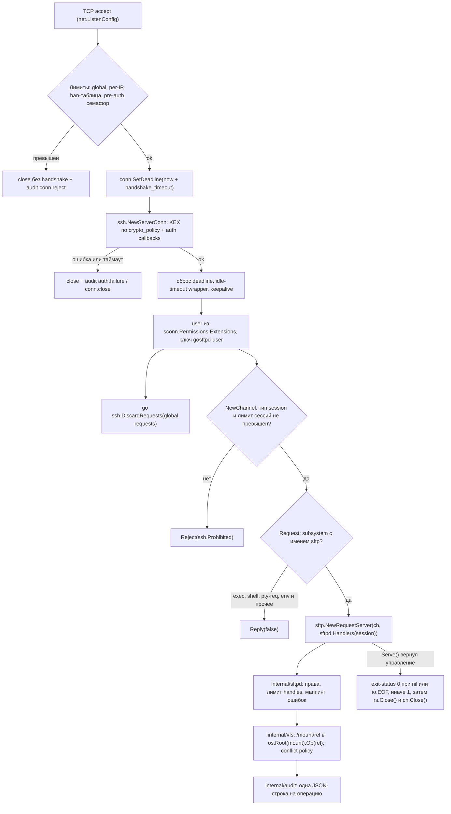
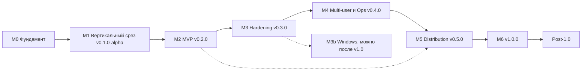

# Go-SFTP-Server: Roadmap

> **Статус документа:** первая редакция от 2026-10-07. Документ основан на аудите репозитория и на исследовании экосистемы, проверенном по исходникам модулей и базе уязвимостей Go.
> **Владелец проекта:** [@o-kolomoiets](https://github.com/o-kolomoiets). Все пункты со словами «решение владельца» сведены в [§13](#13-решения-которые-должен-принять-владелец).
> **Рабочие имена:** module path `github.com/o-kolomoiets/go-sftp-server`, бинарь `gosftpd`. Оба имени утверждает владелец (D2 в §13).

## TL;DR

Сейчас репозиторий — это заброшенная заготовка 2023 года из 16 файлов и примерно 216 строк Go. Он не компилируется, потому что четыре `.go` файла пустые. Если добавить в пустые файлы строку `package`, бинарь сразу падает на захардкоженном пути к ключу. Если поправить пути к ключу и к конфигу, сервер принимает TCP-соединения, выбрасывает их, не закрывая, и не делает SSH-рукопожатие. Слой SFTP написан против API, которого нет в `github.com/pkg/sftp`. Зависимость `golang.org/x/crypto` закреплена на версии от 2021-12-15, и её затрагивают 23 известных advisory в пакетах `ssh/*`. Ни одно обещание README не выполнено. Поэтому предлагается не чинить код, а **пересобрать проект на правильных примитивах**: `golang.org/x/crypto/ssh` v0.57.0, `github.com/pkg/sftp` v1.13.11 (`RequestServer`) и `os.Root`, минимальная версия Go — 1.26.5. Ниша проекта: **«rootless SFTP drop-box в одном исполняемом файле, безопасный по умолчанию»**. Это вход только по ключу, изоляция каталогов через `os.Root`, «никогда не перезаписываем молча», аудит каждого действия, без root, без БД и без web-интерфейса. Порядок работ выбран так, чтобы рабочий вертикальный срез появился как можно раньше. Оценка до v1.0 — около 88–127 человеко-дней: 68–99 чд на milestones, около 0,5 чд в месяц на поддержку и патч-релизы, а также резерв 20% (§5). При темпе около 12 часов в неделю получается примерно такой график: M0 займёт 2–3 недели, первая альфа выйдет через 2–3 месяца, MVP v0.2.0 — через 4–5,5 месяца, v1.0 — через 11–16 месяцев. Поддержку Windows (трек M3b, 4–6 чд) можно выпустить и после v1.0.

## Как пользоваться этим roadmap

- Прогресс отслеживается в [TASKS.md](TASKS.md): там задачи текущего и следующего milestone с ID и статусами; статус обновляется в том же PR, который закрывает задачу. Этот документ остаётся планом, чекбоксы здесь не отмечаются. Когда появятся внешние контрибьюторы, задачи переносятся в GitHub issues и [milestones](https://docs.github.com/en/issues/using-labels-and-milestones-to-track-work/about-milestones) (метки `security`, `P0`…`P3`, `good first issue`).
- Решения из §13 после принятия записываются в `docs/adr/` и в столбец «Статус» таблицы §13.
- При каждом релизе `ROADMAP.md` обновляется: статус milestone, фактические трудозатраты в сравнении с оценкой, сдвиг дат. Если факт расходится с оценкой больше чем на 30%, оценки следующих milestones пересматриваются.
- Этот документ написан на русском для владельца. Пользовательская документация, README и сообщения коммитов — на английском (D19).

## Оглавление

- [Как пользоваться этим roadmap](#как-пользоваться-этим-roadmap)
- [Ближайшие шаги (первые две недели)](#ближайшие-шаги-первые-две-недели)
- [1. Видение и позиционирование](#1-видение-и-позиционирование)
- [2. Текущее состояние (честный аудит)](#2-текущее-состояние-честный-аудит)
- [3. Принципы проекта](#3-принципы-проекта)
- [4. Целевая архитектура](#4-целевая-архитектура)
- [5. Milestones](#5-milestones)
- [6. Спецификации ключевых функций](#6-спецификации-ключевых-функций)
- [7. Безопасность](#7-безопасность)
- [8. Стратегия тестирования](#8-стратегия-тестирования)
- [9. CI/CD и релизы](#9-cicd-и-релизы)
- [10. Документация и сообщество](#10-документация-и-сообщество)
- [11. Метрики успеха](#11-метрики-успеха)
- [12. Риски и как их снижать](#12-риски-и-как-их-снижать)
- [13. Решения, которые должен принять владелец](#13-решения-которые-должен-принять-владелец)
- [14. Приложения](#14-приложения)

---

## Ближайшие шаги (первые две недели)

Задачи упорядочены, каждая занимает от 30 минут до 3 часов, всего 12–20 часов. После этих шагов будет закрыта примерно половина M0: сборка, CI, гигиена. Реалистично это 1–2 недели. Остальное (CONTRIBUTING, CoC, шаблоны, Makefile, `.golangci.yml`) — следом, по чек-листу M0.

- [ ] **1. Принять решения D1–D4, D14, D16, D17 и D19 из §13 (около часа):** D1 — лицензия, D2 — имя репозитория и бинаря (сначала проверить, что `go-sftp-server` и `gosftpd` свободны на GitHub, GHCR, в Debian и Homebrew), D3 — ниша, D4 — формат конфига, D14 — минимальная версия Go, D16 — DCO или CLA, D17 — бюджет времени, D19 — язык документации. Если сомневаетесь, берите рекомендации из §13: Apache-2.0, `go-sftp-server` / `gosftpd`, drop-box, TOML, Go 1.26.5, DCO, 12 ч в неделю, английский. Записать выбор в `docs/adr/0001-foundation.md`.
- [ ] **2. Переименовать репозиторий** на GitHub в `go-sftp-server` (старые ссылки GitHub перенаправит). Затем выполнить `go mod edit -module github.com/o-kolomoiets/go-sftp-server -go=1.26.5`.
- [ ] **3. Удалить старый код:** `git rm -r main.go cmd/server pkg`. Ни один файл не стоит переносить: вердикты по каждому файлу в §2.2.
- [ ] **4. Создать скелет.** Функция `main` в `cmd/gosftpd/main.go` состоит из одной строки `os.Exit(cli.Run(context.Background(), os.Args))`; сигналы обрабатывает `serve` через `signal.NotifyContext`. Добавить `internal/version/version.go` с переменными `Version`, `Commit`, `Date` и запасным вариантом через `runtime/debug.ReadBuildInfo`, а также `internal/cli/` с командой `gosftpd version` на `github.com/spf13/cobra` v1.10.2. Затем `go get github.com/spf13/cobra@v1.10.2 && go mod tidy`: так из `go.mod` уйдут старые `pkg/sftp` v1.13.5 и x/crypto. Проверка: `go build ./... && go vet ./... && go mod tidy -diff`.
- [ ] **5. Гигиена репозитория.** Добавить `.gitattributes` со строкой `* text=auto eol=lf` и выполнить `git add --renormalize .`: сейчас README, `.gitignore` и `folders.json` хранятся с CRLF. В `.gitignore` добавить `/gosftpd`, `/bin/`, `/dist/`, `/out/`, `/coverage/`, `*_key`, `*.pem`, `config.local.toml`, `/gosftpd.toml` (его создаёт `gosftpd init`), `/share/` (каталог zero-config) и перевод строки после последней строки `.idea/` (`*.out` и `.idea/` там уже есть); каталог `testdata/fuzz` **не** игнорировать. Добавить `.editorconfig`.
- [ ] **6. Временный честный README (на английском, D19):** статус «pre-alpha, не работает», абзац о планах, ссылка на `ROADMAP.md`, лицензия. Исправить опечатку «A a minimal».
- [ ] **7. Минимальный CI** в `.github/workflows/ci.yml`, права `permissions: contents: read`. Job `lint`: `test -z "$(gofmt -l .)"` (сам `gofmt -l` всегда завершается с кодом 0), `go vet ./...`, `go mod tidy -diff`, golangci-lint v2.14.0 через `golangci/golangci-lint-action` (в него встроены staticcheck v0.8.1 и gosec v2.29.0; до `.golangci.yml` из §9.2 — с настройками по умолчанию). Job `test`: `go test -race ./...` на `1.26.x` и `1.27.x`. Job `min-go` (`go-version-file: go.mod`, только `go build ./... && go vet ./...`). Job `vuln`: `golang/govulncheck-action@v1`. Job `ci-ok` (`needs: [lint, test, min-go, vuln]`, `if: always()`) падает, если какая-либо из них упала или отменена (§9.1). `lint` и `vuln` ставят Go через `go-version: stable` + `check-latest: true` (§9.1). Локально те же инструменты запускаются через Makefile и `go tool -modfile=tools/go.mod` (§4.5).
- [ ] **8. Обновления зависимостей:** `.github/dependabot.yml` с экосистемами `gomod` (`directories: ["/", "/tools"]`: `tools/go.mod` — отдельный модуль, и без второго каталога Dependabot не обновит инструменты) и `github-actions`, интервал weekly, minor и patch сгруппированы.
- [ ] **9. Безопасность репозитория.** Создать `SECURITY.md`: поддерживается только последний minor, отчёты через GitHub private vulnerability reporting. В Settings включить private vulnerability reporting, secret scanning с push protection и CodeQL default setup. Ruleset на `main`: Require a pull request (required approvals: **0**, иначе единственный мейнтейнер не смержит свой PR), required status check `ci-ok` (агрегирует `lint`, матрицу `test`, `min-go` и `vuln`, позже остальные job'ы из §9.1; матричные проверки GitHub называет по значениям матрицы, например `test (1.26.x)`, поэтому проверка с именем `test` никогда не придёт и заблокирует все PR), Require code scanning results (CodeQL, security alerts «High or higher»: CodeQL default setup — отдельная проверка, `ci-ok` её не агрегирует), block force pushes, require linear history.
- [ ] **10. Spike для M1 (2–3 часа)** в ветке `spike/m1-handshake`; в `main` она не мержится до начала M1, потому что M0 не тянет `x/crypto` и `pkg/sftp`. В `internal/server` написать вызов `ssh.NewServerConn` с deadline на рукопожатие и in-process тест: сервер слушает `127.0.0.1:0`, клиент делает `ssh.Dial` к `ln.Addr().String()`, открывает канал `client.OpenChannel("session", nil)`, отправляет `ch.SendRequest("subsystem", true, ssh.Marshal(struct{ Name string }{"sftp"}))`, создаёт клиента `sftp.NewClientPipe(ch, halfCloser{ch})` (у обёртки `Close()` вызывает `ch.CloseWrite()`), делает `Getwd()`, закрывает клиента и читает из канала запросов `exit-status`: после `ssh.Unmarshal` должно быть `Status == 0`. `Session.Wait()` после `RequestSubsystem` не подходит: он возвращает «ssh: session not started». При штатном закрытии `rs.Serve()` возвращает `io.EOF`. Тест подтвердит, что стек `x/crypto` v0.57.0 + `pkg/sftp` v1.13.11 собирается на Go 1.26.5+.

---

## 1. Видение и позиционирование

### 1.1 Питч в одно предложение

> **gosftpd — один статический бинарь, который превращает любой каталог в защищённый SFTP drop-box: вход только по ключу, изоляция через `os.Root`, загрузки никогда не перезаписывают файлы молча, каждое действие попадает в аудит-лог; без root, без базы данных и без web-интерфейса.**

### 1.2 Целевые пользователи (персоны)

| # | Персона | Боль сейчас | Что получает от gosftpd |
|---|---|---|---|
| П1 | **Homelab / NAS-энтузиаст**: сканеры, телефоны и backup-джобы складывают файлы на домашний сервер | `atmoz/sftp` (1,03 млрд pull'ов) застыл: последний содержательный коммит в 2024-09, тег `latest` от 2024-07-14. Домашний каталог принадлежит root, писать в его корень нельзя, для bind mount нужен `CAP_SYS_ADMIN` | Rootless-образ около 15 MB, `docker run ... serve --dir /srv/sftp`, миграция из `users.conf` |
| П2 | **Небольшая команда, принимающая файлы от партнёров**: зарплатные ведомости, выписки, data feeds | Управляемый endpoint стоит денег (AWS Transfer Family $0,30/ч плюс $0,04/GB, около $216 в месяц за круглосуточный endpoint; Azure Blob SFTP $0,30/ч). SFTPGo для этой задачи слишком тяжёлый | Партнёрские inbox-папки «только запись», которые работают с temp-загрузкой WinSCP и rclone (§6.3), защита от перезаписи, webhook на завершение загрузки, аудит |
| П3 | **Разработчик / QA / CI**: нужен настоящий SFTP-сервер в тестах | `testcontainers-go` (модуль `sftp` v0.44.0) поднимает `atmoz/sftp:latest`, а для этого нужен Docker; в Go нет SFTP-аналога `httptest` | `gosftpd serve --ephemeral`, позже Go-пакет `sftptest` (post-1.0) |
| П4 | **Сисадмин, уставший от `Match` / `ChrootDirectory`** | В OpenSSH каждая компонента пути chroot должна принадлежать root и не быть writable для group и others. Пользователи — системные аккаунты, логи только в syslog | Виртуальные пользователи в одном TOML-файле, права на уровне mount'а, JSON-аудит |

### 1.3 Ниша и альтернативы

| | OpenSSH `internal-sftp` + `ChrootDirectory` | SFTPGo v2.7.6 | `atmoz/sftp` | `rclone serve sftp` v1.75.1 | **gosftpd (цель)** |
|---|---|---|---|---|---|
| Что это | sshd из ОС | Платформа: SFTP, FTP(S), WebDAV, HTTP; backend'ы S3, GCS, Azure; WebAdmin и WebClient | Docker-обёртка над OpenSSH | Команда rclone, раздающая любой rclone-backend | Один бинарь, только SFTP |
| Лицензия | BSD-style | AGPL-3.0-only с дополнительными условиями по разделу 7 лицензии; основные усилия в Enterprise-редакции | MIT | MIT | решение владельца (рекомендация Apache-2.0) |
| Root | нужен (chroot) | не нужен | контейнер; для bind mount нужен `CAP_SYS_ADMIN` | не нужен | **не нужен** |
| Пользователи | системные аккаунты | БД (по умолчанию SQLite) и web-админка | `users.conf` / `SFTP_USERS` | фактически один (несколько только через `--auth-proxy`) | виртуальные, в TOML-файле |
| Конфликт при загрузке | перезапись | перезапись; запрещается правом `overwrite` (тогда отказ); атомарность — `upload_mode`; переименования при конфликте нет | перезапись | перезапись | `rename` / `reject` / `overwrite` / `version` |
| Аудит | syslog | развитый | syslog OpenSSH | лог rclone | JSON Lines со стабильной схемой |
| Объём | в составе ОС | бинарь 58 MB, конфиг по умолчанию 447 строк и 368 ключей | образ alpine 9,2 MB (сжатый) | полный rclone | бинарь ≤ 10 MB, образ ≤ 15 MB |
| Активность (на 2026-10) | OpenSSH 10.6p1 (2026-10) | v2.7.6 (2026-09-18) | застой, 195 открытых issues | активен | — |
| Почему не подходит для нашей ниши | сложная настройка, нет drop-box-семантики | тяжёлый, большая web-поверхность (CVE), AGPL, open-core | застой, ограничения chroot | не рассчитан на многопользовательский приём файлов | молодой проект (это наш риск) |

Если не считать SFTPGo, ниша простых SFTP-серверов на Go почти пуста: существующие проекты заброшены (`taruti/sftpd` — последний push в 2019, `s3-sftp-proxy` — в 2022, `sftpplease` — в 2023, `pterodactyl/sftp-server` в архиве). Значит, место есть. Но малое число звёзд у этих проектов показывает, что «ещё один SFTP-сервер» без острого, проверяемого тезиса не взлетит. Наш тезис технический. Ни `pkg/sftp` v1, ни `pkg/sftp/v2` alpha, ни SFTPGo не используют `os.Root`. А наивные Go-решения небезопасны (проверено в ходе исследования, воспроизводится за минуту): `sftp.NewServer` с `WithServerWorkingDirectory` по команде `get /etc/hostname` отдаёт клиенту файл хоста, `afero.BasePathFs` позволяет выйти за пределы каталога через `../data2` и через symlink. У SFTPGo в 2026 году было три CVE, связанных с путями, и не все из web-части: CVE-2026-30914 (расхождение нормализации путей между протоколами, затрагивает и SFTP), CVE-2026-30915 (очистка placeholders в путях home) и CVE-2026-49244 (ZIP-загрузка из публичных share). У всех трёх крупных облаков теперь есть managed SFTP: у Google это Cloud FTP (GA с 2026-08-26). Поэтому стоимость — довод для небольших команд, а не утверждение, что альтернатив нет.

### 1.4 Явные non-goals (до 1.0, оформить в `docs/adr/0002-non-goals.md`)

| Не делаем | Почему | Куда отправлять пользователей |
|---|---|---|
| Web UI, share-ссылки, админский REST API с RBAC | Основная поверхность атак (CrushFTP CVE-2025-31161, GoAnywhere CVE-2025-10035, MOVEit, web-CVE SFTPGo) | SFTPGo |
| FTP/FTPS, WebDAV, HTTP | За пределами ниши | SFTPGo, copyparty |
| Backend'ы S3, GCS, Azure | Семантика `WriteAt` в SFTP плохо ложится на object store; ресурс одного мейнтейнера | `rclone serve sftp`, SFTPGo. Интерфейс VFS оставляем, чтобы вернуться к этому после 1.0 |
| Shell, exec, port forwarding, agent forwarding, legacy SCP (`scp -O`), rsync, git | Лишняя поверхность. OpenSSH ≥ 9.0 по умолчанию передаёт `scp` по протоколу SFTP. SFTPGo в v2.7.0 сам убрал git и rsync как ненужный риск | OpenSSH |
| Создание symlink и hardlink клиентом | Угроза изоляции (у SFTPGo GHSA-fj9v-mxr3-w75w) | — |
| Шифрование данных на диске, автоудаление (retention) входящих файлов | Шифрование — задача тома или ФС, иначе в процессе появляются ключи и их ротация. Retention — задача планировщика | LUKS, ZFS native encryption, fscrypt; рецепт `docs/recipes/retention.md` (M4): `systemd-tmpfiles` со строкой `e /srv/sftp/inbox - - - 30d` или exec-hook на `fs.upload`, который переносит файл в архив |
| LDAP, OIDC, MFA в 1.x | Сложно. Для корпоративных сценариев есть SSH-сертификаты (M4) | SSH CA |
| БД, HA, кластер | Противоречат принципу «один бинарь» | — |

---

## 2. Текущее состояние (честный аудит)

### 2.1 Что есть

- 16 файлов в git, около 216 строк Go, 7 коммитов от одного автора. Последний коммит `6f72083` от 2023-05-28: «Added basic templates for main functionalities».
- Лицензия GPL-3.0. Тестов, CI, `CONTRIBUTING.md`, roadmap и планов нет.
- `go.mod`: `module sftp-server`, `go 1.20`, `github.com/pkg/sftp v1.13.5` (2022-03-30), `golang.org/x/crypto v0.0.0-20211215153901-e495a2d5b3d3 // indirect`.

### 2.2 Что сломано: вердикт по каждому файлу

| Файл | Проблема | Вердикт |
|---|---|---|
| `main.go` | `server.Run("/path/to/your/config.json")` — захардкоженный плейсхолдер. staticcheck SA4023: `Run` никогда не возвращает `nil`, поэтому программа всегда завершается через `log.Fatal` | **DELETE**, замена — `cmd/gosftpd/main.go` |
| `cmd/server/server.go` | Библиотечный пакет лежит в `cmd/`. Listener захардкожен на `0.0.0.0:55555` | **REWRITE**, переезжает в `internal/server` и `internal/cli` |
| `pkg/auth/auth.go` | Читает «private key» по относительному пути `path/to/your/private/key`; на самом деле это host key. Бинарь сразу падает с `open path/to/your/private/key: no such file or directory`. Аутентификации пользователей нет. `GetPrivateKey` — мёртвый код | **REWRITE**, переезжает в `internal/hostkey` и `internal/auth` |
| `pkg/auth/keys.go`, `pkg/log/log.go`, `pkg/sftp/requests.go`, `pkg/sftp/responses.go` | 0 байт, поэтому `expected 'package', found 'EOF'`. Имя `log` к тому же совпадает с пакетом stdlib. `requests`/`responses` намекают на ручное кодирование пакетов, которое уже делает `pkg/sftp` | **DELETE** |
| `pkg/config/config.go` | Есть только `folders`. Нет валидации, нет `DisallowUnknownFields`. Поле никто не читает | **REWRITE**, переезжает в `internal/config` (TOML) |
| `pkg/config/folders.json` | Плейсхолдеры, CRLF, лежит внутри пакета | **DELETE**, вместо него `internal/config/example.toml` |
| `pkg/sftp/handler.go` | Ручной `switch req.Method` по значениям `"Write"`, `"Read"`, `"Close"`, которые `RequestServer` никогда не передаёт. Комментарии ссылаются на несуществующие `RespondWithFileList`, `RespondWithHandle`, `RespondWithData`. Заглушки возвращают `nil`, то есть молчаливый «успех». Пакет называется `sftp`, как и импортируемый `github.com/pkg/sftp`. В файловом обработчике хранится поле `authHandler *auth.AuthHandler`, то есть host key | **DELETE**, вместо него `internal/vfs` и `internal/sftpd` |
| `pkg/sftp/sftp_server.go` | `_, err := listener.Accept()` выбрасывает соединение и не закрывает его, что ведёт к утечке FD. Горутина пустая, SSH-рукопожатия нет. На первой же ошибке `Accept` цикл завершается | **REWRITE** в `internal/server` |
| `go.mod`, `go.sum` | Module path нельзя поставить через `go install`. Go 1.20 давно EOL. x/crypto помечен `// indirect` и уязвим | **REWRITE** (§4.5) |
| `README.md` | Обещает всё, что не работает (§2.3). CRLF | **REWRITE** (§10) |
| `LICENSE` | GPL-3.0 | **KEEP** до решения D1 |
| `.gitignore` | CRLF; последняя строка `.idea/` без перевода строки (сам `.idea/` игнорируется, но каталог попал в git раньше `.gitignore`, отсюда коммит «Delete .idea directory»); бинарь, ключи и `dist/` не игнорируются | **KEEP + FIX** |

### 2.3 Обещания README и реальность

| Обещание README | Реальность | Где закрывается |
|---|---|---|
| Подмножество SFTP: list, upload, download | SSH-рукопожатия нет вообще | M1 |
| Порт 55555 | Захардкожен | M1: настраиваемый, по умолчанию `2022` |
| Whitelist каталогов, выше которых выйти нельзя «ни при каких обстоятельствах» | `config.Folders` никто не читает | M1 (`os.Root`), M2 (mounts и права) |
| Переименование при конфликте вместо перезаписи | Нет | M1 базово, M2 полная матрица, M3 режим `version` |
| Логирование всех действий | `pkg/log` пустой | M1 (JSON-аудит), M2 (стабильная схема) |
| Конфиг в JSON | Только `folders` | M2, формат TOML. Обещание JSON сознательно снимается (D4) |
| Простой CLI | Флагов нет | M1 `serve`; M2 `init`, `config`, `user` |
| «Secure coding practices» | 23 advisory в `x/crypto/ssh*` на текущем пине, утечка соединений | M0–M3 |
| Contribution guidelines | `CONTRIBUTING.md` нет | M0 |
| «Demonstration project» | Это правда | Заменить на бейдж статуса (alpha / beta / stable) |

### 2.4 Известные ловушки стека (проверено в ходе исследования по исходникам и живым клиентам)

Ниже — факты о поведении `x/crypto` v0.57.0, `pkg/sftp` v1.13.11, stdlib, GoReleaser/nfpm и реальных клиентов (OpenSSH 9.6p1 `sftp`/`scp`, paramiko, rclone). Каждый пункт подтверждён чтением исходников или прогоном живого клиента. Каждую ловушку нужно закрыть тестом; там, где это полезно, указано, как её воспроизвести.

| # | Ловушка | Что делать |
|---|---|---|
| T1 | Если закрыть session-канал без запроса `exit-status`, OpenSSH `scp` завершается с кодом 1, хотя файл передан. `sftp -b` при этом проходит. Примеры `pkg/sftp` этот запрос не отправляют | После `rs.Serve()` вызвать `ch.SendRequest("exit-status", false, ssh.Marshal(struct{ Status uint32 }{code}))`, где `code` = 0, если `Serve()` вернул `nil` или `io.EOF`, иначе 1; затем `rs.Close()`. Проверка: `scp -P 2022 f host:`, затем `echo $?` даёт 1, если `exit-status` не отправлен. `scp` обязателен в interop |
| T2 | `FSTAT`/`FSETSTAT` по handle превращаются в `Stat`/`Setstat` по `Request.Filepath` открытого запроса (request-server.go:271-294). Handle в обработчик не передаётся, отличить FSETSTAT от SETSTAT по пути нельзя | Если загрузку переименовали, присвоить `r.Filepath = finalVirtualPath` внутри `Filewrite`. Тогда `put -p` меняет атрибуты новой копии, а не оригинала. Это недокументированное поведение; его фиксирует регрессионный тест |
| T3 | Команда `rename` в OpenSSH использует `posix-rename@openssh.com`, который перезаписывает цель. rclone пишет во временный `.partial` и делает posix-rename поверх цели | Политика конфликтов покрывает OPEN, RENAME и posix-rename вместе (§6.2) |
| T4 | `scp` в режиме SFTP открывает существующий файл с `WRITE+CREAT` без `TRUNC`, а размер обрезает через `FSETSTAT` | Конфликт нельзя определять по флагу `TRUNC` |
| T5 | `pkg/sftp` отправляет клиенту `err.Error()` дословно, например `openat evil/secret: path escapes from parent`. Сами по себе `sftp.ErrSSHFx*` дают тексты «failure», «permission denied», «no such file» | Слой маппинга ошибок: свой тип с `Unwrap()` на `sftp.ErrSSHFx*` и фиксированным сообщением без путей (§7.4 п.8). Проверка: заранее положить symlink `evil` наружу, `get evil/secret` — без маппинга сообщение клиента содержит путь хоста |
| T6 | `Request.Attributes()` игнорирует ошибку декодирования и может вернуть `nil` | Обязательная проверка на nil |
| T7 | Для `SYMLINK` в `Request.Filepath` приходит сырой target без очистки, а `os.Root.Symlink` target не проверяет | Symlink и hardlink запрещены (`ErrSSHFxOpUnsupported`) |
| T8 | `os.File.WriteAt` не работает с файлом, открытым с `O_APPEND` | Никогда не открывать с `O_APPEND`; doc `FileWriter` предупреждает об этом |
| T9 | `statvfs@openssh.com` рекламируется по умолчанию. `df` в `sftp -b` обрывает batch и тогда, когда расширение не рекламируется: ошибку «Server does not support statvfs@openssh.com extension» формирует сам клиент (sftp-client.c). То же с `ln` и `hardlink@openssh.com` | Не рекламировать, пока не реализовано; в batch-файлах писать `-df`. `sftp.SetSFTPExtensions(...)` без синхронизации пишет глобальную переменную, которую `RequestServer` читает на каждом `SSH_FXP_INIT`: вызывать ровно один раз через `sync.Once` до первого `NewRequestServer`, в тестах — из `TestMain`, иначе `-race` найдёт гонку. `sftp.SftpServerWorkerCount` — константа (8), её не настроить. Проверка: `df` в `sftp -b` обрывает batch |
| T10 | `x/crypto/ssh` не имеет таймаута на рукопожатие. Списки алгоритмов по умолчанию включают `diffie-hellman-group14-sha1`, `hmac-sha1-96`, `ssh-rsa` (SHA-1). `SupportedAlgorithms().MACs` всё ещё содержит `hmac-sha1`. Неизвестные имена алгоритмов молча игнорируются | `SetDeadline` вокруг `NewServerConn`; явные списки алгоритмов только из профилей `modern`/`compat`, unit-тест имён в профилях (§7.6, M3) |
| T11 | `PublicKeyCallback` вызывается и для ключей, владение которыми клиент не доказал. Кэш вызовов: `maxCachedPubKeys = 1` | Callback — чистый lookup; личность берётся только из `ServerConn.Permissions` (урок CVE-2024-45337) |
| T12 | `os.Root.Rename` молча перезаписывает цель, `Root.Link` возвращает `EEXIST` | No-clobber rename через `Root.Link` + `Root.Remove`, как `process_rename` в OpenSSH `sftp-server` |
| T13 | Открытие FIFO блокирует worker | Открывать с `O_NONBLOCK`, затем `Stat()` и отказ, если не `IsRegular()`. Проверка: `mkfifo share/p`, затем `get p` — без `O_NONBLOCK` worker висит |
| T14 | `ls -l` показывает uid/gid хоста (в живом тесте было `0 0`) | `sftp.FileInfoUidGid` (виртуальные uid/gid) или `NameLookupFileLister`: он подставляет имена в longname для `ls -l`, расширение `users-groups-by-id@openssh.com` для этого не нужно. Проверка: `ls -l` в `sftp` |
| T15 | paramiko `put()` с `confirm=True` после загрузки делает stat по запрошенному пути и в режиме rename падает с `size mismatch`. rclone при каждом запуске создаёт новую копию `(n)` | Session-scoped `stat_redirect`, режим `version`, документация (§6.2) |
| T16 | Пример `request-server` из `pkg/sftp` берёт имя subsystem как `req.Payload[4:]` (может вызвать panic) и обслуживает одно соединение | Разбирать имя через `ssh.Unmarshal`; пример не копировать |
| T17 | Лог-sink на `bytes.Buffer` в тестах не goroutine-safe, `-race` ловит это с первого прогона | Sink в тестах с mutex |
| T18 | В snapshot-пакете nfpm конфиг получил владельца `root:root` и права 0640, и сервисный пользователь не может его прочитать. Любой неотслеживаемый файл в рабочем дереве (`dist/`, сгенерированные man-страницы) даёт `vcs.modified=true` и суффикс `+dirty` | postinstall выполняет `chgrp`; `/dist/` и `/out/` в `.gitignore`; `go generate` и before-hook с `go-licenses` пишут только в `out/` (§9.3) |

---

## 3. Принципы проекта

1. **Secure by default.** Только вход по ключу, пароли включаются явно. Shell, exec и forwarding запрещены. Создание symlink и hardlink запрещено. Криптополитика современная. Лимиты включены с разумными значениями.
2. **Один статический бинарь.** `CGO_ENABLED=0`, без БД, без web и без внешних процессов, кроме явно настроенных hooks.
3. **Минимальный конфиг.** Zero-config через `gosftpd serve --dir ./share` и один TOML-файл для многопользовательского режима. Парсинг строгий: неизвестный ключ — это ошибка.
4. **Пути хоста не уходят клиенту.** Вся файловая работа идёт только через `*os.Root`, а ошибки маппятся в коды без путей.
5. **Данные не теряются молча.** Политика конфликтов покрывает OPEN, RENAME, posix-rename и право удаления как одно целое.
6. **Честность.** README обещает только то, что покрыто тестом или примером.
7. **Совместимость с реальными клиентами важнее буквы спецификации.** Каждый релиз проверяется OpenSSH `sftp`/`scp`, paramiko и rclone, а к v1.0 ещё WinSCP, FileZilla и Cyberduck.
8. **Мало зависимостей и быстрые обновления.** Не больше 10 прямых runtime-зависимостей, включая `golang.org/x/*`; достижимую уязвимость закрываем патч-релизом не позже чем через 7 дней (§9.6).
9. **Наблюдаемость.** Одно действие даёт одну строку аудита со стабильной схемой.
10. **Тонкие слои.** Внешние библиотеки стоят за адаптерами: `pkg/sftp` только в `internal/sftpd`, `x/crypto/ssh` только в `internal/server`, `internal/auth`, `internal/hostkey` и `internal/config` (там только `ssh.ParseAuthorizedKey` в `Validate()`).
11. **До 1.0 публичного Go API нет.** Весь код лежит в `internal/`. Публичный контракт — это CLI, схема конфига, схема аудита, имена метрик и exit codes.

---

## 4. Целевая архитектура

### 4.1 Поток запроса



### 4.2 Раскладка пакетов

```text
go-sftp-server/
├── cmd/gosftpd/main.go          # тонкий: os.Exit(cli.Run(context.Background(), os.Args))
├── internal/
│   ├── cli/                     # cobra-команды: serve, init, config, user, hostkey, healthcheck, version
│   ├── config/                  # типы, Default(), Load(), Validate(), CheckFS(), example*.toml (go:embed)
│   ├── hostkey/                 # генерация, загрузка, проверка прав, fingerprint, known_hosts
│   ├── auth/                    # authorized_keys, PublicKey/Password callbacks, CertChecker, ban-таблица
│   ├── server/                  # listener, лимиты, handshake, каналы, сессии, shutdown, reload
│   ├── sftpd/                   # адаптер pkg/sftp: Handlers, маппинг ошибок, учёт handles, TransferError
│   ├── vfs/                     # mount table, resolve(), операции через os.Root, conflict policy, права
│   ├── audit/                   # схема событий поверх log/slog
│   ├── obs/                     # admin listener: /metrics, /healthz, /readyz (M4)
│   ├── hooks/                   # exec и webhook (M4)
│   ├── sandbox/                 # Landlock, sd_notify (M4)
│   ├── testutil/                # AsyncConn, лог-sink с mutex (только для тестов)
│   └── version/                 # Version/Commit/Date
├── test/
│   ├── interop/                 # run.sh, *.batch, paramiko/rclone-скрипты
│   └── bench/                   # docker-compose: OpenSSH internal-sftp vs gosftpd
├── packaging/                   # systemd unit, sysusers, nfpm-скрипты
├── docs/                        # quickstart, configuration, security, audit-log, adr/, release-checklist ...
├── .github/                     # workflows, dependabot, шаблоны issue/PR, CODEOWNERS
├── Dockerfile  .goreleaser.yaml  .golangci.yml  Makefile  ROADMAP.md  CHANGELOG.md
```

Граф зависимостей пакетов: `cli → config, server, hostkey, version`; `server → auth, sftpd, vfs, audit, config`; `auth → config`; `sftpd → vfs, audit`; `vfs → config`; с M4 ещё `server, sftpd → obs, hooks` и `server → sandbox`, `hooks → config`. Циклов нет, `main()` есть только в `cmd/gosftpd`.

### 4.3 Ключевые сигнатуры

```go
// internal/config
func Load(path string) (*Config, error)          // TOML, неизвестные ключи = ошибка
func (c *Config) Validate() error                // статическая проверка; errors.Join, путь ключа в каждой ошибке
func (c *Config) CheckFS() error                 // окружение: пути, права и владельцы файлов (§6.5)

// internal/hostkey
func Load(paths []string) ([]ssh.Signer, error)  // отказ, если mode&0o077 != 0
func GenerateEd25519(path string) (ssh.Signer, error)

// internal/auth
func New(users []config.User) (*Authenticator, error)
func (a *Authenticator) PublicKey(ssh.ConnMetadata, ssh.PublicKey) (*ssh.Permissions, error) // чистый lookup
func (a *Authenticator) Password(ssh.ConnMetadata, []byte) (*ssh.Permissions, error)         // M3, opt-in
func UserFrom(p *ssh.Permissions) (string, bool) // единственный источник личности

// internal/server
func New(cfg *config.Config, deps Deps) (*Server, error)
func (s *Server) Serve(ctx context.Context, ln net.Listener) error
func (s *Server) ServeConn(ctx context.Context, c net.Conn) error // для тестов: 127.0.0.1:0 или net.Pipe с testutil.AsyncConn
func (s *Server) Shutdown(ctx context.Context) error

// internal/vfs
func OpenMounts(ms []config.Mount) (*MountTable, error) // os.OpenRoot для каждого mount'а
func (t *MountTable) Session(u config.User, log *slog.Logger) *Session

// internal/sftpd
func Handlers(s *vfs.Session, lim Limits, a *audit.Logger) sftp.Handlers
```

Тип `sftpd.fileHandler`, обёртка над `*vfs.Session`, реализует `sftp.FileReader`, `sftp.FileWriter` (+`OpenFileWriter`), `sftp.FileCmder` (+`PosixRenameFileCmder`, с M2 `StatVFSFileCmder`), `sftp.FileLister` (+`LstatFileLister`, `RealPathFileLister`, `NameLookupFileLister`). `internal/vfs` не импортирует `pkg/sftp` и возвращает свои ошибки (`vfs.ErrConflict`, `vfs.ErrDenied`, `vfs.ErrUnsupported`), которые маппит `internal/sftpd`. Внутри `internal/vfs` есть узкий интерфейс с флагами возможностей (`RandomWrite`, `AtomicRename`, `Symlinks`). Сначала одна реализация на `os.Root`; memfs для fault injection и S3 откладываются на post-1.0.

### 4.4 Ключевые технические решения (mini-ADR)

| # | Решение | Рассмотренные варианты | Выбор | Почему |
|---|---|---|---|---|
| A1 | SSH-слой | `golang.org/x/crypto/ssh` напрямую; `gliderlabs/ssh` v0.3.8; `charm.land/ssh` v0.4.3 / `wish/v2` | **x/crypto напрямую** | Прямой доступ к `VerifiedPublicKeyCallback`, `PreAuthConnCallback`, `AuthLogCallback` и спискам алгоритмов. `gliderlabs/ssh` не развивается (последний тег 2024-12). `charm.land/ssh` (форк gliderlabs) молча ставит `NoClientAuth=true`, если не задан ни один обработчик аутентификации; `gliderlabs/ssh` v0.3.8 делает то же самое (server.go:131-133). Обработка session + subsystem занимает около 100 строк |
| A2 | Библиотека SFTP | `pkg/sftp` v1.13.11 `RequestServer`; `sftp.NewServer`; `pkg/sftp/v2` v2.0.0-alpha2 | **v1 `RequestServer` за адаптером `internal/sftpd`** | `NewServer` отдаёт всю ФС хоста. v2 пока alpha, и его `localfs` прямо помечен «not normally a safe thing to expose». Переход на v2 затронет один пакет |
| A3 | Изоляция | `os.Root`; `chroot`; `afero.BasePathFs`; проверки префиксов | **`os.Root` на каждый mount плюс песочница процесса (systemd, Landlock)** | `chroot` требует root и действует на весь Go-процесс. afero позволяет выйти наружу через `../data2` и symlink. `os.Root` закрывает лексические и symlink-выходы (проверено) |
| A4 | Формат конфига | JSON (обещание README); YAML (`go.yaml.in/yaml/v3`); TOML (`BurntSushi/toml` v1.6.0, `pelletier/go-toml/v2` v2.4.3) | **TOML на `BurntSushi/toml` v1.6.0, один формат** | В JSON нет комментариев. YAML v3 молча принимает `yes` как `true` и `0022` как восьмеричное 18. BurntSushi отвергает и то и другое, ошибки идут со строкой и колонкой, `MetaData.Undecoded()` ловит неизвестные ключи |
| A5 | CLI | stdlib `flag`; `spf13/cobra` v1.10.2; `kong` v1.16.1; `urfave/cli/v3` | **cobra без viper** | Добавляет 0,58 MB (замер), kong — 2,66 MB. Даёт man-страницы (`doc.GenManTree`) и completion. У viper глобальное состояние и тяжёлые зависимости |
| A6 | Логи | `log/slog`; zap / zerolog | **`log/slog`**: операционный лог в stderr (text/json) и отдельный аудит-поток в JSON | stdlib. `slog.NewMultiHandler` появился в Go 1.26. У аудита и операционного лога разные потребители |
| A7 | Модель пользователей | Виртуальные пользователи под одним сервисным аккаунтом; системные пользователи ОС | **Виртуальные** | Не нужен root, setuid и chown, поверхность атаки меньше |
| A8 | Аутентификация по умолчанию | publickey; password; keyboard-interactive | **publickey**; password opt-in с M3 (argon2id); сертификаты с M4 | Публичный SSH-порт постоянно брутфорсят |
| A9 | Метрики | Prometheus `client_golang` v1.24.1 (+2,6 MB); `VictoriaMetrics/metrics` v1.44.1 (+0,44 MB); OpenTelemetry (+12,4 MB) | **Opt-in Prometheus-эндпоинт** (библиотеку выбирает владелец, D12); **OTel до 1.0 не используем** | Процесс без downstream-вызовов, трейсы почти ничего не дают |
| A10 | Политика версий Go | Только последняя версия; две последние | **Две последние; floor `go 1.26.5`** | x/crypto ≥ v0.56.0 требует go 1.26.0, а исправление os.Root GO-2026-4970 есть только в 1.26.5 |
| A11 | Реализация конфликта при загрузке | Stat, потом Create (TOCTOU); резервирование через `O_EXCL`; temp-файл + `Link` | **`O_CREATE\|O_EXCL`-резервирование + `r.Filepath` remap** (M1); temp + `Root.Link` для `atomic_uploads` (M3) | Гонки исключены самой схемой. Эксперимент (50 параллельных загрузок, 50 разных файлов, оригинал цел, `-race`) проводился для схемы temp + `Root.Link`; для `O_EXCL`-резервирования такой же тест добавляется в M1 |
| A12 | Хранилище | Только локальная ФС; S3 и т. п. | **Только локальная ФС до 1.0** | См. non-goals |
| A13 | Ошибки клиенту | Как есть; маппинг | **Маппинг на `sftp.ErrSSHFx*`** через обёртку с фиксированным сообщением (§7.4 п.8), детали только в лог сервера | Иначе утекают пути хоста (T5) |

### 4.5 Зависимости и версии (проверено 2026-10-07)

| Модуль | Версия | Назначение | С какого milestone |
|---|---|---|---|
| `golang.org/x/crypto` | **v0.57.0** (минимум v0.56.0), прямая зависимость, **не** `// indirect` | `ssh`, `bcrypt`, `argon2` | M1 |
| `github.com/pkg/sftp` | **v1.13.11** (requires go 1.25.0, x/crypto v0.54.0) | `RequestServer` | M1 |
| `golang.org/x/sys` | v0.48.0 (уже в графе через x/crypto) | `unix.Renameat2`/`RENAME_NOREPLACE` (M1, rename каталогов) и `unix.Fstatfs` (M2, statvfs), только через `Root.Open(dir)` + `f.Fd()` и с именами из одного компонента. `windows.MoveFileEx` не используем: он берёт абсолютные пути и обходит `os.Root`, а `Root.Link` работает и на Windows | M1 |
| `github.com/spf13/cobra` | v1.10.2 | CLI | M0 |
| `github.com/BurntSushi/toml` | v1.6.0 | конфиг | M2 |
| `golang.org/x/time` | v0.16.0 | `rate.Limiter` (лимиты, позже bandwidth) | M3 |
| `golang.org/x/term` | v0.46.0 (go 1.26.0) | ввод пароля без эха | M3 |
| `github.com/prometheus/client_golang` | v1.24.1 (go ≥ 1.25.0) **или** `github.com/VictoriaMetrics/metrics` v1.44.1 | метрики (opt-in) | M4 |
| — (свой код) | около 30 строк поверх `$NOTIFY_SOCKET` | `sd_notify`; `github.com/coreos/go-systemd/v22` не берём ради лимита зависимостей | M4 |
| `github.com/landlock-lsm/go-landlock` | v0.10.1 (MIT) | опциональная песочница Linux | M4 |
| `github.com/pires/go-proxyproto` | v0.15.0 | PROXY protocol v2 за балансировщиком (персона П2, opt-in) | M4 |
| `go.uber.org/goleak` | v1.3.0 (тесты) | поиск утечек горутин | M1 |

Прямых runtime-зависимостей получается ровно 10 (`goleak` только в тестах). Каждая новая зависимость требует удалить другую или пересмотреть принцип 8.

**Не используем:** `afero` (`BasePathFs` не изолирует), `gliderlabs/ssh`, `charm.land/ssh`, `github.com/drakkan/crypto` (форк устарел, SFTPGo ушёл с него в v2.7.0, репозиторий отдаёт 404), `pkg/sftp/v2` (alpha), viper, OpenTelemetry, `go-systemd`, `gopkg.in/yaml.v3` (archived 2025-04-01).

**Инструменты:** golangci-lint v2.14.0, staticcheck v0.8.1 (`honnef.co/go/tools`), govulncheck v1.8.0 (`golang.org/x/vuln`), gosec v2.29.0, goreleaser v2.18.2, cosign v3.1.3, syft v1.54.1, actionlint v1.7.12, gotestsum v1.13.0, `github.com/google/go-licenses/v2` v2.0.1. Схема запуска инструментов: в CI — `golang/govulncheck-action@v1` и golangci-lint v2.14.0, в который уже встроены staticcheck v0.8.1 и gosec v2.29.0; actionlint и go-licenses и в CI, и локально идут через `go tool -modfile=tools/go.mod actionlint|go-licenses`. Локально: `go tool -modfile=tools/go.mod govulncheck|staticcheck|gotestsum` через Makefile; отдельный `tools/go.mod` не даёт инструментам попасть в граф модулей пользователя. golangci-lint ставится бинарём: его документация не рекомендует `go install` и `go tool`.

### 4.6 Политика версий Go

- **Правило:** поддерживаем две последние major-версии Go, как и сам Go: релиз поддерживается, пока не выйдут две более новые. На 2026-10-07 это **1.26 и 1.27**. Даты релизов: 1.26.0 — 2026-02-10; 1.27.0 — 2026-08-19; 1.27.1 и 1.26.8 — 2026-09-01. Go 1.25 больше не поддерживается: его последний патч 1.25.14 вышел 2026-08-19.
- **`go.mod`:** `go 1.26.5`. Строка `toolchain go1.27.1` опциональна, она автоматически обновляет toolchain у контрибьюторов. Если её добавить, в `ci.yml` на верхнем уровне задаётся `env: GOTOOLCHAIN: local`, иначе job'ы `1.26.x` и `min-go` фактически соберутся на go1.27.1. Причины выбора: x/crypto v0.56.0 и новее требуют go 1.26.0; исправление выхода из `os.Root` через завершающий слеш (GO-2026-4970 / CVE-2026-39822) есть в go1.25.12, go1.26.5 и go1.27.0-rc.2; исправление GO-2026-4602 есть в 1.26.1.
- **Полный API `os.Root`** есть с Go 1.25; floor 1.26.5 диктуют не API, а безопасность (GO-2026-4970) и требование x/crypto.
- **CI** гоняет `1.26.x` и `1.27.x`. В `go.mod` указан patch (`go 1.26.5`), поэтому `setup-go` с `go-version-file: go.mod` поставит ровно 1.26.5, и govulncheck на нём покажет уязвимости stdlib, закрытые в 1.26.6–1.26.8. Поэтому `go-version-file` используется только в job `min-go`, остальные job'ы берут `1.26.x`/`1.27.x` или `stable` (§9.1). **Релизы** собираются последним `1.27.x`. stdlib вшита в бинарь, поэтому security-релиз Go требует пересборки; будет ли это внеочередной патч-релиз, решает `govulncheck -mode=binary` (патч-политика в §9.6).
- **Следующий подъём:** после выхода Go 1.28 (ожидается около февраля 2027) floor поднимается до 1.27. Тогда без флагов станут доступны `encoding/json/v2` (в 1.27 JSONv2 включён по умолчанию) и пакет `uuid`, который появился только в 1.27.
- Полезное из 1.25–1.26 для этого проекта: полный набор методов `os.Root` (Rename, Link, Symlink, Chmod, Chtimes, MkdirAll и др. появились в **1.25**), `sync.WaitGroup.Go`, GA `testing/synctest`, `slog.NewMultiHandler`, `errors.AsType`, причина отмены в `signal.NotifyContext`, `T.ArtifactDir`.

---

## 5. Milestones

**Допущения по оценкам.** Работает один разработчик в режиме part-time, около 12 часов в неделю. 1 человеко-день (чд) — это примерно 6 часов сфокусированной работы, так что в неделю получается около 2 чд. Оценки даны с запасом на тесты и документацию, но без «налога» на поддержку: в 2026 году вышло 16 advisory по `x/crypto/ssh*`, а security-патчи Go выходят почти ежемесячно. Поэтому поддержка и резерв учтены отдельными строками.

| Milestone | Версия | Суть | Оценка | Календарно (≈2 чд/нед) |
|---|---|---|---|---|
| M0 | — | Фундамент и расчистка | 4–6 чд | 2–3 нед |
| M1 | v0.1.0-alpha | Вертикальный срез: подключился по ключу, положил и забрал файл в jail | 10–14 чд | 5–7 нед |
| M2 | v0.2.0 | MVP: конфиг, много пользователей, права, полная политика конфликтов, первый релиз | 12–18 чд | 6–9 нед |
| M3 | v0.3.0 | Hardening: лимиты, баны, пароли, atomic и version, fuzzing | 16–22 чд | 8–11 нед |
| M3b | — | Windows: набор тестов изоляции, WinSCP в CI, `windows/amd64` в релизах; может идти после v1.0 | 4–6 чд | 2–3 нед |
| M4 | v0.4.0 | Multi-user и ops: reload, сертификаты, метрики, hooks, systemd | 14–20 чд | 7–10 нед |
| M5 | v0.5.0 | Distribution: Docker, пакеты, подписи, SBOM, миграция с atmoz | 6–9 чд | 3–5 нед |
| M6 | v1.0.0 | Стабилизация, бенчмарки, заморозка контрактов, запуск | 6–10 чд + ≥ 4 нед RC | 2–3 мес |
| Поддержка | — | Обновления зависимостей, advisory, патч-релизы | ≈ 0,5 чд/мес, за 11–16 мес ≈ 6–8 чд | — |
| Резерв | — | 20% от суммы milestones M0–M6 | 14–20 чд | — |
| **Итого до v1.0** (без M3b) | | | **≈ 88–127 чд** | **≈ 11–16 мес** с учётом RC |



### M0: Фундамент и расчистка

**Цель.** Репозиторий собирается, у него правильный module path, layout, CI и честный README. От старого кода ничего не остаётся.
**Scope.** Только инфраструктура и решения. Единственная функциональность — `gosftpd version`.

- [ ] Решения D1 (лицензия), D2 (имя), D3 (ниша), D4 (формат конфига), D14 (минимальная версия Go), D16 (DCO или CLA), D17 (бюджет времени), D19 (язык документации) записаны в `docs/adr/0001-foundation.md` и в столбец «Статус» таблицы §13; таблица ADR из §4.4 перенесена туда же. Если выбрана смена лицензии, она выполнена по шагам из D1.
- [ ] Заведён трекер задач `TASKS.md` (раздел «Как пользоваться этим roadmap»).
- [ ] Репозиторий переименован в `go-sftp-server`. Выполнено `go mod edit -module github.com/o-kolomoiets/go-sftp-server -go=1.26.5`. Если оставить заглавные буквы в module path, прокси и кэш модулей экранируют их как `!go-!s!f!t!p-!server`, и пользователям придётся набирать путь в точном регистре.
- [ ] `git rm -r main.go cmd/server pkg`.
- [ ] Созданы `cmd/gosftpd/main.go`, `internal/cli` (cobra v1.10.2, команда `version [--json]`) и `internal/version`.
- [ ] Зависимости `x/crypto` и `pkg/sftp` **добавляются вместе с кодом в M1**, иначе `go mod tidy` их удалит (spike живёт в ветке `spike/m1-handshake`). Целевые версии и причина, по которой x/crypto стоит прямой зависимостью, записаны в `docs/DEPENDENCIES.md`: `pkg/sftp` v1.13.11 тянет x/crypto v0.54.0, а она уязвима к GO-2026-6303, 6354 и 6355.
- [ ] Добавлены `.gitattributes` (`* text=auto eol=lf`), исправленный `.gitignore`, `.editorconfig`, выполнен renormalize.
- [ ] `.golangci.yml` (§9.2), `.github/workflows/ci.yml` (§9.1), `.github/dependabot.yml`, `.github/actionlint.yaml` (метка `ubuntu-26.04`).
- [ ] `tools/go.mod` с директивами `tool` для govulncheck v1.8.0, staticcheck v0.8.1, gotestsum v1.13.0, actionlint v1.7.12 и go-licenses v2.0.1 (§4.5).
- [ ] `Makefile` с целями `build`, `test`, `lint`, `tidy`, `vuln`, позже `interop`, `fuzz`, `cover`, `bench`, `snapshot`, `docs`.
- [ ] Временный README (шаг 6 из «Ближайших шагов»).
- [ ] `SECURITY.md`, `CONTRIBUTING.md` (Go 1.26.5+, make-цели, Conventional Commits, DCO через `git commit -s`), `CODE_OF_CONDUCT.md` (Contributor Covenant 3.0), `CHANGELOG.md` (Keep a Changelog 1.1.0, секция Unreleased), `.github/ISSUE_TEMPLATE/{bug_report,feature_request,config}.yml`, `.github/PULL_REQUEST_TEMPLATE.md`, `.github/CODEOWNERS` (`* @o-kolomoiets`).
- [ ] SPDX-заголовок `// SPDX-License-Identifier: <выбранная лицензия>` в каждом `.go` файле.
- [ ] В настройках GitHub включены private vulnerability reporting, secret scanning с push protection, CodeQL default setup и ruleset на `main`: PR обязателен (required approvals: 0), обязательная проверка `ci-ok` (агрегирует job'ы `ci.yml`, §9.1), Require code scanning results (CodeQL, «High or higher»), линейная история, без force-push.
- [ ] `docs/adr/0002-non-goals.md` (§1.4).

**Definition of Done**
- `go build ./... && go vet ./...` проходят на 1.26.x и 1.27.x; `go mod tidy -diff` пустой.
- На чистой машине работает `go install github.com/o-kolomoiets/go-sftp-server/cmd/gosftpd@latest && gosftpd version`.
- `.go` файлы есть только в `cmd/` и `internal/`; `git ls-files --eol` не показывает `crlf`.
- На `main` включены обязательные проверки; на странице Community Standards закрыты все пункты.

**Оценка:** 4–6 чд. **Зависимости:** нет. **Риски:** затягивание решений по лицензии, имени и языку документации. Митигация: принять рекомендации §13 по умолчанию. Имя нельзя менять после первого релиза, потому что сломается module path.

### M1: Вертикальный срез (v0.1.0-alpha)

**Цель.** Один сквозной рабочий путь: `gosftpd serve --dir ./share` → OpenSSH `sftp` и `scp` делают list, get, put, mkdir, rm и rename внутри `os.Root`, каждая операция пишет строку аудита, shutdown корректный.
**Scope.** Zero-config режим, один неявный пользователь, только публичные ключи, один или несколько `--dir`, политика конфликтов `rename|reject|overwrite`. Докачка (классы RESUME в §6.2) в M1 отклоняется во всех режимах: `SSH_FX_FAILURE` «resume is not supported yet». Append-only guard появляется в M2. **Вне scope:** файл конфига, несколько пользователей, пароли, statvfs, баны.

*Host key (`internal/hostkey`)*
- [ ] `GenerateEd25519(path)`: `ed25519.GenerateKey(rand.Reader)` → `ssh.MarshalPrivateKey(priv, "gosftpd host key")` → `pem.EncodeToMemory` → `os.OpenFile(path, O_WRONLY|O_CREATE|O_EXCL, 0o600)`. Флаг EXCL не даёт затереть существующий ключ и не идёт по symlink. Рядом `.pub` (0644) через `ssh.MarshalAuthorizedKey`.
- [ ] `Load(paths)`: на Unix отказ при `mode&0o077 != 0`, как в sshd («UNPROTECTED PRIVATE KEY FILE»). RSA-ключ оборачивается так, чтобы сервер никогда не подписывал SHA-1: `as, ok := s.(ssh.AlgorithmSigner)`; если `!ok` — ошибка; затем `ssh.NewSignerWithAlgorithms(as, []string{ssh.KeyAlgoRSASHA512, ssh.KeyAlgoRSASHA256})`.
- [ ] При старте печатаются `ssh.FingerprintSHA256` и строка known_hosts. Путь по умолчанию — `os.UserConfigDir()/gosftpd/` либо `--state-dir`; отдельный ключ задаётся `--host-key` (флаг можно повторять).

*SSH-ядро (`internal/server`)*
- [ ] `ssh.ServerConfig`: явные списки KEX, Ciphers и MACs из профиля `modern` (§7.6); `PublicKeyAuthAlgorithms` из `ssh.SupportedAlgorithms().PublicKeyAuths`; `MaxAuthTries: 6`; `ServerVersion: "SSH-2.0-gosftpd"` без номера версии; `AuthLogCallback` пишет в аудит. `PasswordCallback`, `KeyboardInteractiveCallback` и `GSSAPIWithMICConfig` не задаются.
- [ ] Accept-цикл: `var lc net.ListenConfig; ln, err := lc.Listen(ctx, "tcp", addr)` (у `Listen` получатель-указатель, поэтому `net.ListenConfig{}.Listen(...)` не компилируется), `context.AfterFunc(ctx, func() { ln.Close() })`, `s.wg.Go(...)`, `recover` на каждое соединение, учёт соединений в map под mutex, временные ошибки `Accept` повторяются с backoff.
- [ ] `nc.SetDeadline(time.Now().Add(30 * time.Second))` → `ssh.NewServerConn` → `nc.SetDeadline(time.Time{})`.
- [ ] `go ssh.DiscardRequests(reqs)`. Принимаются только каналы `session`, остальные получают `Reject(ssh.Prohibited, ...)`. Сессий на соединение не больше 4.
- [ ] Запрос `subsystem` разбирается так: `var sub struct{ Name string }; err := ssh.Unmarshal(req.Payload, &sub)`; при `err == nil && sub.Name == "sftp"` ответ `Reply(true)`, на любой другой запрос `Reply(false)`.
- [ ] `sftp.NewRequestServer(ch, handlers, sftp.WithStartDirectory("/"))`. **После `Serve()` отправляется `exit-status`: 0, если `Serve()` вернул `nil` или `io.EOF`, иначе 1; затем вызываются `rs.Close()` и `ch.Close()` (T1).**
- [ ] `signal.NotifyContext(ctx, os.Interrupt, syscall.SIGTERM)`. При остановке перестаём принимать соединения, ждём до `shutdown_timeout` (30 с) и закрываем оставшиеся принудительно; незавершённые загрузки обрабатываются по §6.2 («Оборванные загрузки»). Второй сигнал завершает процесс немедленно: сразу после первого сигнала вызывается `stop()` из `signal.NotifyContext`, и повторный SIGINT/SIGTERM обрабатывается по умолчанию. До M4 SIGHUP игнорируется (`signal.Ignore(syscall.SIGHUP)`), иначе он по умолчанию завершает процесс.
- [ ] `ServeConn(ctx, net.Conn)` для тестов. Полный SSH-handshake поверх голого `net.Pipe` взаимоблокируется: обе стороны сначала пишут строку версии, а `net.Pipe` не буферизует запись. Поэтому обычные интеграционные тесты идут через `127.0.0.1:0` (так делает и x/crypto), а для `testing/synctest` клиентский конец `net.Pipe` оборачивается в `testutil.AsyncConn` (около 25 строк: `Write` кладёт копию в буферизованный канал, горутина пересылает её в pipe). Тест «молчащий клиент» работает и на голом `net.Pipe`.

*Аутентификация (`internal/auth`, zero-config)*
- [ ] `--authorized-keys FILE`. По умолчанию берётся `~/.ssh/authorized_keys`, если файл есть; иначе выход с кодом 2 и подсказкой. Файл разбирается построчно через `ssh.ParseAuthorizedKey`, предупреждения содержат `file:line`. Строка с опциями вне allowlist (§6.5) отклоняется; `cert-authority` до M4 тоже отклоняется. Индекс ключей — `string(key.Marshal())`.
- [ ] `PublicKeyCallback` делает чистый lookup и возвращает `&ssh.Permissions{Extensions: map[string]string{"gosftpd-user": name, "pubkey-fp": ssh.FingerprintSHA256(k)}}`. После handshake имя пользователя читается **только** из `sconn.Permissions`.
- [ ] Zero-config принимает любое SSH-имя (оно попадает в лог); `--user NAME` требует конкретное имя.

*VFS и адаптер SFTP (`internal/vfs`, `internal/sftpd`)*
- [ ] Mount table строится из `--dir [NAME=]PATH` (флаг можно повторять; без `NAME` имя mount'а — последний компонент пути); для каждого mount'а при старте вызывается `os.OpenRoot`. Единственный mount становится `/`, при нескольких корень `/` — синтетический каталог только для чтения (§6.1).
- [ ] `resolve()` по правилам §7.4.
- [ ] Операции только через `*os.Root`:
  - `Open` с `O_NONBLOCK` на Unix, затем `Stat`, только регулярные файлы;
  - `OpenFile` на запись, никогда с `O_APPEND`;
  - `Stat` и `Lstat`;
  - листинг через `Open(".")` и `ReadDir(n)` порциями (`ListerAt`);
  - `Mkdir(perm & 0o777)`;
  - `Remove` и `Rmdir` с проверкой типа через `Lstat`;
  - `Rename` v3 no-clobber: файлы через `Root.Link` + `Root.Remove`; при `EPERM`/`EXDEV`/`EOPNOTSUPP` (каталоги, чужие файлы при `fs.protected_hardlinks`) — `unix.Renameat2(..., RENAME_NOREPLACE)` на Linux, иначе `Lstat` цели + `Root.Rename` (окно гонки документируется, §6.2);
  - `Symlink` и `Link` отдают `sftp.ErrSSHFxOpUnsupported`;
  - `Setstat`: проверка `r.Attributes()` на nil; atime и mtime через `Root.Chtimes`; `size` применяется, только если в этой же сессии открыт writer на этот виртуальный путь (таблица `openWriters` в `vfs.Session`, ключ — итоговый путь после remap) и соблюдён append-only guard (с M2), иначе `PERMISSION_DENIED`; флаг `setstat` для `size` не проверяется, право проверено при открытии writer'а (§6.3). uid, gid и права игнорируются. Внимание: `pkg/sftp` передаёт FSETSTAT как `Setstat` по пути, отличить его от SETSTAT по handle нельзя (T2).
- [ ] Политика конфликтов `rename|reject|overwrite` по матрице §6.2: резервирование через `O_EXCL`, **`r.Filepath = finalVirtualPath`**, `PosixRenameFileCmder` подчиняется той же политике. Зарезервированный файл, не получивший ни одного байта, удаляется при обрыве (§6.2).
- [ ] `sftp.SetSFTPExtensions("posix-rename@openssh.com")` вызывается ровно один раз через `sync.Once` в `internal/sftpd` до первого `NewRequestServer`, а не из `server.New`; в тестах — из `TestMain` (T9). statvfs ещё не реализован, hardlink запрещён.
- [ ] Маппинг ошибок (§7.4 п.8). Обёртка reader/writer считает байты, реализует `io.Closer` и `sftp.TransferError` и пишет аудит при Close. Лимит `max_open_handles = 64` на сессию.

*Аудит и CLI*
- [ ] `internal/audit`: JSON через `slog.NewJSONHandler` поверх своего `io.Writer` (`audit.sink`), который запоминает ошибку записи (`atomic.Pointer[error]`), сообщает о ней серверу и сбрасывает её после успешной пробной записи (§6.4). `slog.Logger` ошибку `Handler.Handle` отбрасывает, поэтому без такой обёртки fail-closed (D20, §6.4) не сработает. Вывод в stdout или в файл `--audit-output PATH|stdout`; события из §6.4 (`server.*`, `conn.*`, `auth.*`, `session.*`, `fs.*`).
- [ ] `gosftpd serve` с флагами `--dir`, `--authorized-keys`, `--host-key`, `--state-dir`, `--listen` (по умолчанию `:2022`, IPv4 и IPv6), `--read-only`, `--on-conflict`, `--user`, `--log-level`, `--log-format`, `--audit-output`. Также `gosftpd hostkey show` и вывод при первом запуске, как в §6.7.

*Тесты*
- [ ] `internal/server/server_test.go`: ed25519-ключи в памяти, сервер слушает `127.0.0.1:0`, клиент делает `ssh.Dial` к `ln.Addr().String()` с `ssh.FixedHostKey`, затем `sftp.NewClient`; данные в `t.TempDir()`, `goleak.VerifyTestMain(m)`, лог-sink с mutex. `exit-status` проверяется так же, как в spike (п.10 «Ближайших шагов»).
- [ ] Сценарии изоляции ST-1…ST-5, ST-7, ST-9…ST-11 (§8.1) и тест конкурентности: 50 параллельных загрузок под одним именем через `O_EXCL`-резервирование дают 50 разных файлов, оригинал цел (`-race`).
- [ ] `test/interop/run.sh` и `basic.batch`: OpenSSH `sftp -b` и `scp` put/get; негативные шаги с префиксом `-`. Отдельная job в CI.
- [ ] `docs/adr/0003-sftp-library.md` (A2: v1 `RequestServer` против v2).

**Definition of Done**
- OpenSSH 9.6p1 и 10.2p1, `sftp -P 2022 -b basic.batch`: `pwd` показывает `/`; `ls` работает; после put и get sha256 совпадает; повторный `put` того же имени создаёт `name (1).ext`, оригинал не меняется; `put -p` меняет время у копии, а не у оригинала.
- `scp` put и get завершаются с кодом **0**. `scp` с `--on-conflict=overwrite` поверх более длинного файла даёт побайтно идентичный файл (sha256).
- `reput` получает отказ, новых файлов на сервере не появляется. Оборванная загрузка в режиме `rename` не оставляет пустого `name (1).ext`.
- Заранее положенные `ln -s /etc share/etc` и `ln -s ../../outside share/x` дают Permission denied или No such file. Ни одно сообщение клиенту не содержит путь хоста: grep полного транскрипта по абсолютному пути mount'а находит 0 совпадений.
- `ln -s` получает от сервера `Operation unsupported`; `ln` — клиентскую ошибку «Server does not support hardlink@openssh.com extension»; Go-тест, который шлёт `hardlink@openssh.com` напрямую, получает `SSH_FX_OP_UNSUPPORTED`. `ssh -p 2022 host id` получает отказ exec. `ssh -N -L 9999:127.0.0.1:22 -p 2022 host`, затем `nc 127.0.0.1 9999` → клиент печатает `open failed: administratively prohibited`.
- Клиент, который ничего не отправляет, отключается через 30 с.
- SIGTERM: в логе «shutting down», exit 0. SIGHUP процесс не завершает.
- На каждую операцию одна строка аудита. Тест: sink возвращает `ENOSPC` → новое соединение и следующий `put` получают отказ, событие уходит в stderr.
- `go test -race ./...` проходит; покрытие `internal/vfs` не ниже 80%. Тег `v0.1.0-alpha` (только исходники).

**Оценка:** 10–14 чд. **Зависимости:** M0. **Риски:** опора на внутреннее поведение `pkg/sftp` (T2); это поведение фиксирует регрессионный тест. Ограничения `os.Root` (§7.4).

### M2: MVP (v0.2.0)

**Цель.** Многопользовательский сервер с файлом конфигурации, который честно выполняет все обещания README. Первый устанавливаемый релиз.

*Конфиг (`internal/config`)*
- [ ] Типы и `Default()`. Загрузка через `toml.DecodeFile`. Ошибка `toml.ParseError` выводится как `ErrorWithPosition()`. Непустой `md.Undecoded()` даёт ошибку «unknown keys». Свои типы нужны только для `ByteSize` (`"100MiB"`) и `FileMode` (строка с восьмеричным числом, например `"0027"`); `time.Duration` из строк вида `"30s"` toml разбирает сама.
- [ ] Приоритет источников: флаги > env (`GOSFTPD_CONFIG`, `GOSFTPD_LISTEN`, `GOSFTPD_LOG_LEVEL`, `GOSFTPD_LOG_FORMAT`) > файл > значения по умолчанию. Флаг перекрывает остальное, только если у него `Changed()`.
- [ ] Порядок поиска: `--config`, затем `$GOSFTPD_CONFIG`, `./gosftpd.toml`, `/etc/gosftpd/config.toml`, `os.UserConfigDir()/gosftpd/config.toml`. Если задан хотя бы один `--dir` и нет `--config`, файл конфига не ищется (zero-config).
- [ ] `Validate()` — статическая проверка без обращения к ФС; собирает все ошибки через `errors.Join`, каждая с путём ключа:
  - пути mount'ов абсолютные; mount'ы не перекрываются, имена уникальны без учёта регистра;
  - пользователи ссылаются на существующие mount'ы; пустой список пользователей допустим (warning «no users configured»);
  - пресеты и флаги прав корректны;
  - `rename_template` содержит `{n}` и не содержит `/`;
  - CIDR и ключи в `authorized_keys` разбираются (плейсхолдер вида `<paste ...>` из примеров даёт ошибку «replace the placeholder»);
  - у хэшей паролей известный PHC-префикс (с M3);
  - у каждого пользователя есть хотя бы один способ входа из `auth.methods` (иначе warning).
- [ ] `CheckFS()` — проверки окружения при старте `serve` и в `config validate --check-fs`: пути mount'ов существуют (или задан `create = true`), у host keys права 0600, права и владелец файлов конфига и ключей по правилу §6.5 («Права файлов»); предупреждение, если конфиг читаем для всех.
- [ ] Опции mount'а `require_mountpoint` (§6.1 п.9), `setstat_mode = "times"|"ignore"|"deny"` (§6.3) и `flatten` (§6.1 п.2).
- [ ] `config_version = 1`, `include = ["users.d/*.toml"]`. Через go:embed подключаются два примера: минимальный `example.toml` (`config example`, §6.7) и справочник `example-full.toml` (`config example --full`, §6.6). Тест проверяет, что оба проходят `Validate()` после подстановки тестового ключа вместо плейсхолдеров, а минимальный ещё и запускается в e2e-тесте (ключ и путь mount'а подставляются). В `example-full.toml` попадают только ключи, реализованные к текущему milestone (`atomic_uploads`, `fsync`, `versions`, `on_conflict = "version"`, `password_hash`, `[auth.ban]` — с M3; `[metrics]`, `[[hooks]]` — с M4); §6.6 показывает вид к v1.0. Устаревшие ключи обрабатываются по политике §9.6 (warning с новым именем).

*CLI*
- [ ] `init`, `config validate [--check-fs]|show|example [--full]`, `user add|list`, `hostkey generate|show`, `completion` (§6.7). `user add` печатает готовый TOML-фрагмент в stdout и ничего не пишет на диск. Exit codes: 0, 1, 2. Golden-тесты вывода.

*Пользователи и права*
- [ ] `[users.NAME]` с полями `authorized_keys`, `authorized_keys_file`, `allow_from`, `expires`, `disabled`, `access` (§6.5). Неизвестный пользователь проходит тот же путь кода и за то же время, что и неверный ключ.
- [ ] Опция ключа `from=` превращается в `Permissions.CriticalOptions["source-address"]`; x/crypto ≥ v0.55.0 применяет её ко всем callback'ам. Поддерживается `expiry-time=`.
- [ ] Флаги прав и пресеты (§6.3), включая правила для `write` (переименовать и выставить времена у файла, созданного этой же сессией) и для `size` на writer этой сессии (без флага `setstat`); `read_only` срезает права mount'а до list и read.
- [ ] Плейсхолдер `{user}` с `create = true` создаёт личный home (0750) безопасно (§6.1 п.4): родительский `os.Root`, затем `parent.Mkdir(user, 0o750)`, проверка `parent.Lstat(user)` (каталог, не symlink), `parent.OpenRoot(user)` и сверка `os.SameFile` с `root.Stat(".")`. Сценарий ST-12 (§8.1).

*Завершение политики конфликтов*
- [ ] Полная матрица флагов (§6.2): RESUME с append-only guard (`resume = "append-only"|"off"`); `FSETSTAT size < minOffset` отклоняется.
- [ ] `stat_redirect` (session-scoped, TTL 60 с), в том числе для цели posix-rename. Событие `fs.upload` содержит `requested_path`, `final_path` и `conflict`.

*Полировка протокола*
- [ ] `StatVFSFileCmder` через `unix.Fstatfs(int(f.Fd()), &st)`, где `f` — `root.Open(".")` корня mount'а; отдельные файлы `statvfs_linux.go` и `statvfs_bsd.go` (darwin, freebsd), на Windows `OpUnsupported`. Набор расширений в том же `sync.Once` (M1) становится `"posix-rename@openssh.com", "statvfs@openssh.com"` (на Windows — без statvfs).
- [ ] Виртуальные владельцы в листинге: обёртка над `os.FileInfo`, реализующая интерфейс `sftp.FileInfoUidGid` (виртуальные uid/gid), и/или `NameLookupFileLister`.
- [ ] `LstatFileLister`; `RealPathFileLister` возвращает только виртуальные пути; `Readlink` отдаёт `OpUnsupported`.
- [ ] Политика symlink `inside-only|deny`. FIFO, сокеты и устройства скрыты из листинга и никогда не открываются.

*Interop, документация, релиз*
- [ ] Interop job расширена: OpenSSH 10.6 (alpine:edge или сборка из исходников), paramiko 5.x, rclone v1.75.x (в документации флаг `--sftp-shell-type none`), lftp. Схема аудита фиксируется golden-тестом по `testdata/audit.schema.json`.
- [ ] README перестроен (§10). Новые документы: `docs/quickstart.md`, `docs/configuration.md` (тест проверяет, что описан каждый ключ), `docs/audit-log.md`, `docs/security.md` (черновик), `docs/interop.md` (в том числе альтернативы temp-загрузке: `rclone --inplace` и в WinSCP «Transfer to temporary filename: Disable»), `docs/release-checklist.md` (§9.6).
- [ ] Минимальный `.goreleaser.yaml`: linux и darwin (amd64, arm64), архивы и `checksums.txt`; windows/amd64 — только после зелёного набора тестов изоляции (M3b). `release.yml` запускается на теги `v*`; в CI job `goreleaser-check`.

**Definition of Done**
- Пример конфига с тремя пользователями (`read`, `upload`, `full`) проходит `config validate` и работает. Опечатка в ключе даёт exit 2 и сообщение с именем ключа.
- Interop зелёный для OpenSSH `sftp`/`scp` (включая 10.6), paramiko и rclone.
- paramiko `put()` поверх существующего файла в режиме `rename` проходит благодаря stat redirect. `reput` даёт побайтно идентичный файл. Запись по смещению 0 в существующий файл в режиме `rename` получает Permission denied.
- `scp` в mount с пресетом `upload` проходит без сообщений об ошибках (FSETSTAT size, §6.3). rclone без `--inplace` загружает файлы в mount с пресетом `upload`. `rclone copy` в mount с пресетом `full` и `on_conflict = "rename"` не удаляет и не меняет оригинал. Пользователь с пресетом `upload` на mount'е с `on_conflict = "overwrite"` не может заменить существующий файл через `.filepart` + rename.
- `{user}`-home, заранее подменённый symlink'ом наружу или на чужой home (`alice → bob`), → mount недоступен, вне его ничего не создано и не прочитано (ST-12).
- `df -h` работает; `ls -l` не показывает uid/gid хоста.
- По README путь от `gosftpd init` до первого `put` занимает меньше 5 минут.
- Покрытие: в целом ≥ 60%, `internal/vfs` ≥ 80%, `internal/auth`, `config`, `sftpd` ≥ 70% (§8.5). Релиз выпущен по `docs/release-checklist.md`, тег `v0.2.0` с бинарями.

**Оценка:** 12–18 чд. **Зависимости:** M1. **Риски:** режим `rename` путает инструменты синхронизации. Митигация: документация и режим `version` в M3. Конфиг может разрастись; митигация — жёсткий scope и non-goals.

### M3: Hardening (v0.3.0)

**Цель.** Сервер можно держать на публичном IP: он устойчив к брутфорсу и DoS, загрузки атомарны, парсеры прошли fuzzing.

- [ ] **Лимиты** (`internal/server`, `internal/auth`), значения в §7.5:
  - `max_connections`, `max_connections_per_ip` (IPv6 агрегируется по /64) и семафор `max_preauth_connections`; проверка сразу после `Accept`, превышение закрывает соединение без handshake;
  - `idle_timeout` через обёртку, которая обновляет lastActivity;
  - keepalive `sconn.SendRequest("keepalive@openssh.com", true, nil)` каждые 30 с, после 3 неудач соединение закрывается;
  - TCP keepalive через `net.ListenConfig{KeepAliveConfig: ...}`.
- [ ] **Ban-таблица:**
  - LRU не больше 65 536 записей;
  - `auth.ban.after_failures = 10`, `within = "10m"`, `duration = "30m"`;
  - неудачи считаются по соединению, а не по каждому предложенному ключу;
  - CIDR из `exempt` не банятся;
  - проверка бана — только сразу после `Accept`, до KEX; неудачи считаются в `AuthLogCallback`. `PreAuthConnCallback` вызывается уже после KEX и отклонить соединение не может, он используется только для баннера;
  - события `conn.reject reason=ban`.
- [ ] **Пароли (opt-in):**
  - `auth.methods = ["publickey", "password"]`;
  - PHC argon2id `m=19456,t=2,p=1` (минимум OWASP; пример из doc `argon2.IDKey` с 2 GiB для pre-auth не годится), bcrypt cost ≥ 10 принимается для импорта;
  - сравнение через `crypto/subtle.ConstantTimeCompare`, для неизвестного пользователя — dummy-хэш;
  - семафор на `runtime.NumCPU()` одновременных проверок, пароли длиннее 1024 байт отклоняются;
  - `gosftpd user hash-password [--stdin]`, на TTY ввод через `x/term`.
- [ ] **Диск:** `max_file_size` проверяется по `off+len(p)` в `WriteAt` (это закрывает трюк с sparse-файлом); `min_free_space` проверяется перед открытием на запись.
- [ ] **`atomic_uploads = true`** (опция mount'а, по умолчанию из `[defaults]`):
  - запись во временный `.gosftpd-<16hex>.part` с `O_EXCL` и правами 0600 в том же каталоге; такие файлы скрыты из листинга;
  - при `Close` без `TransferError`: `f.Sync()`, если включён `fsync`; публикация через цикл `Root.Link(tmp, candidate)` (на `EEXIST` пробуется следующее имя), затем `Root.Remove(tmp)`;
  - fallback на Linux — `unix.Renameat2(..., unix.RENAME_NOREPLACE)`;
  - janitor при старте удаляет `.part` старше 24 ч;
  - в atomic-режиме докачки нет.
- [ ] **`on_conflict = "version"`:** старая версия перемещается в `.versions/<rel>/<stem>.<UTC 20261007T114500Z><ext>`, хранение ограничено `keep` и `max_age`. posix-rename поверх существующего файла версионирует цель так же.
- [ ] **Криптополитика:** профиль `compat` (ожидаемые замечания ssh-audit к нему перечислены в `docs/security/hardening.md`, §7.6). Своих списков алгоритмов в конфиге нет, только `crypto_policy`. Unit-тест проверяет, что каждое имя в профилях есть в `ssh.SupportedAlgorithms()`, нет в `ssh.InsecureAlgorithms()` и в списке «Никогда» (§7.6): x/crypto молча отбрасывает неизвестные имена (T10), а `hmac-sha1` числится среди поддерживаемых.
- [ ] **Fuzzing:** не меньше 5 целей (§8.3), `fuzz.yml` каждую ночь, падения коммитятся как регрессионные seed'ы.
- [ ] **Тесты таймаутов** через `testing/synctest` на `net.Pipe` с `testutil.AsyncConn` (M1). **Нагрузочный тест:** 1000 TCP-соединений без handshake с одного IP.
- [ ] **Покрытие:** unit и e2e объединяются в бинарном формате через `go tool covdata` (команды в §8.5); для security-пакетов действуют нижние пороги (шаг в job `test`, §9.1). В CI появляется job `fuzz-smoke`: 60 с на каждую fuzz-цель в PR (§8.3).
- [ ] **`limits@openssh.com` (исследовательская задача):** `pkg/sftp` его не рекламирует, поэтому OpenSSH `sftp` без `-B` работает с gosftpd буфером 32 KiB, а с `internal-sftp` — до 261 120 байт (§8.6). Варианты: upstream-PR в `pkg/sftp` v1 или `Hijack` в v2; итог записать в `docs/adr/`.
- [ ] **ssh-audit** в CI против профиля `modern` с host key ed25519. **OpenSSF Scorecard** workflow (`ossf/scorecard-action` v2.4.4); actions закреплены по SHA.
- [ ] **WinSCP:** ручной чек-лист в `docs/interop.md` (сервер на Linux, клиент на Windows); автоматизация — в M3b.
- [ ] Отказ запускаться от uid 0 без `--allow-root` (exit 2 с подсказкой).
- [ ] Документы `docs/security/threat-model.md` (§7.1) и `docs/security/hardening.md`.

**Definition of Done**
- 1000 «молчащих» TCP-соединений с одного IP: принято не больше лимита, память и число FD ограничены, легитимный клиент подключается.
- После 10 соединений с неудачной аутентификацией за 10 минут IP отклоняется на этапе accept на 30 минут; адрес из `exempt` не банится; при 1 млн случайных IPv6-источников размер таблицы ограничен.
- Медианы времени ответа «неизвестный пользователь» и «неверный пароль» различаются не больше чем на 10%.
- В atomic-режиме `kill -9` клиента посреди загрузки не оставляет файла под итоговым именем.
- 5 прогонов `rclone sync` в режиме `version` с неизменным источником не создают лишних файлов.
- WinSCP с настройками по умолчанию (файл больше 100 KiB идёт через `.filepart` и rename) загружает файл в mount с пресетом `upload` (ручная проверка).
- ssh-audit не даёт ни одного `fail` на `modern` с host key ed25519.
- На 65-й одновременный handle сервер отвечает отказом, остальные сессии работают.

**Оценка:** 16–22 чд. **Зависимости:** M2. **Риски:** ложные баны у пользователей агентов с многими ключами (митигация: счёт по соединению плюс exempt).

### M3b: Windows (трек, может идти после v1.0)

**Цель.** `windows/amd64` выпускается только после того, как изоляция путей на Windows покрыта тестами: у Go были CVE, связанные с путями Windows (например, GO-2025-3750).

- [ ] Набор тестов на изоляцию на `windows-latest`: `NUL`, `con.txt`, `a.txt::$DATA`, `C:/x`, `..\..\x`, `secret.txt.`, конфликт `Report.PDF` и `report.pdf` (`O_EXCL` и `strings.EqualFold` вместо сравнения байтов).
- [ ] Interop WinSCP: `windows-latest` + `winscp.com` в batch-режиме против gosftpd на том же runner'е: temp-загрузка `.filepart`, докачка, пресет `upload`.
- [ ] `windows/amd64` добавлен в `.goreleaser.yaml` (zip) с пометкой experimental в README и `docs/install.md`.

**Definition of Done:** набор тестов изоляции и WinSCP-job зелёные на `windows-latest`; релиз содержит `gosftpd_*_windows_amd64.zip`. **Оценка:** 4–6 чд. **Зависимости:** M3. **Риски:** семантика Windows (регистр, ADS, зарезервированные имена) — Tier 2, отдельный набор тестов.

### M4: Multi-user и Operations (v0.4.0)

**Цель.** Сервером удобно управлять, даже если его администрируют несколько человек: изменения без рестарта, корпоративная аутентификация, мониторинг, автоматизация вокруг входящих файлов.

- [ ] **Reload по SIGHUP:**
  - сначала валидация, затем атомарная замена через `atomic.Pointer[snapshot]`; новые сессии получают новый снимок, существующие продолжают со старым;
  - перечитываются пользователи, ключи, `authorized_keys_file`, mount'ы, права, лимиты, уровень лога, переоткрывается файл аудита (для logrotate);
  - mount переоткрывается, если у пути изменилась пара (dev, inode): диск смонтировали после старта или каталог пересоздали (§6.1 п.9);
  - смена `listen` требует рестарта, сервер пишет об этом warning; с включённым Landlock новые mount'ы тоже требуют рестарта (warning в лог);
  - опция `reload.disconnect_removed_users`;
  - событие `server.reload`.
- [ ] **sd_notify** (около 30 своих строк поверх `$NOTIFY_SOCKET`, без `go-systemd`):
  - `READY=1`, `RELOADING=1` с `MONOTONIC_USEC`, `STOPPING=1`;
  - для systemd ≥ 253 `Type=notify-reload`;
  - для Debian 12 и RHEL 9 (systemd 252) — drop-in `legacy-notify.conf` с `Type=notify` и `ExecReload=/bin/kill -HUP $MAINPID`, его ставит postinstall (§9.4);
  - автоматический reload через fsnotify **не** делаем: редакторы пишут файлы частями.
- [ ] **Управление пользователями:**
  - `gosftpd user add NAME --key FILE|STRING --access mount=preset [--expires 72h] --write` пишет файл `users.d/NAME.toml` (без `--write` команда, как в M2, только печатает фрагмент); основной конфиг не переписывается, комментарии сохраняются;
  - `user disable|remove`;
  - после истечения срока вход отклоняется с `reason=expired`;
  - печатается готовая инструкция для партнёра: host, port, fingerprint.
- [ ] **SSH user certificates:**
  - строки `cert-authority` + `principals=` в `authorized_keys` начинают приниматься (до M4 отклоняются);
  - `auth.trusted_user_ca_keys` → `ssh.CertChecker{IsUserAuthority: ..., IsRevoked: ..., SupportedCriticalOptions: []string{"source-address"}}`;
  - principal должен совпадать с именем пользователя, `force-command` и неизвестные critical options отклоняются;
  - в аудит пишутся `key_id` и `serial`;
  - нужен x/crypto ≥ v0.52.0: GO-2026-5014, 5015 и 5019.
- [ ] **`VerifiedPublicKeyCallback`** (x/crypto ≥ v0.43.0) — место для побочных эффектов, связанных с ключом. Возвращать `PartialSuccessError` вместе с не-nil `Permissions` нельзя.
- [ ] **Host keys:**
  - `gosftpd hostkey rotate --type ed25519`: переходный период с ключом другого типа, затем cutover;
  - x/crypto не поддерживает `hostkeys-00@openssh.com`, а `AddHostKey` заменяет ключ того же типа;
  - host certificates через `ssh.NewCertSigner`; предупреждение за 30 дней до истечения.
- [ ] **Admin listener** `[metrics] listen = "127.0.0.1:9090"` (пусто — выключен):
  - отдельный `http.Server{ReadHeaderTimeout: ...}`;
  - `/metrics`, `/healthz`, `/readyz` (503 до готовности и во время drain), опционально `/debug/pprof`;
  - метрики из §11.2; в лейблах нет пользователей и путей.
- [ ] `gosftpd healthcheck` для `HEALTHCHECK` в distroless-образе: без `--url` делает TCP-connect к `server.listen`, ждёт строку `SSH-2.0-` и закрывает соединение, не отправив свою (в аудит такая проба не попадает, §6.4), поэтому работает и без admin listener'а (он выключен по умолчанию); с `--url` опрашивает `/readyz` admin listener'а.
- [ ] **Hooks** `[[hooks]]`:
  - фильтры `on = ["fs.upload"]`, `mounts = ["inbox"]`, `glob = "*.pdf"`;
  - `exec`: argv без shell, env `GOSFTPD_EVENT/PATH/FINAL_PATH/HOST_PATH/USER`, timeout;
  - `webhook`: POST JSON с событием аудита, заголовок `X-Gosftpd-Signature` (HMAC-SHA256), retry с backoff, ограниченная очередь;
  - по умолчанию асинхронно.
- [ ] PROXY protocol v2 (`go-proxyproto` v0.15.0), opt-in `server.trusted_proxies = [CIDR]`; PROXY-заголовок с других адресов — разрыв соединения.
- [ ] `packaging/systemd/gosftpd.service` (§9.4), `packaging/gosftpd.sysusers` и `packaging/gosftpd.tmpfiles`.
- [ ] Опционально на Linux: Landlock (`go-landlock` v0.10.1) после bind listener'ов, `landlock.V5.BestEffort().RestrictPaths(landlock.RWDirs(rw...), landlock.RODirs(ro...), landlock.ROFiles(cfg...))`:
  - ограничения необратимы: новые mount'ы при SIGHUP требуют рестарта;
  - в RO-список входят `/etc/gosftpd` (включая `users.d`), `/etc/ssl/certs`, `/etc/pki` (на RHEL CA bundle лежит там, а правила Landlock привязаны к inode после разрешения symlink), `/etc/resolv.conf`, `/etc/hosts`, `/usr/share/zoneinfo`, `/proc/self` (process collector в `/metrics`), а также каталоги exec-hooks и `/bin/sh`, если он нужен hook'у (`RODirs` даёт и право execute);
  - в RW-список входят все mount'ы, `/var/lib/gosftpd`, каталог аудита (`/var/log/gosftpd`) и `landlock.RWFiles("/dev/null")`: `os/exec` открывает `/dev/null` для stdin и stdout hook'а, если они не заданы;
  - при старте в лог пишется `landlock: ABI vN applied` или `landlock: not available`;
  - под systemd в unit разрешены вызовы `landlock_*`: они не входят в `@system-service`, а группы `@sandbox` до systemd 254 нет (§9.4).
- [ ] Документы `docs/operations.md` (reload, shutdown и оборванные загрузки, ротация логов, бэкапы, обновления, устаревший `os.Root` после перемонтирования), `docs/metrics.md` и `docs/recipes/` (retention через `systemd-tmpfiles` или hooks, шифрование тома).

**Definition of Done**
- Добавили пользователя, отправили `kill -HUP`, и он входит без рестарта, а параллельная загрузка 1 GiB завершается. Невалидный конфиг при HUP оставляет старый и увеличивает `gosftpd_config_reloads_total{result="error"}`.
- Сертификат с правильным principal пускает. Истёкший, отозванный, с чужим principal или от недоверенного CA не пускает.
- Webhook на `fs.upload` приходит с `final_path` и валидной подписью. Имя файла `$(rm -rf x)` в exec-hook ничего не исполняет.
- После `mount` нового диска в каталог mount'а и SIGHUP новые файлы попадают на новый диск.
- `systemd-analyze security gosftpd.service` даёт ≤ 2,0. Проверка делается именно под `gosftpd.service`: в логе `landlock: ABI vN applied`, а добавленный в тестовую сборку вызов `os.Open("/etc/passwd")` получает `EACCES`.

**Оценка:** 14–20 чд. **Зависимости:** M3. **Риски:** разные версии systemd у дистрибутивов; сложность reload. Митигация для reload: неизменяемые снимки конфига.

### M5: Distribution (v0.5.0)

**Цель.** Установка за минуту любым способом, а любой артефакт можно проверить.

- [ ] Полный `.goreleaser.yaml` (§9.3): linux, darwin, freebsd × amd64, arm64 (windows — после M3b); `-trimpath`; `mod_timestamp`; `mtime` из коммита для файлов в архивах и пакетах; `CGO_ENABLED=0`; ldflags `-s -w -X .../internal/version.Version=...`.
- [ ] `dockers_v2` → `ghcr.io/o-kolomoiets/gosftpd`. Базовый образ `gcr.io/distroless/static-debian13:nonroot`, закреплённый по digest (обновляет Dependabot). `USER 65532:65532`, `EXPOSE 2022 9090`, `HEALTHCHECK` в exec-форме (TCP-проверка без `--url`, §6.7). Host key хранится в volume `/var/lib/gosftpd`. Конфиг в образ не встраивается: Quickstart создаёт его командой `config example` (минимальный, `audit.output = "stdout"`, §6.7); без смонтированного конфига `serve` завершается с кодом 2 и подсказкой.
- [ ] nfpm: deb, rpm, apk, archlinux; man-страницы и completions внутри. Пакет ставит собственный минимальный `packaging/config.toml`, а не справочник из §6.6 (он идёт в `/usr/share/doc/gosftpd/`), и `tmpfiles.d`-файл, который создаёт `/srv/sftp` для `gosftpd` (§9.4). Postinstall выполняет `systemd-sysusers`, `systemd-tmpfiles --create` и `chgrp gosftpd /etc/gosftpd/config.toml` (T18), а на systemd < 253 ставит drop-in `legacy-notify.conf` (§9.4); конфиг объявлен как `config|noreplace`. Права пакетных файлов (root:gosftpd, 0640) проходят проверку §6.5.
- [ ] Подписи и происхождение:
  - cosign v3 keyless: `sign-blob --bundle checksums.txt.sigstore.json`, `docker_signs` для образа;
  - SBOM через syft;
  - `actions/attest@v4` для `checksums.txt` и `digests.txt`;
  - подписанные git-теги;
  - `THIRD_PARTY_LICENSES` генерирует before-hook в `out/` через `go-licenses/v2` v2.0.1 по шаблону `packaging/third_party_licenses.tpl` (не коммитится, T18).
- [ ] Man-страницы через `cobra/doc.GenManTree` и completions генерируются `go generate` в `out/man` и `out/completions` (`/out/` в `.gitignore`) и **не коммитятся**; иначе неотслеживаемые файлы дают `vcs.modified=true` (T18). Не в `dist/`: GoReleaser запускает before-hooks раньше проверки, что `dist/` пуст, и релиз упадёт.
- [ ] `gosftpd serve --ephemeral`: временный каталог, случайный ключ, информация для подключения в JSON на stdout. Это для персоны П3 (CI).
- [ ] **Миграция с atmoz:** `--users-conf FILE` и переменная `SFTP_USERS` в синтаксисе `user:pass[:e][:uid[:gid[:dir1[,dir2]...]]]`. uid и gid игнорируются, потому что пользователи виртуальные; это задокументировано. Руководство в `docs/migrate-from-atmoz.md`.
- [ ] `docs/install.md` с командами проверки подписей и Docker-запуском из §10 (`chown 65532:65532` для `data` и `state`, `chown root:65532` для `config.toml`); пример `docker-compose.yml` (`read_only: true`, `cap_drop: [ALL]`, `no-new-privileges:true`, `stop_grace_period: 40s`).

**Definition of Done**
- Тег `v0.5.0` создаёт архивы, пакеты, `checksums.txt` с `.sigstore.json`, SBOM, multi-arch образ в GHCR и attestations. Команды проверки из документации выполняются успешно.
- Две сборки одного тега дают одинаковые checksums бинарей и архивов; подписи и SBOM могут отличаться.
- Quickstart (a) из §10 выполняется дословно на чистой Ubuntu 24.04 (umask 002) и работает без root на amd64 и arm64; после пересоздания контейнера fingerprint host key не меняется; `docker inspect` показывает `healthy` с конфигом из Quickstart; сжатый образ ≤ 15 MB.
- `apt install ./gosftpd_*.deb && systemctl enable --now gosftpd` на Debian 12, Debian 13 и Ubuntu 24.04: сразу после этого `systemctl is-active gosftpd` возвращает `active`, а `sudo -u gosftpd gosftpd config validate --check-fs` — 0, без правки прав и конфига.
- Пример из README atmoz `foo:pass:::upload` работает без изменений.

**Оценка:** 6–9 чд. **Зависимости:** M4 (healthcheck, unit); часть может идти параллельно с M3/M4 сразу после M2.

### M6: v1.0.0

**Цель.** Стабильный продукт с замороженными контрактами, опубликованными бенчмарками и запуском.

- [ ] `docs/compatibility.md` замораживает контракт SemVer: CLI, схема конфига v1, схема аудита v1, имена метрик, exit codes, пути в образе, раскладка state dir. Туда же переносятся политика устаревания и политика поддержки после 1.0 (§9.6).
- [ ] `test/bench` (W1–W4 из §8.6) против OpenSSH `internal-sftp`; результаты, железо и сырые CSV в `docs/benchmarks.md`.
- [ ] Покрытие ≥ 80% в целом и ≥ 90% для `internal/vfs`, `internal/auth`, `internal/config`, `internal/sftpd`.
- [ ] Ночной fuzzing зелёный ≥ 2 недель, interop ≥ 1 месяца. Ручные чек-листы WinSCP, FileZilla и Cyberduck записаны в `docs/interop.md`.
- [ ] Бейдж OpenSSF Best Practices уровня «passing», Scorecard ≥ 7 (Signed-Releases = 10 требует `*.intoto.jsonl` в ассетах, §9.5), включены GitHub Immutable Releases.
- [ ] Самопроверка по чек-листу §7.2. Если есть возможность, запросить внешний security review.
- [ ] `v1.0.0-rc.1`, не меньше 4 недель на обратную связь, затем `v1.0.0`.
- [ ] `docs/architecture.md`, `docs/development.md`.
- [ ] Запуск: Show HN, r/selfhosted, PR в awesome-selfhosted, сравнительные статьи из §1.3; README и `docs/` к этому моменту на английском (D19).

**DoD:** все пункты выше выполнены, нет открытых issue с меткой `security` или `P0`. **Оценка:** 6–10 чд плюс календарное время на RC.

### Post-1.0 backlog (по убыванию ценности)

| # | Фича | Ценность / усилие | Заметки |
|---|---|---|---|
| 1 | Публичный пакет `sftptest` (аналог `httptest`): `NewServer(t, opts...)`, fault injection | высокая / M | Первый публичный Go API, нужна политика стабильности |
| 2 | Квоты `quota_bytes` и `quota_files` по пользователю или mount'у, statvfs по квоте | средняя / M | Счётчик в state dir |
| 3 | Ограничение полосы через `x/time/rate` (global → user → session) | средняя / S | |
| 4 | MFA ключ + пароль через `ssh.PartialSuccessError` (Permissions = nil), KRL | средняя / M | x/crypto ≥ v0.52.0 |
| 5 | Переход на `pkg/sftp/v2`, когда выйдет не-alpha тег | средняя / M | Запись в `docs/adr/` |
| 6 | Upstream в `pkg/sftp`: `expand-path@openssh.com` (нужен для `scp host:~/x`), `fsync@openssh.com` на стороне сервера; `limits@openssh.com` исследуется раньше, в M3 | средняя / M | Даёт проекту репутацию в сообществе |
| 7 | Режим `gosftpd stdio`: `Subsystem sftp /usr/bin/gosftpd stdio ...` в sshd, тесты через `sftp -D` | средняя / S | |
| 8 | Windows service (`kardianos/service` v1.3.0), `%ProgramData%\gosftpd` | средняя / M | |
| 9 | Homebrew через `homebrew_casks`. `brews` в GoReleaser soft-deprecated с v2.10 и полностью deprecated с v2.16, но не удалён: deprecated-опции убирают только в major-версии | низкая / S | Нужна notarization для macOS |
| 10 | FIPS-сборка (`GOFIPS140`); поведение SSH-алгоритмов проверить при реализации | низкая / S | |
| 11 | Рецепты уведомлений (ntfy, Slack, n8n) поверх webhook, без SMTP в ядре | низкая / S | |
| 12 | Backend'ы memfs и S3 (`aws-sdk-go-v2/service/s3` v1.114.1 или `minio-go/v7` v7.3.0), только последовательная запись | под вопросом / L | Возможно, никогда (D15) |
| 13 | Admin HTTP API (только loopback или unix socket, токены) | под вопросом / L | Только по реальному запросу |

---

## 6. Спецификации ключевых функций

### 6.1 Whitelist каталогов (mounts)

1. **Виртуальный корень.** `/` — синтетический каталог только для чтения. В нём видны только mount'ы, доступные пользователю, отсортированные по имени. Каждый mount выглядит как каталог: `dr-xr-xr-x`, если он только для чтения, или `drwxr-xr-x`, если доступна запись; mtime берётся у корня mount'а.
2. **Flatten.** Если пользователю доступен ровно один mount и `flatten = true` (по умолчанию `true`, ключ `[defaults].flatten`; в zero-config тоже), этот mount отдаётся как `/`.
3. **Имена mount'ов** соответствуют `^[A-Za-z0-9][A-Za-z0-9._ -]{0,63}$`, уникальны без учёта регистра. Зарезервированы имя из `versions.dir` и имена устройств Windows (`CON`, `NUL`, `COM1`…); `.` и `..` regex и так отсекает.
4. **Путь mount'а** абсолютный. Перекрывающиеся пути (один внутри другого) — ошибка валидации. Плейсхолдер `{user}` даёт личный home и допускается только как целый последний компонент пути; имя пользователя проверяется regex'ом из §6.5 до подстановки. Для такого mount'а при старте открывается родительский `os.Root` (`/srv/sftp/home`; при `create = true` создаётся и сам родитель). Личный каталог создаётся через `parent.Mkdir(user, 0o750)` (с `create = true`) и открывается через `parent.OpenRoot(user)`, а не через `os.OpenRoot(filepath.Join(...))`. Перед `OpenRoot` выполняется `parent.Lstat(user)`: если это не каталог (в том числе symlink, даже указывающий внутрь `home`, например `alice → bob`), mount для этой сессии недоступен, в аудит пишется `fs.denied reason=home_not_dir`. После открытия `os.SameFile` сверяет `root.Stat(".")` с результатом `Lstat` (пара dev, inode), иначе mount тоже недоступен: так закрыта подмена между двумя вызовами. Сам `OpenRoot` отклоняет только symlink наружу («path escapes from parent»), а `alice → bob` открыл бы home Боба (урок SFTPGo CVE-2026-30915).
5. **Операции над `/` и над самими mount'ами** (mkdir, put, rm, rename, setstat) возвращают `SSH_FX_PERMISSION_DENIED`.
6. **Отображение путей.** Путь клиента — виртуальный POSIX-путь. Относительные пути разрешаются от `/` (`WithStartDirectory`). `REALPATH` отдаёт только виртуальные пути. `cd ..` останавливается на `/`, потому что `pkg/sftp` очищает пути через `cleanPathWithBase`. Путь вида `/<mount>/<rest>` превращается в `(mount.root *os.Root, rest)`.
7. **Rename между mount'ами** запрещён: `SSH_FX_OP_UNSUPPORTED`.
8. **Пути хоста** не появляются ни в одном ответе, листинге или сообщении об ошибке.
9. **Mount открывается один раз.** `os.Root` держит fd каталога с момента старта. Если диск или NFS смонтировали в путь mount'а после старта или каталог пересоздали, сервер продолжит писать в старый inode, например в каталог точки монтирования на корневом разделе. Защита: `RequiresMountsFor=` в unit (§9.4); опция mount'а `require_mountpoint = true` запрещает старт, если путь лежит на той же ФС, что и его родитель; с M4 при SIGHUP mount переоткрывается, если изменилась пара (dev, inode). Описано в `docs/operations.md`.

### 6.2 Политика конфликтов при загрузке

Политика задаётся на mount через `on_conflict`, по умолчанию `rename` (D5). Режимы: `rename`, `reject`, `overwrite` и `version` (с M3).

**Классификация OPEN.** Проверка существования делается через `Lstat` и учитывает только регулярный файл внутри mount'а.

| # | Флаги OPEN | Файл есть? | Класс | Кто так делает |
|---|---|---|---|---|
| 1 | любые с `EXCL` | да | **FAILURE «file already exists» во всех режимах** | paramiko `'x'` |
| 2 | `WRITE+CREAT+TRUNC` | да | CONFLICT | OpenSSH `put`, rclone, paramiko `'w'`, lftp |
| 3 | `WRITE+CREAT` без `TRUNC` и `APPEND` | да | CONFLICT | OpenSSH `scp` (in-place, T4) |
| 4 | `WRITE(+CREAT)+APPEND` | да | RESUME | OpenSSH `reput`, paramiko `'a'` |
| 5 | `WRITE` без `CREAT`, `TRUNC`, `APPEND` | да | RESUME | Cyberduck (докачка со смещениями) |
| 6 | `WRITE+TRUNC` без `CREAT` | да | CONFLICT | |
| 7 | `READ+WRITE` (через `OpenFileWriter`) | — | классифицируется по остальным флагам, как строки 2–6 и 8–9 | |
| 8 | `WRITE` без `CREAT` | нет | `NO_SUCH_FILE` | |
| 9 | любые с `CREAT` | нет | CREATE (`O_CREATE\|O_EXCL`) | |
| 10 | цель — каталог | — | FAILURE | |
| 11 | цель — symlink | — | по `symlinks`: `deny` → FAILURE; `inside-only` → по типу файла, на который он указывает | |

**Что происходит в каждом режиме**

| Класс | `rename` | `reject` | `overwrite` | `version` (M3) |
|---|---|---|---|---|
| CONFLICT | Резервируется свободное имя по шаблону, `r.Filepath` переключается на него, оригинал не трогается | FAILURE «file exists (on_conflict=reject)». В SFTP v3 нет отдельного кода для «уже существует» | `O_WRONLY` (+`O_TRUNC`, если запрошен `TRUNC`). Нужно право `overwrite` | Запись во временный файл; при `Close` старая версия уходит в `.versions`, новая занимает имя |
| RESUME | В M1 — FAILURE «resume is not supported yet» во всех режимах. С M2: append-only guard при `resume = "append-only"` (по умолчанию); при `"off"` — FAILURE «resume is disabled». CONFLICT здесь нельзя: клиент пишет по смещению N, и новое имя получит N нулевых байт в начале | как в `rename` | Обычная запись без guard (с M2); нужно право `overwrite` | Append-only guard |

**Append-only guard.** Существующий файл открывается `O_WRONLY` без `O_APPEND`, и запоминается `minOffset` = размер на момент открытия. `WriteAt(off < minOffset)` и `FSETSTAT size < minOffset` отклоняются с `PERMISSION_DENIED` и сообщением «existing data is immutable». Обрезка до размера ≥ `minOffset` разрешена: OpenSSH делает её при прерванной докачке.

**Алгоритм имён в режиме `rename`**
- Шаблон `rename_template = "{stem} ({n}){ext}"`, где n = 1…`max_rename_attempts` (по умолчанию 100). Когда попытки кончаются, используется `{stem} ({UTC 20261007T114500Z}-{4 hex}){ext}`: это защищает от DoS через перебор O(n²).
- Деление на stem и ext учитывает `compound_extensions` (`.tar.gz`, `.tar.bz2`, `.tar.xz`, `.tar.zst`). Dot-файл `.env` становится `.env (1)`. Файл без расширения `README` становится `README (1)`. Запрошенное имя не разбирается: `a (1).txt` становится `a (1) (1).txt`. Результат обрезается до 255 байт по границе UTF-8.
- Имя резервируется через `root.OpenFile(name, O_WRONLY|O_CREATE|O_EXCL, mode)`. Такое резервирование исключает гонки между сессиями и корректно работает на ФС без учёта регистра. Потом `r.Filepath = finalVirtualPath` (T2).
- Если запись в зарезервированное имя завершилась `TransferError` или файл закрыт, не получив ни одного байта, он удаляется через `Root.Remove`, а в аудит пишется событие `fs.upload result=aborted`.

**RENAME и posix-rename**

| Запрос | Цели нет | Цель есть: `rename` | `reject` | `overwrite` | `version` |
|---|---|---|---|---|---|
| `SSH_FXP_RENAME` (v3, `rename -l`) | `Root.Link` + `Root.Remove`; если hardlink не поддерживается (`EXDEV`, `EOPNOTSUPP`, `EPERM`: каталоги, чужие файлы при `fs.protected_hardlinks`) — `unix.Renameat2(..., RENAME_NOREPLACE)` на Linux (с M1), иначе `Lstat` цели + `Root.Rename` (окно гонки документируется) | FAILURE | FAILURE | FAILURE | FAILURE |
| `posix-rename@openssh.com` (OpenSSH `rename`, rclone, WinSCP) | `rename`/`reject`/`version`: `Root.Link` + `Root.Remove(src)`; на `EEXIST` (цель появилась после проверки) — политика конфликтов; без hardlink — как в строке выше. `overwrite`: `Root.Rename` | Источник переносится на свободное имя через цикл `Root.Link`, затем `Remove(src)` | FAILURE | `Root.Rename`; нужны права `rename` и `overwrite` | Цель уходит в `.versions`, затем `Rename` |

**Stat redirect** (`stat_redirect = true`, по умолчанию при `rename`). Внутри **одной** сессии `STAT`, `LSTAT` и `SETSTAT` по пути `requested_path` перенаправляются на `final_path`. Перенаправление снимается, когда эта сессия снова открывает, удаляет или переименовывает этот путь, через 60 с или при завершении сессии. Для posix-rename в режиме `rename` redirect ставится и на цель (`target` → фактическое имя): rclone после move проверяет размер и при несовпадении удаляет «неудачную копию» по исходному имени, а с пресетом `full` это был бы оригинал. `List`, `Remove`, `Rename` и `Open` никогда не перенаправляются. Другие сессии видят оригинал.

> **Уточнено при реализации (M2-15).** rclone распределяет одну передачу по нескольким SSH-соединениям одного пользователя (загрузка в одном, move, установка mtime и проверка размера в других). Поэтому redirect и признак «файл создан этим загрузчиком» (§6.3) действуют для **пользователя** во всех его соединениях, а не только в одной сессии: redirect — 60 с, «свой» файл — час после последнего изменения и только пока файл не менял никто другой. Другие пользователи видят оригинал. Исключение из «Open никогда не перенаправляется»: докачка (`reput`) имени с действующим redirect идёт в копию, размер которой клиент только что получил через STAT.

**Документированные ограничения**
- SFTP v3 не умеет сообщить клиенту выбранное имя: OPEN возвращает только handle. Итоговое имя видно только в аудите, hooks и листинге.
- `rename` + `rclone sync`/`copy` создают дубликат при каждом запуске. Для целей синхронизации нужен `version`.
- Право `delete` обходит «никогда не перезаписываем»: можно удалить и загрузить заново. Для inbox нужен пресет `upload` без `delete`.
- EXCL всегда сильнее режима.
- **Оборванные загрузки.** При обрыве соединения, `kill -9` клиента или graceful shutdown по истечении `shutdown_timeout` незавершённая неатомарная загрузка остаётся на диске под итоговым именем с частью данных (пустой зарезервированный файл удаляется, см. выше). В аудит пишется `fs.upload result=aborted` с `bytes`, hooks на `fs.upload` не срабатывают. Если загрузка шла под запрошенным именем, клиент может её докачать (с M2, append-only). Докачка переименованной копии из новой сессии попадёт на оригинал: stat redirect живёт только внутри сессии, а append-only guard сохранит старые байты, но допишет новые. Если частичные файлы недопустимы, нужен `atomic_uploads = true` (M3). Это описано в `docs/operations.md`.

### 6.3 Модель прав

Флаги: `list`, `read`, `write` (создавать новые файлы), `overwrite` (менять содержимое существующих, включая truncate), `delete`, `rename`, `mkdir`, `rmdir`, `setstat`.

| Пресет | Флаги | Типичное применение |
|---|---|---|
| `read` | list, read | публичная раздача |
| `upload` | list, write, mkdir | drop-box партнёра: нельзя читать, удалять и перезаписывать |
| `readwrite` | list, read, write, overwrite, rename, mkdir, setstat | рабочая папка |
| `full` | все | личный home |

Значение `access` — имя пресета или список через запятую (`"list,write"`). `mount.read_only = true` урезает права до `list,read`.

**Temp-загрузки и `write`.** WinSCP загружает файлы больше 100 KiB во временный `.filepart` и потом переименовывает, rclone пишет `.partial` и делает posix-rename; оба затем выставляют mtime. Поэтому право `write` включает переименование файла, который создала эта же сессия, в несуществующее имя или по политике конфликтов mount'а (сюда попадают `*.filepart`, `*.partial` и любые temp-имена); если политика mount'а — `overwrite` и цель уже существует, замена цели по-прежнему требует права `overwrite`, без него rename получает `PERMISSION_DENIED`. Право `write` включает и `setstat` времён у такого файла. Чтобы переименовать чужие или ранее загруженные файлы, нужно право `rename`. `size` на путь, который эта сессия держит открытым на запись, проверяется не флагом `setstat`, а правом, по которому открыт writer (`write` для нового файла, `overwrite` для существующего): `scp` шлёт FSETSTAT size после каждой загрузки и печатает «remote fsetstat: Permission denied» при отказе, а при `overwrite` без `setstat` поверх более длинного файла остался бы старый хвост.

**Соответствие операций:**
- `OPENDIR` → list; `STAT`/`LSTAT`/`FSTAT`/`REALPATH` → list (paramiko `put(confirm=True)` делает stat после каждой загрузки);
- `OPEN(READ)` → read; `OPEN(WRITE)` нового файла → write; существующего → политика конфликтов (§6.2): RESUME с append-only guard → write; запись в существующий файл без guard (режим `overwrite`, в том числе при `resume = "off"`) → overwrite;
- `REMOVE` → delete; `RMDIR` → rmdir; `MKDIR` → mkdir; RENAME → rename (+overwrite, если цель заменяется), кроме случая из абзаца про temp-загрузки;
- `SETSTAT`/`FSETSTAT` → setstat; исключения (см. выше) — size на writer этой сессии (право проверено при открытии writer'а) и atime/mtime у файла, созданного этой сессией (достаточно write); `READLINK` → всегда `OP_UNSUPPORTED`.

При `setstat_mode = "times"` меняются только atime и mtime; size на writer этой сессии разрешён при любом `setstat_mode` (FSETSTAT в `pkg/sftp` приходит как Setstat по пути, T2); chmod и chown молча игнорируются. Отказ — всегда `SSH_FX_PERMISSION_DENIED` (а не `Failure`) и событие `fs.denied`.

### 6.4 Схема аудит-лога

Два потока. **Операционный лог** пишется в stderr в формате text или JSON. **Аудит** всегда идёт в JSON Lines, без сэмплирования, схема версионируется полем `schema`. В аудит пишутся одна строка на действие, а не на пакет; для передач строка пишется при Close или abort.

| Поле | Тип | Когда | Пример |
|---|---|---|---|
| `time`, `level`, `msg` | slog | всегда | `msg: "audit"` |
| `schema` | int | всегда | `1` |
| `event` | string | всегда | `fs.upload` |
| `conn_id`, `session_id` | hex(64 bit) | после accept / session | `9f3c2a17d0b4e6a1` |
| `user` | string ≤ 64 | после auth | `alice` |
| `remote_addr`, `local_addr` | string | всегда | `203.0.113.7:53122` |
| `client_version` | string ≤ 128 | после KEX | `SSH-2.0-OpenSSH_9.6p1 ...` |
| `auth_method`, `key_fp` | string | auth.* | `publickey`, `SHA256:...` |
| `cert_key_id`, `cert_serial` | string, int | при сертификате | |
| `mount`, `path`, `target_path`, `final_path` | виртуальные пути | fs.* | `/inbox/report.pdf` |
| `conflict` | `none` / `renamed` / `rejected` / `overwritten` / `versioned` | fs.upload, fs.rename | `renamed` |
| `open_flags` | string | fs.upload | `WRITE+CREAT+TRUNC` |
| `bytes`, `start_offset`, `duration_ms` | int | передачи | `5000000` |
| `result` | `ok` / `denied` / `not_found` / `error` / `aborted` | всегда | `ok` |
| `sftp_status` | int | fs.* | `0` |
| `error`, `reason` | очищенная строка без путей хоста | при неудаче | `expired`, `ban`, `limit` |

**События:**
- `server.start`, `server.reload`, `server.stop`, `server.audit_recovered`;
- `conn.accept`, `conn.reject` (`reason`: `limit` / `ban`), `conn.close` (`bytes_in`, `bytes_out`);
- `auth.success`, `auth.failure` (метод `none` пропускается);
- `session.start`, `session.end` (`files_up`, `files_down`, `duration_ms`);
- `fs.download`, `fs.upload`, `fs.remove`, `fs.rename`, `fs.mkdir`, `fs.rmdir`, `fs.setstat`, `fs.denied`;
- по opt-in: `fs.list`, `fs.stat`.

Фильтр задаётся в `audit.events` по категориям `conn`, `server` (всегда включена), `auth`, `session`, `transfer`, `modify`, `denied`, `list`, `stat`.

```json
{"time":"2026-10-07T11:20:42Z","level":"INFO","msg":"audit","schema":1,"event":"fs.upload","conn_id":"4b1d0c9e2f7a8b36","session_id":"9f3c2a17d0b4e6a1","user":"alice","remote_addr":"203.0.113.7:53122","local_addr":"192.0.2.10:2022","key_fp":"SHA256:<fp>","mount":"inbox","path":"/inbox/report.pdf","final_path":"/inbox/report (1).pdf","conflict":"renamed","open_flags":"WRITE+CREAT+TRUNC","bytes":300000,"duration_ms":412,"result":"ok","sftp_status":0}
```

**Правила.**
- Все строки, которые контролирует клиент, проходят JSON-экранирование; это защищает от инъекций `\n` и ANSI в лог.
- Пароли, ответы keyboard-interactive, ключевой материал и сырые пакеты не логируются никогда.
- Соединения, закрытые клиентом до конца обмена версиями (health-пробы, сканеры), в аудит не пишутся (кроме `conn.reject`): только счётчик `gosftpd_connections_total{result="no_handshake"}` и debug-лог. `conn.accept` пишется после получения строки версии клиента (обёртка над `net.Conn` отмечает первые байты от клиента). Остальные ошибки рукопожатия от сканеров идут в операционный лог на уровне `debug` и учитываются в счётчике.
- До 1.0 встроенной ротации нет: используются journald, Docker logging или logrotate. До M4 SIGHUP игнорируется, поэтому для logrotate нужен `copytruncate`; с M4 файл аудита переоткрывается по SIGHUP. Файл аудита (в отличие от загружаемых файлов, T8) открывается с `O_APPEND`, иначе `copytruncate` оставит «дыру» из нулей.
- **Если аудит записать нельзя** (диск заполнен, ошибка ввода-вывода, закрытый pipe; ошибку ловит обёртка `audit.sink`, M1), поведение задаёт `audit.on_error` (решение D20). `fail-closed` (рекомендуется, по умолчанию): новые соединения и операции, меняющие данные, получают отказ, пока запись не восстановится; уже идущая передача завершается, её событие уходит в операционный лог (stderr); `/readyz` отдаёт 503. Раз в 5 с `audit.sink` пробует записать событие `server.audit_recovered`; при успехе ошибка сбрасывается, и `/readyz` снова отдаёт 200. `fail-open`: работа продолжается, ошибки идут в stderr и в метрику `gosftpd_audit_write_errors_total`. Аудит в stdout (Docker, journald) почти никогда не упирается в этот случай.
- Схема эволюционирует по правилам §9.6: внутри `schema = 1` поля только добавляются.

### 6.5 Модель пользователей и аутентификации

- **Виртуальные пользователи** работают под одним непривилегированным сервисным аккаунтом. Имя должно соответствовать `^[a-z0-9][a-z0-9._-]{0,31}$`.
- **Поток личности.** Callback возвращает `Permissions.Extensions["gosftpd-user"]` и `["pubkey-fp"]`. После handshake личность читается **только** из `sconn.Permissions`; состояние в замыканиях запрещено (CVE-2024-45337). Побочные эффекты делаются в `VerifiedPublicKeyCallback`.
- **Методы.** По умолчанию `["publickey"]`. `password` включается явно (M3). `keyboard-interactive` с одним промптом «Password:» — по запросу пользователей WinSCP/FileZilla (флаги проверить при реализации). GSSAPI не поддерживается.
- **Опции в authorized_keys.** Allowlist: `from=` (только CIDR, переносится в `source-address`), `expiry-time=`, `no-touch-required` (переносится в `Permissions.Extensions["no-touch-required"]`; x/crypto ≥ v0.52.0 учитывает его сама), `restrict`; `cert-authority` + `principals=` — только с M4, до этого строка отклоняется. `verify-required` **отклоняется**: x/crypto у SK-подписи проверяет только флаг user presence (0x01), флаг user verification она не проверяет, а приложение подпись не видит, так что опция молча ослабила бы защиту. Ограничения `no-pty`, `no-port-forwarding`, `no-agent-forwarding`, `no-X11-forwarding`, `no-user-rc` игнорируются, потому что действуют всегда. Строка с `command=`, `permitopen=` или любой другой опцией **отклоняется** с предупреждением `file:line`. `ssh.ParseAuthorizedKey` опции только возвращает и сам их не применяет.
- **Ключи.** Разрешены ed25519, ecdsa, rsa ≥ 2048 (x/crypto минимума не проверяет, поэтому при загрузке `authorized_keys` строка с `k.(ssh.CryptoPublicKey).CryptoPublicKey().(*rsa.PublicKey).N.BitLen() < 2048` отклоняется с предупреждением `file:line`; подписи только `rsa-sha2-256`/`512`), `sk-ssh-ed25519@openssh.com`, `sk-ecdsa-...`.
- **Атрибуты пользователя:** `disabled`, `expires` (RFC 3339), `allow_from` (CIDR), `authorized_keys_file` (перечитывается при reload), `password_hash` (PHC).
- **Защита от перебора и enumeration.** `MaxAuthTries = 6`, как в sshd и в x/crypto по умолчанию. Значение 3 обрывало бы агенты с многими ключами, потому что в x/crypto отклонённый offer считается неудачей. Неизвестный пользователь проходит тот же путь и за то же время, что и неверный ключ.
- **Права файлов.** Конфиг, `authorized_keys` и ключи не загружаются, если они доступны на запись группе или всем либо их владелец — не root и не пользователь, от имени которого работает процесс (`gosftpd` под systemd, uid 65532 в Docker, вы сами в zero-config); это аналог StrictModes в sshd. Пакетный `/etc/gosftpd/config.toml` (root:gosftpd, 0640) это правило проходит. Конфиг, созданный на хосте для Docker, принадлежит вашему uid и при umask 002 доступен группе на запись, поэтому в Quickstart его владельцем делается root (§10).

### 6.6 Полный пример конфига (`gosftpd config example --full`)

Это справочник по всем ключам в том виде, какой он примет к v1.0 (до этого в `example-full.toml` только реализованные ключи, M2), а не рабочий конфиг: пути и файлы в нём должны существовать. Пакет и Docker-образ используют минимальные конфиги (§6.7, §9.4). Комментарии здесь даны по-русски для владельца; в поставляемом `internal/config/example-full.toml` они на английском (D19).

```toml
# gosftpd: пример конфигурации. Схема v1. Неизвестные ключи = ошибка.
# Пути ниже должны существовать (или create = true); проверка: gosftpd config validate --check-fs
config_version = 1
include = ["users.d/*.toml"]            # файлы, которые пишет `gosftpd user add`

[server]
listen = [":2022"]                      # IPv4 и IPv6 (dual-stack)
host_keys = ["/var/lib/gosftpd/ssh_host_ed25519_key"]
host_key_auto_generate = true           # создать ed25519 (0600) при первом старте
server_version = "SSH-2.0-gosftpd"      # без номера версии
crypto_policy = "modern"                # modern | compat
handshake_timeout = "30s"
idle_timeout = "15m"
keepalive_interval = "30s"
shutdown_timeout = "30s"

[limits]
max_connections = 256
max_connections_per_ip = 16
max_preauth_connections = 64
max_sessions_per_conn = 4
max_open_handles = 64                   # на SFTP-сессию
max_auth_tries = 6

[auth]
methods = ["publickey", "password"]     # "password" с M3; без него partner-acme не войдёт
# trusted_user_ca_keys = "/etc/gosftpd/user_ca.pub"   # M4

[auth.ban]
after_failures = 10
within = "10m"
duration = "30m"
exempt = ["127.0.0.0/8", "::1/128"]

[defaults]                              # наследуются mount'ами
on_conflict = "rename"                  # rename | reject | overwrite | version
rename_template = "{stem} ({n}){ext}"
max_rename_attempts = 100
compound_extensions = [".tar.gz", ".tar.bz2", ".tar.xz", ".tar.zst"]
stat_redirect = true
flatten = true                          # один доступный пользователю mount отдаётся как /
resume = "append-only"                  # append-only | off
setstat_mode = "times"                  # times | ignore | deny
symlinks = "inside-only"                # inside-only | deny
umask = "0027"                          # строка, разбирается как восьмеричное
max_file_size = "0"                     # 0 = без ограничения; "10GiB"
min_free_space = "1GiB"
atomic_uploads = false                  # M3: temp-файл + публикация без перезаписи; отключает докачку
fsync = false                           # M3: f.Sync() перед публикацией
require_mountpoint = false              # true: не стартовать, если путь на той же ФС, что и родитель

[mounts.public]
path = "/srv/sftp/public"
read_only = true

[mounts.inbox]
path = "/srv/sftp/inbox"
create = true
on_conflict = "rename"

[mounts.home]
path = "/srv/sftp/home/{user}"
create = true
on_conflict = "version"                 # M3
versions = { dir = ".versions", keep = 10, max_age = "720h" }

[users.alice]
authorized_keys = ["<paste alice's public key>"]
authorized_keys_file = "/etc/gosftpd/keys/alice.pub"
allow_from = ["10.0.0.0/8", "192.168.0.0/16"]
access = { public = "read", inbox = "upload", home = "full" }

[users.partner-acme]
password_hash = "$argon2id$v=19$m=19456,t=2,p=1$<salt>$<hash>"
expires = 2026-12-31T23:59:59Z
access = { inbox = "list,write" }

[log]
level = "info"                          # debug | info | warn | error
format = "text"                         # text | json

[audit]
output = "/var/log/gosftpd/audit.jsonl" # или "stdout"
events = ["conn", "auth", "session", "transfer", "modify", "denied"]   # server всегда
on_error = "fail-closed"                # fail-closed | fail-open (D20)

[metrics]                               # M4; пусто = HTTP-listener не создаётся
listen = ""
pprof = false

# [[hooks]]                             # M4
# on = ["fs.upload"]
# mounts = ["inbox"]
# glob = "*.pdf"
# exec = { argv = ["/usr/local/bin/on-upload"], timeout = "30s" }   # в одном hook — либо exec, либо webhook
# webhook = { url = "https://example.internal/hooks/sftp", secret_file = "/etc/gosftpd/hook.secret", timeout = "10s" }
```

### 6.7 CLI и первый запуск

```text
gosftpd serve [--config PATH] [--dir [NAME=]PATH]... [--authorized-keys FILE] [--host-key PATH]...
              [--state-dir DIR] [--listen ADDR] [--read-only] [--on-conflict MODE] [--user NAME]
              [--ephemeral] [--users-conf FILE] [--allow-root] [--log-level L]
              [--log-format text|json] [--audit-output PATH|stdout]
gosftpd init [--out PATH] [--user NAME] [--authorized-keys FILE] [--dir [NAME=]PATH]... [--force]   # по умолчанию ./gosftpd.toml
gosftpd config validate [--check-fs] [--config PATH]    # печатает ВСЕ ошибки, exit 2; --check-fs: пути и права (§6.5)
gosftpd config show [--config PATH] | example [--full]  # example: минимальный рабочий конфиг; --full: справочник §6.6
gosftpd config migrate [--config PATH] [--write]        # когда появится config_version = 2 (§9.6)
gosftpd user add NAME --key FILE|STRING --access MOUNT=PRESET... [--expires 72h] [--write]
                                                        # без --write печатает TOML (M2), с --write пишет users.d/NAME.toml (M4)
gosftpd user list | disable NAME | remove NAME
gosftpd user hash-password [--stdin]                    # пароль никогда не передаётся аргументом
gosftpd hostkey show [--known-hosts HOST:PORT] | generate [--type ed25519|ecdsa|rsa] [--out PATH]
                | rotate [--type ed25519|ecdsa|rsa]
gosftpd healthcheck [--url URL]                         # без --url: TCP к server.listen, ждёт "SSH-2.0-"; с --url: /readyz
gosftpd version [--json]
gosftpd completion bash|zsh|fish|powershell
```

Соглашения. Exit codes: `0` — успех, `1` — ошибка во время работы, `2` — ошибка использования или конфига. Если stdin не TTY, программа ничего не спрашивает. У каждой команды есть `--help` с примерами. В zero-config `serve`, если ключей нет ни в `--authorized-keys`, ни в `~/.ssh/authorized_keys`, программа завершается с кодом 2 и подсказкой.

Ожидаемый вывод при первом запуске (fingerprint показан условно):

```text
$ gosftpd serve --dir ./share
gosftpd v0.1.0-alpha (go1.27.1 linux/amd64)
host key: /home/me/.config/gosftpd/ssh_host_ed25519_key (generated, 0600)
  ED25519 SHA256:<fingerprint>   # совпадает с `ssh-keygen -lf <key>.pub`
  known_hosts: [192.168.1.10]:2022 ssh-ed25519 AAAAC3Nza...
auth:    publickey, 2 keys from /home/me/.ssh/authorized_keys
mounts:  / -> /home/me/share (rw, on_conflict=rename)
listen:  :2022 (IPv4 and IPv6)
connect: sftp -P 2022 me@192.168.1.10
```

`gosftpd init` создаёт закомментированный `./gosftpd.toml` (его находит порядок поиска, M2) и host key (0600), ничего не перезаписывает без `--force` и печатает следующие команды: `user add`, `config validate`, `serve`. Без `--dir` он ведёт себя как `--dir ./share`: в конфиг пишется `[mounts.share] path = "<абсолютный путь к ./share>"` с `create = true` (имя mount'а по умолчанию — последний компонент пути, как у `serve --dir`), пользователь из `--user` получает к нему `full`. Остальное: `listen = [":2022"]`, `host_keys = ["<os.UserConfigDir()>/gosftpd/ssh_host_ed25519_key"]`, `audit.output = "stdout"`; `/var/lib/gosftpd` используется только в Docker и пакете. Файл создаётся с правами 0600 независимо от umask, иначе при umask 002 его отвергнет проверка §6.5.

`gosftpd config example` печатает минимальный рабочий конфиг для Quickstart (§10); e2e-тест M2 запускает именно его. Если плейсхолдер ключа не заменён, `Validate()` прямо об этом сообщает:

```toml
# gosftpd minimal config (`gosftpd config example`). Reference: `gosftpd config example --full`.
config_version = 1

[server]
listen = [":2022"]
host_keys = ["/var/lib/gosftpd/ssh_host_ed25519_key"]  # Docker volume "state"
host_key_auto_generate = true

[mounts.data]
path = "/srv/sftp"                                     # Docker volume "data"
create = true

[users.alice]
authorized_keys = ["<paste your public key, e.g. ~/.ssh/id_ed25519.pub>"]
access = { data = "full" }

[audit]
output = "stdout"
```

---

## 7. Безопасность

### 7.1 Модель угроз (кратко; полная версия в `docs/security/threat-model.md`)

- **Активы:**
  - AS1 — файлы в mount'ах;
  - AS2 — приватные host keys;
  - AS3 — учётные данные: `authorized_keys`, хэши, ключи CA;
  - AS4 — остальная ФС хоста;
  - AS5 — доступность: CPU, память, FD, диск;
  - AS6 — целостность аудита;
  - AS7 — конфиг.
- **Нарушители:**
  - N1 — неаутентифицированный атакующий из интернета: сканеры, брутфорс, фаззеры протокола;
  - N2 — MITM в сети;
  - N3 — аутентифицированный злонамеренный или скомпрометированный пользователь;
  - N4 — локальный пользователь ОС с правом записи в раздаваемые каталоги: подкладывает symlink, hardlink, FIFO;
  - N5 — атака на цепочку поставок.
  - Администратор считается доверенным.
- **Точки входа:**
  - TCP listener и обмен версиями;
  - KEX;
  - методы userauth;
  - connection layer: каналы и global requests;
  - SFTP-пакеты, включая расширения;
  - файлы конфига, ключей и `authorized_keys`;
  - CLI и env;
  - admin HTTP (opt-in);
  - исходящие hooks.
- **Границы доверия:** интернет ↔ pre-auth; pre-auth ↔ сессия; сессия ↔ VFS/`os.Root`; пользователь ↔ пользователь; процесс ↔ ОС; CI ↔ релизные артефакты.

| Угроза (STRIDE) | Пример | Контроль |
|---|---|---|
| Spoofing | Обход аутентификации через состояние callback'а | Личность только из `Permissions`, `VerifiedPublicKeyCallback`, x/crypto ≥ 0.31.0 |
| Spoofing | MITM при первом подключении | Fingerprint и строка known_hosts при старте, host certificates (M4) |
| Tampering | Перезапись чужих данных | Политика конфликтов (§6.2), права, `read_only` |
| Tampering | Выход за mount через `..`, symlink, absolute path | `os.Root`, запрет создания symlink и hardlink, floor go1.26.5 |
| Tampering | N4 подменяет `{user}`-home (symlink наружу или на чужой home) или каталог mount'а symlink'ом либо точкой монтирования | Родительский `os.Root`, `Lstat` и `os.SameFile` для `{user}` (§6.1 п.4), `RequiresMountsFor`, `require_mountpoint` (§6.1 п.9) |
| Repudiation | «Я этого не загружал» | Аудит с `key_fp`, `session_id`, `final_path` |
| Repudiation | Действия без следа, когда аудит не пишется (диск заполнен) | `audit.on_error = "fail-closed"` (D20) |
| Info disclosure | Пути хоста в ошибках, uid/gid в `ls -l` | Маппинг ошибок, виртуальные владельцы |
| DoS | Slowloris на KEX, исчерпание FD через handles, заполнение диска, sparse `WriteAt` | Таймауты, лимиты (§7.5), `max_file_size`, `min_free_space` |
| Elevation | Shell, exec, forwarding | Принимается только subsystem `sftp`, всё остальное `Reply(false)` / `Reject` |

### 7.2 Security-чеклист

**P0 (до v0.1.0-alpha / v0.2.0)**
- [ ] `x/crypto` ≥ v0.56.0 (берём v0.57.0) как прямая зависимость; `pkg/sftp` v1.13.11; `go 1.26.5`; govulncheck чистый.
- [ ] Deadline на рукопожатие; принимаются только `session` + subsystem `sftp`; `exit-status`; `DiscardRequests`.
- [ ] Все файловые операции через `os.Root`; одна функция `resolve()` для всех путей, включая `target` у rename.
- [ ] Symlink и hardlink отдают `OP_UNSUPPORTED`; `hardlink@openssh.com` не рекламируется; FIFO и устройства не открываются.
- [ ] Маппинг ошибок без путей хоста; проверка `r.Attributes()` на nil.
- [ ] Личность только через `Permissions`; allowlist опций `authorized_keys`; `MaxAuthTries = 6`.
- [ ] Явная криптополитика без SHA-1, CBC и DSA; host key 0600 с отказом при более открытых правах; RSA подписывает только SHA-2.
- [ ] Политика конфликтов покрывает OPEN, RENAME, posix-rename; EXCL всегда сильнее режима.
- [ ] `max_open_handles`; JSON-экранирование в аудите; секреты не логируются; ошибка записи аудита обрабатывается по D20.
- [ ] CI: govulncheck, staticcheck/gosec, `-race`; `SECURITY.md`; private vulnerability reporting.

**P1 (M3–M4)**
- [ ] Лимиты на соединения: global, per-IP и pre-auth; ban-таблица с LRU; idle и keepalive.
- [ ] Пароли только opt-in: argon2id `m=19456,t=2,p=1`, семафор, dummy-хэш, константное время.
- [ ] Сертификаты: `IsUserAuthority` задан (GO-2026-5015), principal == user, `force-command` отклоняется.
- [ ] `max_file_size`, `min_free_space`, atomic-загрузки и janitor.
- [ ] Fuzzing парсеров и `resolve()`; набор тестов на изоляцию под Windows (M3b, до него Windows не выпускается).
- [ ] systemd-песочница (§9.4); отказ запускаться от uid 0 без `--allow-root`; Scorecard, actions закреплены по SHA.
- [ ] Unit-тест профилей `modern` и `compat`: каждое имя есть в `SupportedAlgorithms()`, нет в `InsecureAlgorithms()` и в списке «Никогда» (§7.6).

**P2 (M4–M6)**
- [ ] Landlock (Linux); host certificates и ротация ключей; подписанные релизы, SBOM, provenance.
- [ ] PROXY protocol v2 (`github.com/pires/go-proxyproto` v0.15.0) только от `trusted_proxies`, если сервер стоит за балансировщиком.
- [ ] Рекомендация в документации: `fs.protected_hardlinks=1` и `fs.protected_symlinks=1`.

**P3 (post-1.0)**
- [ ] MFA (`PartialSuccessError`, Permissions = nil), KRL, FIPS-сборка, отказ отдавать файлы с `Nlink > 1` (opt-in), внешний аудит или OSS-Fuzz.

### 7.3 Релевантные уязвимости и версии, на которые нужно закрепиться

На закреплённую сейчас `x/crypto v0.0.0-20211215153901` приходится **23** advisory в пакетах `ssh/*`: 17 в `ssh`, 5 в `ssh/agent`, 1 в `ssh/knownhosts`. По всему модулю их 25. В 2026 году по `x/crypto/ssh*` опубликовано 16 advisory: 13 вышли 2026-05-22, потом GO-2026-6303, 6354 и 6355. **CVE-2021-43565 (GO-2022-0968) текущий пин не затрагивает**: исправление вышло в `0.0.0-20211202192323`, это раньше пина.

| ID | CVE | Суть | Исправлено |
|---|---|---|---|
| GO-2021-0356 | CVE-2022-27191 | DoS через crafted Signer | x/crypto `0.0.0-20220314234659-1baeb1ce4c0b` |
| GO-2023-2402 | CVE-2023-48795 | Terrapin (обрезка префикса); сервер объявляет `kex-strict-s-v00@openssh.com` | v0.17.0 |
| GO-2024-3321 | CVE-2024-45337 | Неправильное использование `PublicKeyCallback` даёт обход авторизации | v0.31.0 (частично: `maxCachedPubKeys = 1`) |
| GO-2025-3487 | CVE-2025-22869 | DoS при медленном или незавершённом KEX | v0.35.0 |
| GO-2025-4134 | CVE-2025-58181 | GSSAPI: неограниченная память в `NewServerConn` | v0.45.0 |
| GO-2025-4116 / 4135 | CVE-2025-47913 / 47914 | `ssh/agent` (на сервер не влияет) | v0.43.0 / v0.45.0 |
| GO-2026-5013 | CVE-2026-46597 | Panic декодера AES-GCM на сервере | v0.52.0 |
| GO-2026-5014 | CVE-2026-39828 | `PartialSuccessError` с не-nil Permissions терял ограничения сертификата | v0.52.0 |
| GO-2026-5015 | CVE-2026-39835 | Panic `CertChecker` без `IsUserAuthority`/`IsHostAuthority` | v0.52.0 |
| GO-2026-5016 | CVE-2026-39827 | Отклонённые каналы: неограниченный рост памяти | v0.52.0 |
| GO-2026-5017 | CVE-2026-39830 | Незапрошенные global responses блокируют read loop | v0.52.0 |
| GO-2026-5018 | CVE-2026-39829 | CPU DoS через огромные RSA/DSA-параметры (RSA ограничен 8192 битами; затрагивает `ParsePrivateKey`) | v0.52.0 |
| GO-2026-5019 | CVE-2026-39831 | FIDO: не проверялось присутствие пользователя | v0.52.0 |
| GO-2026-5020 | CVE-2026-39834 | Бесконечный цикл при записи больше 4 GB | v0.52.0 |
| GO-2026-5021 | CVE-2026-42508 | `knownhosts`: отозванный CA | v0.52.0 |
| GO-2026-5023 | CVE-2026-46595 | Permissions, возвращённые `VerifiedPublicKeyCallback`, обходили проверку `source-address` (недоработка исправления CVE-2024-45337) | v0.52.0 |
| GO-2026-5033 | CVE-2026-46598 | `ssh/agent`: panic на ed25519 | v0.52.0 |
| GO-2026-6303 | CVE-2026-56854 | `source-address` не применялся для Password, KeyboardInteractive, NoClientAuth, GSSAPI | v0.55.0 |
| GO-2026-6354 | CVE-2026-78662 | Flood channel requests приводит к deadlock | **v0.56.0** |
| GO-2026-6355 | CVE-2026-56855 | Crafted messages приводят к deadlock | **v0.56.0** |
| GO-2026-4970 | CVE-2026-39822 | **Go stdlib:** `os.Root` идёт по final symlink с завершающим `/` наружу (Unix). Воспроизведено на go1.24.7 | go1.25.12 / **go1.26.5** / go1.27.0-rc.2 |
| GO-2026-4602 | CVE-2026-27139 | **Go stdlib:** `ReadDir` возвращал FileInfo вне root | go1.25.8 / go1.26.1 |
| GO-2026-4403 | CVE-2025-22873 | **Go stdlib:** `os.Root` и `../` | go1.23.9 / go1.24.3 |
| GO-2025-3750 | CVE-2025-0913 | **Go stdlib, Windows:** `O_CREATE\|O_EXCL` на dangling symlink | go1.23.10 / go1.24.4 |

`pkg/sftp`: в Go vulndb записей нет. v1.13.11 ограничивает аллокацию по счётчику extended-attributes из сети (CVE не присвоен), это ещё одна причина взять v1.13.11. **Уроки SFTPGo** (2026; не все из web-части):
- GO-2026-4699 / CVE-2026-30914 / GHSA-x8qh-7475-c5mp — расхождение нормализации путей между обработчиками протоколов давало обход прав и выход из virtual folder, **затрагивает и SFTP**. Урок: каноникализировать путь на входе один раз, в `resolve()`;
- GO-2026-4697 / CVE-2026-30915 — плохая очистка placeholders в путях home. Урок для `{user}` (§6.1 п.4);
- CVE-2026-49244 — выход за пределы каталога при частичной ZIP-загрузке из публичных share. Это web-функция, ещё один довод за non-goal «без web»;
- GHSA-fj9v-mxr3-w75w — обход прав через symlink (создание symlink выключено по умолчанию);
- GHSA-q7pc-356p-hggc — malformed channel requests;
- GHSA-j4w8-6gjf-fqvg — память при разборе SCP (довод не реализовывать legacy SCP).

### 7.4 Правила изоляции путей

1. Одна функция `resolve(p)` используется **всеми** обработчиками, включая `target` у Rename и posix-rename.
2. `p = path.Clean("/" + p)`. Первый компонент — имя mount'а (неизвестное имя даёт `NO_SUCH_FILE`), остаток `rest` превращается в `"."`, если пуст.
3. Отклоняются NUL, невалидный UTF-8, путь длиннее 4096 байт, глубина больше 64. Требуется `fs.ValidPath(rest)`. Вызывается `filepath.Localize(rest)`: на Windows она отклоняет `:`, `\`, NUL и зарезервированные имена (`CON`, `NUL`, `COM1`…, `CONIN$`). На Windows дополнительно отклоняются компоненты, которые заканчиваются на `.` или пробел (кроме самого `.`).
4. В `*os.Root` передаётся **только относительное** имя: абсолютное `os.Root` всё равно отклонит. Абсолютные пути хоста в коде не встречаются нигде.
5. Создание symlink и hardlink запрещено. Существующие symlink внутри mount'а `os.Root` проходит, только если они не выходят наружу (не больше 8 переходов). При `symlinks = "deny"` любой symlink отклоняется.
6. Открываются только регулярные файлы и каталоги: `O_NONBLOCK`, затем `Stat`. FIFO, сокеты и устройства скрыты.
7. Биты setuid, setgid и sticky из клиентского mode молча отбрасываются (событие на уровне debug); итоговые права — `mode & 0o777 &^ umask`. `Root.OpenFile`, `Mkdir` и `MkdirAll` и так отвергают биты вне 0o777, поэтому маска применяется до вызова. Chown клиентом отключён.
8. Маппинг ошибок (`vfs.Err*` и ошибки ОС → статус SFTP): `fs.ErrNotExist` → `sftp.ErrSSHFxNoSuchFile`; `fs.ErrPermission`, `EACCES`, `EPERM` и «path escapes from parent» → `sftp.ErrSSHFxPermissionDenied`; `fs.ErrExist` → `sftp.ErrSSHFxFailure` («file already exists»); всё остальное → `sftp.ErrSSHFxFailure` («operation failed»). Исходная ошибка пишется в лог сервера вместе с `session_id` и никогда не возвращается напрямую. `statusFromError` в `pkg/sftp` (server.go:633-656) сначала проверяет `os.IsNotExist` и `syscall.Errno`/`*os.PathError`, затем ищет код через `errors.As` и отправляет клиенту `err.Error()` внешней ошибки. Сами по себе `sftp.ErrSSHFx*` дают тексты «failure», «permission denied», «no such file», поэтому возвращается свой тип с `Unwrap()` (проверено с `pkg/sftp` v1.13.11: клиент получает `"file already exists" (SSH_FX_FAILURE)`):

   ```go
   type sftpStatus struct {
       code error // один из sftp.ErrSSHFx*
       msg  string
   }

   func (e sftpStatus) Error() string { return e.msg }
   func (e sftpStatus) Unwrap() error { return e.code }

   var errExists = sftpStatus{code: sftp.ErrSSHFxFailure, msg: "file already exists"}
   ```
9. **Чего `os.Root` не закрывает** (это нужно документировать и компенсировать): bind mounts, `/proc`, файлы устройств, гонку `Chmod`/`Chown`/`Chtimes` на Unix при подмене файла symlink'ом, hardlink'и наружу, заранее созданные локальным пользователем, а также устаревший fd, если каталог mount'а перемонтировали или пересоздали после старта (§6.1 п.9). Компенсация: запуск под непривилегированным пользователем, systemd-песочница (`RequiresMountsFor=`), Landlock, `require_mountpoint`, не раздавать такие деревья.

### 7.5 Лимиты ресурсов и значения по умолчанию

| Ключ | По умолчанию | Почему |
|---|---|---|
| `server.handshake_timeout` | 30s | В x/crypto нет таймаута рукопожатия (защита от slowloris) |
| `server.idle_timeout` | 15m | Брошенные сессии |
| `server.keepalive_interval` | 30s, 3 промаха | Мёртвые TCP-соединения |
| `server.shutdown_timeout` | 30s | Должен быть меньше `TimeoutStopSec` в systemd и `stop_grace_period` в Docker |
| `limits.max_connections` | 256 | FD и память |
| `limits.max_connections_per_ip` | 16 | Один источник не займёт всё. Проверить при реализации с rclone (`--transfers`, `--checkers`) |
| `limits.max_preauth_connections` | 64 | Аналог `MaxStartups` |
| `limits.max_sessions_per_conn` | 4 | Окно канала 2 MiB, поэтому память ограничена только при ограниченном числе каналов |
| `limits.max_open_handles` | 64 на сессию | `openRequests` в `pkg/sftp` — неограниченная map, каждый handle — это FD |
| `limits.max_auth_tries` | 6 | Как в sshd; меньшее значение ломает агенты с многими ключами |
| `auth.ban` | 10 неудач за 10m → бан на 30m; LRU 65 536; IPv6 по /64 | Брутфорс (аналог `PerSourcePenalties` из OpenSSH 9.8) |
| `defaults.max_rename_attempts` | 100, затем timestamp | Перебор O(n²) |
| `defaults.max_file_size` | 0 (без лимита) | Задаётся явно для inbox |
| `defaults.min_free_space` | 1GiB | Сервер не должен заполнить диск хоста |
| argon2id | m=19456 KiB, t=2, p=1; семафор `NumCPU` | Pre-auth память: N × 19 MiB |
| SFTP tx packet (`sftp.WithRSMaxTxPacket`) | 32 KiB по умолчанию; после бенчмарка максимум около 255 KiB, но не 256 KiB | 256 KiB данных плюс заголовок превышают `SFTP_MAX_MSG_LENGTH` (256 KiB) в OpenSSH и `maxMsgLength` в `pkg/sftp`. Клиент OpenSSH без `-B` выбирает буфер сам только по `limits@openssh.com`, которого `pkg/sftp` не рекламирует (M3) |
| systemd `LimitNOFILE` | 131072 | 256 соединений × 4 сессии × 64 handles = 65 536 FD под файлы, плюс сокеты, listener'ы, аудит, hooks |

### 7.6 Криптополитика

- **`modern`** (по умолчанию):
  - KEX: `mlkem768x25519-sha256`, `curve25519-sha256`;
  - Ciphers: `chacha20-poly1305@openssh.com`, `aes256-gcm@openssh.com`, `aes128-gcm@openssh.com`, `aes256-ctr`, `aes128-ctr`;
  - MACs: `hmac-sha2-256-etm@openssh.com`, `hmac-sha2-512-etm@openssh.com`;
  - `PublicKeyAuthAlgorithms = ssh.SupportedAlgorithms().PublicKeyAuths` (без `ssh-rsa` SHA-1 и без `ssh-dss`).
- **`compat`** добавляет KEX `ecdh-sha2-nistp256/384/521`, `diffie-hellman-group16-sha512`, `diffie-hellman-group14-sha256` и MACs `hmac-sha2-256`, `hmac-sha2-512`. ssh-audit помечает NIST-кривые (KEX и host key ECDSA), non-ETM MAC и 2048-битный group14 как fail или warn. Поэтому критерий «ssh-audit без `fail`» (M3, §11.1) применяется только к `modern` с host key ed25519, а для `compat` список ожидаемых замечаний фиксируется в `docs/security/hardening.md`.
- **Никогда:** `diffie-hellman-group14-sha1`, `hmac-sha1`, `hmac-sha1-96`, CBC, `ssh-rsa` (SHA-1), `ssh-dss`. `SupportedAlgorithms().MACs` всё ещё содержит `hmac-sha1`, поэтому MACs задаются явным списком. Списки по умолчанию в x/crypto содержат SHA-1-варианты, поэтому их нельзя оставлять `nil`.
- ML-KEM ставится первым. OpenSSH 10.0 предпочитает `mlkem768x25519-sha256`, а 10.1 предупреждает о не-PQ KEX (`WarnWeakCrypto`). В x/crypto `mlkem768x25519-sha256` есть с v0.38.0 (экспортированная константа `KeyExchangeMLKEM768X25519` — с v0.39.0); `sntrup761` не реализован, и это нормально.
- Host keys: по умолчанию ed25519, опционально `ecdsa-sha2-nistp256`, RSA 3072 только для старых клиентов и только с SHA-2-подписью. Компрессия только `none`, другого x/crypto и не поддерживает.

---

## 8. Стратегия тестирования

### 8.1 Пирамида

| Уровень | Что покрывает | Инструменты | С какого milestone |
|---|---|---|---|
| Unit / table | `resolve()` на входах `""`, `/`, `..`, `/../../etc/passwd`, `a/../../b`, `a//b/./c/`, NUL, `C:/x`, `..\..\x`, `nul`, `COM1.txt`, `file.txt:ads`, длинные и unicode-пути; генератор имён при конфликте; правила `Validate()`; разбор `authorized_keys`; матрица прав; кодирование событий аудита | `testing`, golden-файлы | M1 |
| In-process интеграция | Настоящий SSH + SFTP: `ssh.Dial` + `sftp.NewClient` против `Serve` на `127.0.0.1:0` или `ServeConn` на `net.Pipe` с `testutil.AsyncConn`. Сценарии: round-trip, все операции, выходы наружу (лексические, absolute, relative и directory symlinks, `link/` с завершающим слешем), read-only, конфликт и `Chmod` по handle, Rename и PosixRename, cross-mount, отказ exec/shell/direct-tcpip/tcpip-forward, неизвестный пользователь, `MaxAuthTries`, 50 параллельных загрузок | `goleak` v1.3.0, `-race`, `testing/synctest` для таймаутов, лог-sink с mutex | M1 |
| Interop | Реальные клиенты (§8.2) против собранного бинаря | `test/interop/run.sh`, `go build -cover` + `GOCOVERDIR` | M1 (OpenSSH), M2 (остальные) |
| Fuzz | Парсеры и изоляция (§8.3) | `go test -fuzz` | M3 |
| Нагрузка и злоупотребления | 1000 молчащих соединений, брутфорс, 10 000 handles, неограниченный рост таблицы банов | Скрипты, `/proc/self/fd` | M3 |
| Бенчмарки | §8.6 | `b.Loop()`, `benchstat`, `test/bench` | M3 (micro), M6 (macro) |

Каждый баг-фикс приходит с регрессионным тестом. Регрессия, при которой путь выходит за mount, должна ловиться минимум двумя независимыми тестами: unit и интеграционным.

**Сценарии изоляции** (интеграционные тесты; DoD milestones ссылаются на них по номеру; ST-1…ST-5, ST-7, ST-9…ST-11 — с M1; ST-6, ST-8 и ST-12 — с M2):
- ST-1. `get ../../etc/passwd` и `a/../../b` → `NO_SUCH_FILE` или `PERMISSION_DENIED`, файл вне mount'а не прочитан.
- ST-2. Абсолютный путь `/etc/passwd` трактуется как виртуальный → `NO_SUCH_FILE`.
- ST-3. Заранее созданный `ln -s /etc share/etc` → отказ на `ls`, `get` и `put` через него.
- ST-4. Относительный symlink наружу `ln -s ../../outside share/x` → отказ.
- ST-5. Symlink на каталог наружу с завершающим слешем (`link/`, GO-2026-4970) → отказ.
- ST-6. Symlink внутри mount'а: при `symlinks = "inside-only"` работает, при `"deny"` → отказ.
- ST-7. `SYMLINK`, `LINK` и прямой `hardlink@openssh.com` от клиента → `OP_UNSUPPORTED`.
- ST-8. FIFO, сокет и устройство в mount'е скрыты из листинга; попытка открыть не блокирует worker.
- ST-9. Rename и posix-rename с `target` вне mount'а или в другой mount → отказ, источник не тронут.
- ST-10. Полный транскрипт ошибок клиента не содержит абсолютного пути mount'а (grep = 0).
- ST-11. `exec`, `shell`, `pty-req`, `direct-tcpip`, `tcpip-forward` → отказ.
- ST-12. `{user}`-home, заранее подменённый symlink'ом наружу или на соседний home (`home/alice → bob`), → mount недоступен, вне его ничего не создано и не прочитано.

### 8.2 Матрица interop с реальными клиентами

| Клиент | Особенности, которые проверяем | Автоматизация | Проверено заранее |
|---|---|---|---|
| OpenSSH `sftp` 9.6p1 (`ubuntu-24.04`), 10.2p1 (`ubuntu-26.04`: образ в public preview, пока он не GA, job идёт с `continue-on-error: true`); с M2 — 10.6 (alpine:edge или сборка из исходников) | `REALPATH .`; `rename` через posix-rename; `put -p` через fsetstat; `reput` (`APPEND`); `df` (statvfs); `chmod` | CI, M1 | Проверено на 9.6 |
| OpenSSH `scp` (SFTP-режим по умолчанию с 9.0; `-O` — legacy, не поддерживается и должен аккуратно отклоняться) | `WRITE+CREAT` без `TRUNC` + `FSETSTAT size`; требуется `exit-status`; `~user/` требует `expand-path` (не поддерживается) | CI, M1 | Проверено |
| paramiko 5.0.0 | `put(confirm=True)` делает stat после загрузки; `'x'` = `CREAT+EXCL`; `'a'` = `CREAT+APPEND` | CI (pip), M2 | Проверено |
| rclone v1.75.1 | Пробует exec для определения shell (должен получить отказ, fallback работает); `.partial` + posix-rename (без `--inplace`) в пресет `upload`; `SetModTime` через Setstat по пути; проверка размера после move: `rclone copy` в `full` + `rename` не трогает оригинал; `about` (statvfs) | CI, M2 | Проверено |
| lftp 4.9.x | `put` выставляет size и mtime через `FSETSTAT`; поведение `mirror -R` на изменённых файлах (по наблюдению REMOVE, затем upload) **проверить при реализации** | CI (apt), M2 | Частично |
| Cyberduck (CLI `duck`) | Докачка `WRITE`-only со смещениями; move с флагом overwrite | Ручной чек-лист к v1.0 (M6) | По исходникам |
| WinSCP | Temp-загрузка `.filepart` для файлов больше 100 KiB, затем rename (пресет `upload`); докачка; keyboard-interactive | Ручной чек-лист с M3; `windows-latest` + `winscp.com` в M3b; флаги проверить | По документации |
| FileZilla | REALPATH, OPENDIR, докачка со смещения, RENAME v3 | Ручной чек-лист перед релизом | — |
| `curl sftp://` (libssh2) | Базовые get и put | Опционально | — |

Результаты по версиям хранятся в `docs/interop.md`, в том числе раздел «известные ограничения» для каждого режима.

### 8.3 Fuzz-цели

| Цель | Пакет | Инвариант |
|---|---|---|
| `FuzzResolve` | `internal/vfs` | Нет panic; результат `"."` или `filepath.IsLocal`; нет `..`, не абсолютный; идемпотентность |
| `FuzzResolveInRoot` | `internal/vfs` | На временном дереве с symlink любой открытый файл лежит под root |
| `FuzzConflictName` | `internal/vfs` | Имя в том же каталоге, ≤ 255 байт, при n > 0 не совпадает с входом |
| `FuzzParseConfig` | `internal/config` | Нет panic на произвольных байтах; `Validate()` не паникует |
| `FuzzAuthorizedKeys` | `internal/auth` | Нет panic; allowlist опций соблюдается |
| `FuzzRequestServer` | `internal/sftpd` | Случайный поток SFTP v3-пакетов через `net.Pipe` в `sftp.NewRequestServer` с настоящими обработчиками на `t.TempDir()`; ответы сервера читаются отдельной горутиной, иначе запись в `net.Pipe` заблокируется. Инварианты: sentinel вне каталога не изменился, нет panic, handles ≤ лимита |

Upstream серверную часть `pkg/sftp` не фаззит: в OSS-Fuzz и CIFuzz крутится только клиентская цель. Поэтому `FuzzRequestServer` особенно ценна. Seed'ы берутся из `f.Add` и закоммиченного `testdata/fuzz/<Target>/`. Каждое найденное падение коммитится как seed. В PR каждая цель работает 60 с (job `fuzz-smoke`, с M3), ночью — 10 минут на цель.

### 8.4 CI-гейты

| Гейт | Инструмент | Когда | Блокирует merge |
|---|---|---|---|
| Формат и lint | `test -z "$(gofmt -l .)"`, golangci-lint v2.14 (gofumpt, goimports, встроенные staticcheck и gosec и др.); заголовок PR (job `pr-title`) | PR | да |
| `go mod tidy -diff`, actionlint v1.7.12, кросс-сборка FreeBSD | job `lint` | PR | да |
| Unit + интеграция | `go test -race -shuffle=on -count=1 ./...` (`ubuntu-24.04`, `ubuntu-24.04-arm`, macOS × Go 1.26.x, 1.27.x); Windows без `-race`; сборка на floor (job `min-go`) | PR | да |
| Interop | `test/interop/run.sh` | PR, с M1 | да |
| Уязвимости | `golang/govulncheck-action` v1; раз в неделю по `main`; `govulncheck -mode=binary` для релизного бинаря | PR + cron | да |
| CodeQL (default setup), `actions/dependency-review-action` v5 | CodeQL — правило ruleset «Require code scanning results»; dependency review — job `deps-review` | PR | да |
| Нижние пороги покрытия | security-пакеты, шаг в job `test` | PR, с M3 | да |
| `goreleaser release --snapshot --skip=publish,sign,sbom` | | PR, с M2 | да |
| Fuzz smoke | 60 с на цель, job `fuzz-smoke` | PR, с M3 | да |
| Fuzz | 10 минут на цель | ночью | issue |
| Scorecard | `ossf/scorecard-action` v2.4.4 | раз в неделю | нет |

### 8.5 Цели по покрытию

| Этап | Общее | `internal/vfs` | `internal/auth`, `config`, `sftpd` |
|---|---|---|---|
| M1 | — | ≥ 80% | — |
| v0.2.0 | ≥ 60% | ≥ 80% | ≥ 70% |
| v1.0.0 | ≥ 80% | ≥ 90% | ≥ 90% |

Покрытие unit-тестов объединяется с e2e в бинарном формате: `mkdir -p coverage/unit coverage/e2e`; `go test -cover -coverpkg=./... ./... -args -test.gocoverdir=$PWD/coverage/unit`; бинарь для interop собирается `go build -cover` и запускается с `GOCOVERDIR=$PWD/coverage/e2e`; затем `go tool covdata textfmt -i=coverage/unit,coverage/e2e -o cover.out` и `go tool cover -func=cover.out`. Текстовый `-coverprofile` с данными `GOCOVERDIR` не объединяется. Сводка публикуется в `$GITHUB_STEP_SUMMARY`. Merge блокируется, только если покрытие security-пакетов падает ниже порога; колебания общего процента merge не блокируют.

### 8.6 Бенчмарки

`test/bench/docker-compose.yml` описывает три сервиса: OpenSSH (`Subsystem sftp internal-sftp`, `ChrootDirectory`, `ForceCommand internal-sftp`), `gosftpd` и client. Каждый получает `cpus: 2` и `mem_limit`. Шифр фиксируется (`-c aes128-gcm@openssh.com`, затем `chacha20-poly1305@openssh.com`).

| Нагрузка | Что меряем |
|---|---|
| W1 | Upload и download 1 GiB через OpenSSH `sftp` на обоих серверах: (а) без `-B` — реальное поведение по умолчанию: internal-sftp отдаёт `limits@openssh.com` и получает буфер до 261 120 байт, gosftpd — нет и остаётся на 32 KiB; (б) `-B 32768 -R 64`; (в) `-B 261120 -R 64`. `-B 262144` не годится: клиент сам падает с «Outbound message too long» |
| W2 | 10 000 файлов по 4 KiB через `put -r` |
| W3 | `ls` каталога со 100 000 записей |
| W4 | 32 параллельных клиента, по 50 MiB каждый |

Метрики: MB/s (медиана 5 прогонов), CPU-секунды сервера из cgroup `cpu.stat`, пиковый RSS. **Стартовые цели**: на W1 не меньше 80% пропускной способности OpenSSH в вариантах (б) и (в), вариант (а) публикуется отдельно и показывает эффект `limits@openssh.com`; на W2 не больше 2× по CPU. После первого замера цели уточняются. Микробенчмарки используют `for b.Loop()` и `benchstat` в CI-job, которая не блокирует merge. Горячие места ищем через pprof на admin listener.

---

## 9. CI/CD и релизы

### 9.1 Workflows

| Файл | Триггер | Содержание |
|---|---|---|
| `ci.yml` | push в `main`, PR | `lint` (checkout v7 с `persist-credentials: false` → setup-go v7 с `go-version: stable` + `check-latest: true` → golangci-lint-action v9 с `version: v2.14` → `go mod tidy -diff` → `go tool -modfile=tools/go.mod actionlint` → `GOOS=freebsd go vet ./... && GOOS=freebsd go build ./...`, Tier 2, §9.4); `test` (матрица `ubuntu-24.04`, `ubuntu-24.04-arm`, macos, windows × `1.26.x`/`1.27.x`; с M3 на `ubuntu-24.04` × `1.27.x` — шаг с нижними порогами покрытия, §8.5); `min-go` (`go-version-file: go.mod`, только `go build ./... && go vet ./...` на floor); `interop` (ubuntu-24.04 и ubuntu-26.04; на `ubuntu-26.04`, пока образ в public preview, `continue-on-error: true`); `vuln` (`stable` + `check-latest`); `deps-review` (`if: github.event_name == 'pull_request'`, `actions/dependency-review-action` v5); `pr-title` (только в PR, например `amannn/action-semantic-pull-request` с `permissions: pull-requests: read`); `goreleaser-check` (с M2, `env: NFPM_MAINTAINER: ${{ vars.NFPM_MAINTAINER }}`, §9.3); `fuzz-smoke` (с M3, матрица по целям §8.3, `-fuzztime=60s`); `ci-ok` (`needs: [lint, test, min-go, vuln, deps-review, pr-title]`, с M1 + `interop`, с M2 + `goreleaser-check`, с M3 + `fuzz-smoke`; `if: always()`; шаг `run: exit 1` с условием `contains(needs.*.result, 'failure') \|\| contains(needs.*.result, 'cancelled')`; пропущенные в push-событии `deps-review` и `pr-title` дают `skipped` и не мешают) — единственная required status check в ruleset; CodeQL требуется отдельным правилом ruleset (шаг 9 «Ближайших шагов») |
| `fuzz.yml` | cron ночью, `workflow_dispatch` | Матрица `{pkg, fn}`: `go test -run=^$ -fuzz=^Fn$ -fuzztime=10m pkg`; при падении загружает `testdata/fuzz` |
| `vuln.yml` | cron раз в неделю | govulncheck по `main` и `-mode=binary` по бинарю последнего релиза. При находке открывается issue; достижимая уязвимость в релизе означает патч-релиз по §9.6 |
| `release.yml` | push тега `v*` | §9.3 |
| `scorecard.yml` | cron раз в неделю | `ossf/scorecard-action` v2.4.4 |
| CodeQL | default setup в Settings | без файла workflow |
| `.github/dependabot.yml` | weekly | `gomod` (`directories: ["/", "/tools"]`, minor и patch сгруппированы), `github-actions`, `docker` (digest базового образа) |

Общие правила: на верхнем уровне `permissions: contents: read`, права расширяются только на уровне job. Сторонние actions закрепляются по commit SHA с комментарием о версии с M3 (до этого — по тегу). `pull_request_target` с checkout кода из PR не используется. `actionlint` v1.7.12 не знает метку `ubuntu-26.04`, поэтому её нужно добавить в `.github/actionlint.yaml`.

### 9.2 Линтеры (`.golangci.yml`, проверено `golangci-lint config verify` v2.14.0)

```yaml
version: "2"
run: { timeout: 5m }
linters:
  default: standard            # errcheck, govet, ineffassign, staticcheck, unused
  enable: [bodyclose, contextcheck, copyloopvar, errorlint, exhaustive, gocritic, gosec, intrange,
           misspell, modernize, nilerr, noctx, nolintlint, perfsprint, prealloc, revive, sloglint,
           testifylint, thelper, tparallel, unconvert, unparam, usestdlibvars, usetesting, wastedassign]
  settings:
    gosec: { excludes: [G304] } # переменные пути — норма для SFTP; изоляцию даёт os.Root
    sloglint: { kv-only: true, static-msg: true, key-naming-case: snake, context: scope }
    errorlint: { errorf: true }
    nolintlint: { require-explanation: true, require-specific: true }
  exclusions:
    generated: lax
    presets: [common-false-positives, std-error-handling]
    rules: [{ path: _test\.go, linters: [gosec, unparam, prealloc] }]
formatters:
  enable: [gofumpt, goimports]
  settings: { goimports: { local-prefixes: [github.com/o-kolomoiets/go-sftp-server] } }
issues: { max-issues-per-linter: 0, max-same-issues: 0 }
```

С M4, когда появятся метрики, добавляется `promlinter`. staticcheck v0.8.1 работает внутри golangci-lint; отдельный запуск `-checks all` — по желанию.

### 9.3 Пайплайн релиза

1. Мейнтейнер выполняет `git tag -s vX.Y.Z && git push --tags`. Это рекомендуемый вариант для одного мейнтейнера. Альтернатива — `googleapis/release-please-action` v5; но теги, созданные через `GITHUB_TOKEN`, не запускают другие workflows, поэтому GoReleaser пришлось бы гонять в том же workflow.
2. Права `release.yml`: `contents: write`, `packages: write`, `id-token: write`, `attestations: write`. Шаги: checkout с `fetch-depth: 0` → setup-go (`go-version: stable`, `check-latest: true`) → `sigstore/cosign-installer` v4 → `anchore/sbom-action/download-syft` → `docker/setup-qemu-action` v4 → `docker/setup-buildx-action` v4 → `docker/login-action` v4 (ghcr.io) → `goreleaser/goreleaser-action` v7 (`version: '~> v2'`, `args: release --clean`, `env: NFPM_MAINTAINER: ${{ vars.NFPM_MAINTAINER }}` — переменная репозитория, не секрет и не в коде) → `actions/attest@v4` с `subject-checksums` для `./dist/checksums.txt` и `./dist/digests.txt`.
3. GoReleaser сначала создаёт GitHub release как draft, загружает артефакты и только потом публикует. Immutable Releases включаем после того, как пайплайн проверен (M6).

Фрагмент `.goreleaser.yaml` (GoReleaser v2.18.2; проверено `goreleaser check` и snapshot-сборками: checksums архивов и пакетов двух сборок совпали; шаблоны рендерятся с `missingkey=error`, поэтому `.Env.X` без переменной ломает сборку, а `envOrDefault` — нет):

```yaml
version: 2
project_name: gosftpd
before:
  hooks:
    - go mod tidy
    - go generate ./...                                # out/man и out/completions; не в dist/
    - sh -c "mkdir -p out && go tool -modfile=tools/go.mod go-licenses report ./cmd/gosftpd --ignore github.com/o-kolomoiets/go-sftp-server --template=packaging/third_party_licenses.tpl > out/THIRD_PARTY_LICENSES"
builds:
  - main: ./cmd/gosftpd
    binary: gosftpd
    env: [CGO_ENABLED=0]
    goos: [linux, darwin, freebsd]                      # windows/amd64 — после M3b
    goarch: [amd64, arm64]
    flags: [-trimpath]
    ldflags: ["-s -w -X github.com/o-kolomoiets/go-sftp-server/internal/version.Version={{.Version}} -X github.com/o-kolomoiets/go-sftp-server/internal/version.Commit={{.FullCommit}} -X github.com/o-kolomoiets/go-sftp-server/internal/version.Date={{.CommitDate}}"]
    mod_timestamp: "{{ .CommitTimestamp }}"            # воспроизводимый бинарь
archives:
  - formats: [tar.gz]
    files:                                             # mtime из коммита, иначе архив зависит от времени сборки
      - { src: "LICENSE*", info: { mtime: "{{ .CommitDate }}" } }
      - { src: "*.md", info: { mtime: "{{ .CommitDate }}" } }
      - { src: out/THIRD_PARTY_LICENSES, info: { mtime: "{{ .CommitDate }}" } }   # без файла glob падает, релиз ломается
      - { src: "out/*/*", info: { mtime: "{{ .CommitDate }}" } }
checksum: { name_template: checksums.txt }
sboms: [{ artifacts: archive }]
signs:
  - { cmd: cosign, signature: "${artifact}.sigstore.json", args: [sign-blob, "--bundle=${signature}", "${artifact}", --yes], artifacts: checksum }
nfpms:
  - formats: [deb, rpm, apk, archlinux]
    maintainer: '{{ envOrDefault "NFPM_MAINTAINER" "gosftpd maintainers" }}'   # реальное «Имя <адрес>» — из переменной репозитория
    mtime: "{{ .CommitDate }}"
    contents:
      - { src: packaging/systemd/gosftpd.service, dst: /usr/lib/systemd/system/gosftpd.service, file_info: { mtime: "{{ .CommitDate }}" } }
      - { src: packaging/config.toml, dst: /etc/gosftpd/config.toml, type: "config|noreplace", file_info: { mode: 0640, group: gosftpd, mtime: "{{ .CommitDate }}" } }
docker_digest: { name_template: digests.txt }
release: { prerelease: auto }
```

Дальше добавляются остальные `nfpms.contents` (sysusers, tmpfiles, справочник конфига, man-страницы, completions, §9.4), `dockers_v2` (образ `ghcr.io/o-kolomoiets/gosftpd`, платформы `linux/amd64` и `linux/arm64`, теги `v{{ .Version }}` и `latest` для не-prerelease), `docker_signs`, а после M3b — `windows` в `goos` с `ignore: [{ goos: windows, goarch: arm64 }]` и `format_overrides: [{ goos: windows, formats: [zip] }]`. Перед тегом выполняется `docs/release-checklist.md` (§9.6).

### 9.4 Артефакты, платформы, packaging

- **Уровни поддержки платформ.**
  - Tier 1: `linux/amd64`, `linux/arm64`. Полные тесты (для arm64 — runner `ubuntu-24.04-arm`), interop, пакеты, Docker.
  - Tier 2: `darwin/arm64` (сборка и unit-тесты на macOS-runner'е); `freebsd/amd64` (в CI только кросс-сборка `GOOS=freebsd go vet ./... && GOOS=freebsd go build ./...` в job `lint`, unit-тесты — по желанию через `vmactions/freebsd-vm`: FreeBSD-runner'ов в GitHub нет); `windows/amd64` (выпускается только после M3b, experimental: семантика `os.Root` на Windows другая).
  - Остальное — best effort.
- **Docker.**
  - `FROM gcr.io/distroless/static-debian13:nonroot@sha256:<pin>` (около 2 MiB, multi-arch), `COPY $TARGETPLATFORM/gosftpd /usr/bin/gosftpd`.
  - `USER 65532:65532`, `EXPOSE 2022 9090`, `HEALTHCHECK CMD ["/usr/bin/gosftpd","healthcheck"]`, `ENTRYPOINT ["/usr/bin/gosftpd"]`, `CMD ["serve","--config","/etc/gosftpd/config.toml"]`.
  - Каталоги с данными должны быть доступны на запись uid 65532: `sudo chown 65532:65532 data state` или `--user "$(id -u):$(id -g)"`. Конфиг, созданный на хосте, принадлежит вашему uid и при umask 002 доступен группе на запись, поэтому контейнер его не загрузит (§6.5): нужен `sudo chown root:65532 config.toml && sudo chmod 0640 config.toml`, а при `--user "$(id -u):$(id -g)"` достаточно `chmod 0600 config.toml`. Конфиг в образ не встраивается, его даёт `config example` (§6.7). Host key хранится в volume `/var/lib/gosftpd`: в distroless без volume его некуда записать, а с записываемым слоем он пересоздавался бы вместе с контейнером, и клиенты получали бы предупреждение known_hosts. Чтобы слушать порт 22 хоста, пробросьте его на 2022 контейнера (`-p 22:2022`).
  - `HEALTHCHECK` без `--url` проверяет SSH-баннер на `server.listen`, поэтому образ становится `healthy` и с минимальным конфигом из Quickstart, где admin listener выключен. Проба закрывает соединение до обмена версиями и не засоряет аудит (§6.4).
  - GHCR бесплатен для публичных пакетов.
- **Пакеты (nfpm).**
  - Форматы deb, rpm, apk, archlinux.
  - Содержимое: `/usr/lib/systemd/system/gosftpd.service`, `/usr/lib/sysusers.d/gosftpd.conf` (`u gosftpd - "gosftpd SFTP server" /var/lib/gosftpd`), `/usr/lib/tmpfiles.d/gosftpd.conf` (`d /srv/sftp 0750 gosftpd gosftpd -`), `/etc/gosftpd/config.toml` (`config|noreplace`, 0640), `/usr/share/doc/gosftpd/config.example.toml` (справочник из §6.6), man1, completions.
  - `/etc/gosftpd/config.toml` — это отдельный минимальный `packaging/config.toml`, а не справочник: пользователей нет (их добавляют в `users.d/`, сервер стартует с warning «no users configured»), один mount `[mounts.inbox] path = "/srv/sftp/inbox"` с `create = true`, аудит в `/var/log/gosftpd/audit.jsonl` (каталог создаёт `LogsDirectory=`).
  - `/srv/sftp` создаёт `systemd-tmpfiles`, а не nfpm: при распаковке пакета пользователя `gosftpd` ещё нет. Без этого каталога `ReadWritePaths=-/srv/sftp` молча игнорируется, `ProtectSystem=strict` оставляет `/srv` только для чтения, и `create = true` не сработает. Строка `d` меняет владельца и у уже существующего `/srv/sftp` (проверено на systemd 255). Если там лежит chroot OpenSSH (ему нужен владелец root), `docs/install.md` предупреждает об этом: до установки строку переопределяют файлом `/etc/tmpfiles.d/gosftpd.conf`, а путь данных меняют через drop-in и конфиг.
  - Postinstall: `systemd-sysusers ...; systemd-tmpfiles --create gosftpd.conf; chgrp gosftpd /etc/gosftpd/config.toml`; если `systemctl --version` < 253 (Debian 12, RHEL 9), ставит drop-in `/etc/systemd/system/gosftpd.service.d/legacy-notify.conf` с `[Service]`, `Type=notify` и `ExecReload=/bin/kill -HUP $MAINPID` (postremove его удаляет); затем `systemctl daemon-reload`.
- **systemd unit** (все директивы есть в man systemd; `Type=notify-reload` требует systemd ≥ 253):

```ini
[Unit]
Description=gosftpd SFTP server
Documentation=man:gosftpd(1)
After=network-online.target
Wants=network-online.target
RequiresMountsFor=/srv/sftp

[Service]
Type=notify-reload
ExecStart=/usr/bin/gosftpd serve --config /etc/gosftpd/config.toml
User=gosftpd
Group=gosftpd
StateDirectory=gosftpd
LogsDirectory=gosftpd
ReadWritePaths=-/srv/sftp
UMask=0027
Restart=on-failure
TimeoutStopSec=45
LimitNOFILE=131072
NoNewPrivileges=yes
ProtectSystem=strict
ProtectHome=yes
PrivateTmp=yes
PrivateDevices=yes
ProtectKernelTunables=yes
ProtectKernelModules=yes
ProtectKernelLogs=yes
ProtectControlGroups=yes
ProtectClock=yes
ProtectHostname=yes
ProtectProc=invisible
ProcSubset=pid
RestrictAddressFamilies=AF_UNIX AF_INET AF_INET6
RestrictNamespaces=yes
RestrictRealtime=yes
RestrictSUIDSGID=yes
LockPersonality=yes
MemoryDenyWriteExecute=yes
RemoveIPC=yes
SystemCallArchitectures=native
SystemCallFilter=@system-service
SystemCallFilter=landlock_create_ruleset landlock_add_rule landlock_restrict_self
SystemCallFilter=~@privileged
SystemCallErrorNumber=EPERM
CapabilityBoundingSet=

[Install]
WantedBy=multi-user.target
```

Замечания к unit-файлу:
- `~@resources` не добавляем: при `SystemCallErrorNumber=EPERM` вызов `setrlimit` получит EPERM, и Go продолжит работать со старым лимитом. Поэтому `LimitNOFILE` задаём явно.
- Landlock требует явного разрешения своих вызовов: `landlock_create_ruleset`, `landlock_add_rule`, `landlock_restrict_self` не входят в `@system-service`, и без этой строки `BestEffort()` молча ничего не применит. Группа `@sandbox` появилась только в systemd 254, а в Debian 12 и RHEL 9 (252) она молча игнорируется, поэтому вызовы перечислены по именам.
- `ReadWritePaths=-/srv/sftp` с префиксом `-`: без него unit падает с 226/NAMESPACE, если каталога нет. `RequiresMountsFor=` не даёт стартовать раньше, чем смонтирован диск с данными (§6.1 п.9). Если данные лежат не в `/srv/sftp`, оба пути меняются через drop-in.
- Для порта 22 нужны `CapabilityBoundingSet=CAP_NET_BIND_SERVICE` и `AmbientCapabilities=CAP_NET_BIND_SERVICE`.
- `AF_UNIX` нужен для sd_notify и journald.
- Для systemd < 253 (Debian 12 и RHEL 9 поставляются с 252) `Type=notify-reload` не поддерживается; postinstall ставит drop-in `legacy-notify.conf` (см. выше).

### 9.5 Подписи, SBOM, provenance

- Cosign v3.1.3 keyless через GitHub OIDC, бандл `checksums.txt.sigstore.json`. Проверка пользователем: `cosign verify-blob --certificate-identity 'https://github.com/o-kolomoiets/go-sftp-server/.github/workflows/release.yml@refs/tags/vX.Y.Z' --certificate-oidc-issuer https://token.actions.githubusercontent.com --bundle checksums.txt.sigstore.json checksums.txt`.
- Образ: `cosign verify ghcr.io/o-kolomoiets/gosftpd@<digest>` с той же OIDC-идентичностью.
- Attestations: `gh attestation verify <file> --repo o-kolomoiets/go-sftp-server`; в публичных репозиториях доступны на всех планах.
- SBOM в формате SPDX JSON (syft) для каждого архива. `THIRD_PARTY_LICENSES` через `go-licenses/v2`. Для Scorecard Signed-Releases `*.sigstore.json` в ассетах даёт 8. Для 10 нужен `*.intoto.jsonl` среди ассетов релиза: `slsa-framework/slsa-github-generator` (generic) или provenance, приложенный файлом. Attestations от `actions/attest` хранятся в API GitHub, а не в ассетах, и в эту оценку не идут.

### 9.6 Версионирование и changelog

- **SemVer.** Пока стабилизируется схема конфига, версии идут как `0.y.z`. В 0.x minor-версия может сломать конфиг, но только с пометкой **BREAKING:** в CHANGELOG и заметкой о миграции. 1.0 выходит, когда CLI, конфиг, аудит и метрики заморожены в `docs/compatibility.md` (M6).
- **Conventional Commits 1.0** (`feat:`, `fix:`, `feat(security):`, `docs:`, `ci:`, `chore(deps):`), на английском (D19). Squash-merge; заголовок PR проверяет job `pr-title` (§9.1).
- **`CHANGELOG.md`** в формате Keep a Changelog 1.1.0 с разделами Added, Changed, Deprecated, Removed, Fixed, Security; несовместимые изменения помечаются префиксом **BREAKING:**. Каждый PR обновляет раздел Unreleased.
- **Патч-политика:** патч-релиз выходит не позже чем через 7 дней, если `govulncheck -mode=binary` по последнему релизу находит достижимую уязвимость (в x/crypto, `pkg/sftp` или stdlib Go). Иначе исправление идёт в ближайший плановый релиз, но релиз с обновлёнными зависимостями и toolchain выходит не реже раза в месяц. Во время 0.x поддерживается только последний minor.
- **Политика устаревания и миграции:**
  - ключ конфига переименовывают или удаляют через стадию deprecated: старое имя принимается с warning и подсказкой нового. До 1.0 — минимум один minor, после 1.0 — минимум два minor и не меньше 6 месяцев; окончательное удаление после 1.0 — только в major;
  - при смене `config_version` появляется `gosftpd config migrate`: печатает конфиг новой версии, с `--write` заменяет файл и оставляет `.bak`;
  - схема аудита: внутри `schema = 1` поля только добавляются; переименование, удаление или смена типа — это `schema = 2`, и на переходный период выбор схемы остаётся в конфиге;
  - имена метрик и лейблов стабильны с 1.0: новые добавлять можно, переименование идёт через период, когда отдаются оба имени;
  - раскладка state dir (`/var/lib/gosftpd`: host keys и служебные файлы) — часть контракта; изменения мигрируются автоматически при старте и попадают в CHANGELOG.
- **Политика поддержки после 1.0:** security-исправления получает последний minor; предыдущий получает только критичные исправления и только в течение 3 месяцев после выхода нового. Ветки `release/1.N` создаются по необходимости, когда нужен патч к старому minor; обычно патчи выходят из `main`. Политика записывается в `SECURITY.md` и `docs/compatibility.md`.
- **Чек-лист релиза** `docs/release-checklist.md` (с M2): раздел Unreleased перенесён в версию; interop зелёный на коммите тега, fuzz — с M3; `govulncheck` чистый; локально `goreleaser release --snapshot --clean`; с M5 — smoke-тест пакетов (deb на Debian 12 и 13, rpm в контейнере), `docker run` до статуса `healthy` и проверка подписей командами из `docs/install.md` на скачанных артефактах после публикации; обновлены `ROADMAP.md` и GitHub milestone.

---

## 10. Документация и сообщество

**Язык (D19).** README, `docs/`, man-страницы, сообщения коммитов, CHANGELOG и шаблоны issue пишутся на английском: так проект доступен аудитории awesome-selfhosted, r/selfhosted и HN. Этот `ROADMAP.md` остаётся на русском как рабочий документ владельца.

**Структура нового README:**
1. Питч и бейджи: CI, release, Scorecard, license, статус.
2. Что это и чем не является: только SFTP; нет shell, legacy SCP и FTP; не замена OpenSSH.
3. Список функций со статусом stable, beta или planned.
4. **Quickstart за 5 минут**, два варианта:
   - (a) Docker: `docker run --rm ghcr.io/o-kolomoiets/gosftpd:vX.Y.Z config example > config.toml` (минимальный конфиг из §6.7) и вставить содержимое `~/.ssh/id_ed25519.pub` вместо плейсхолдера; `sudo chown root:65532 config.toml && sudo chmod 0640 config.toml` (файл вашего uid или доступный группе на запись контейнер не загрузит, §6.5); `mkdir -p data state && sudo chown 65532:65532 data state`; `docker run -d -p 2022:2022 -v ./config.toml:/etc/gosftpd/config.toml:ro -v ./data:/srv/sftp -v ./state:/var/lib/gosftpd ghcr.io/o-kolomoiets/gosftpd:vX.Y.Z`, затем `sftp -P 2022 alice@localhost`. При запуске с `--user "$(id -u):$(id -g)"` оба `chown` не нужны, достаточно `chmod 0600 config.toml`. Volume `state` хранит host key, поэтому fingerprint не меняется при пересоздании контейнера.
   - (b) Бинарь: `gosftpd serve --dir ./share`, либо `gosftpd init --user alice --authorized-keys ~/.ssh/id_ed25519.pub && gosftpd serve`.
5. Фрагмент конфига и ссылка на справочник.
6. Модель безопасности кратко, включая ограничения `os.Root`, и ссылка.
7. Сравнение из §1.3 и раздел «Why not X».
8. Оглавление документации, contributing, лицензия.

**Файлы:**

| Файл | Содержание | Milestone |
|---|---|---|
| `CONTRIBUTING.md` | Окружение (Go 1.26.5+), make-цели, lint, тесты, interop, fuzz, Conventional Commits, DCO, чек-лист PR, ссылка на non-goals | M0 |
| `SECURITY.md` | Поддерживаемые версии, private vulnerability reporting, подтверждение в течение 72 ч (best effort), исправление и раскрытие до 90 дней, GHSA и CVE через GitHub CNA, scope: выход за каталог, обход auth, DoS | M0 |
| `CODE_OF_CONDUCT.md` | Contributor Covenant 3.0 (2025-07-28) | M0 |
| `CHANGELOG.md`, `.github/ISSUE_TEMPLATE/*.yml`, `PULL_REQUEST_TEMPLATE.md`, `CODEOWNERS` | | M0 |
| `docs/adr/*` | 0001-foundation, 0002-non-goals, 0003-sftp-library (v1 против v2) | M0+ |
| `docs/quickstart.md`, `install.md`, `configuration.md` (тест: описан каждый ключ), `audit-log.md`, `interop.md` | | M2 |
| `docs/release-checklist.md` | Шаги перед тегом и после публикации (§9.6) | M2 |
| `docs/security/threat-model.md`, `hardening.md` | | M3 |
| `docs/operations.md`, `metrics.md`, `recipes/` | Reload, shutdown и оборванные загрузки, перемонтирование; retention и шифрование тома как рецепты | M4 |
| `docs/migrate-from-atmoz.md` | | M5 |
| `docs/compatibility.md`, `benchmarks.md`, `architecture.md`, `development.md` | | M6 |
| `man gosftpd` | Генерируется cobra, поставляется в пакетах | M5 |

Когда появятся внешние контрибьюторы: метки `good first issue`, GitHub Discussions, `SUPPORT.md`. Выбор DCO или CLA — решение D16.

---

## 11. Метрики успеха

### 11.1 «Стоит того, чтобы пользоваться»: как проверяем

| Метрика | Цель | Как меряем |
|---|---|---|
| Время от скачивания до первого `put` | < 60 с в zero-config, < 5 минут по README с конфигом | Хронометраж на чистой VM перед релизом |
| Размер бинаря / образа | ≤ 10 MB / ≤ 15 MB (сжатый) | Вывод в release job. Опорные цифры по замеру в ходе исследования: минимальный бинарь `x/crypto/ssh` + `pkg/sftp` — около 4,8 MB, Prometheus добавляет около 2,6 MB |
| RSS в простое | ≤ 20 MB (цель, проверить замером) | `ps`/cgroup в бенчмарке |
| Пропускная способность | ≥ 80% OpenSSH `internal-sftp` на W1 в вариантах (б) и (в) из §8.6 | `docs/benchmarks.md` |
| Безопасность | 0 известных выходов за mount; fuzz в CI; govulncheck чистый; достижимая уязвимость закрыта патч-релизом за ≤ 7 дней (§9.6); ssh-audit без `fail` на `modern` с host key ed25519 | CI, журнал SECURITY |
| Зависимости | ≤ 10 прямых runtime | Скрипт в CI: прямые `require` из `go.mod` (`go list -m -f '{{if not .Indirect}}{{.Path}}{{end}}' all`), пересечённые с модулями бинаря (`go list -deps -f '{{with .Module}}{{.Path}}{{end}}' ./cmd/gosftpd`) |
| Совместимость | ≥ 4 клиента в автоматическом interop (OpenSSH sftp, scp, paramiko, rclone), плюс ручные WinSCP, FileZilla, Cyberduck к v1.0 | `docs/interop.md` |
| Качество | Покрытие по §8.5; Scorecard ≥ 7; OpenSSF Best Practices «passing» | бейджи |
| Принятие (ориентиры через 6 месяцев после v0.2.0, владелец корректирует) | около 100 звёзд, около 1 000 pull'ов образа, ≥ 3 внешних автора issue, запись в awesome-selfhosted | GitHub, GHCR |

### 11.2 Операционные метрики сервера (Prometheus, M4)

Метрики с префиксом `gosftpd_`; в лейблах нет пользователей и путей:

- `gosftpd_build_info{version,goversion}`;
- `gosftpd_connections_active`, `gosftpd_connections_total{result}`;
- `gosftpd_auth_attempts_total{method,result}`;
- `gosftpd_sftp_requests_total{op,result}`, `gosftpd_sftp_request_duration_seconds{op}`;
- `gosftpd_transfer_bytes_total{direction}`;
- `gosftpd_upload_conflicts_total{action}`;
- `gosftpd_bans_active`;
- `gosftpd_config_reloads_total{result}`, `gosftpd_config_last_reload_success_timestamp_seconds`;
- `gosftpd_audit_write_errors_total` (§6.4, D20).

К ним добавляются стандартные Go и process collectors.

---

## 12. Риски и как их снижать

| Риск | Вероятность / влияние | Митигация |
|---|---|---|
| Поток advisory в `x/crypto/ssh` (16 только за 2026 год) | высокая / высокое | x/crypto как прямая зависимость, Dependabot раз в неделю, govulncheck в PR и по расписанию, патч-релиз ≤ 7 дней при достижимой уязвимости (§9.6), подписка на golang-announce; ≈ 0,5 чд/мес заложено в оценку |
| Опора на недокументированное поведение `pkg/sftp` (T2: remap `r.Filepath`), глобальный `SetSFTPExtensions` | средняя / высокое | Регрессионные тесты на каждый апгрейд `pkg/sftp`; вся работа с библиотекой только в `internal/sftpd` |
| `pkg/sftp/v2` сменит API, v1 заморозят | средняя / среднее | Адаптер; ADR 0003; пробный переход в отдельной ветке, когда выйдет v2.0.0 |
| Пробелы `os.Root` (bind mounts, `/proc`, гонка chmod) и новые CVE в stdlib (GO-2026-4970) | средняя / высокое | Floor go1.26.5, релизы на последнем патче, systemd-песочница, Landlock, запрет symlink и hardlink, документация |
| Разнообразие клиентов: режим `rename` ломает sync-инструменты (rclone, paramiko) | высокая / среднее | Stat redirect, append-only resume, режим `version`, interop-матрица, честные «известные ограничения» |
| Расползание scope к «ещё одному SFTPGo» | высокая / высокое | ADR с non-goals, issue закрываются со ссылкой на ADR |
| Один мейнтейнер: время и bus factor | высокая / высокое | Маленький scope, автоматизация (CI, Dependabot, GoReleaser), реалистичные оценки, решение D17 о бюджете времени |
| Оценки окажутся оптимистичными | высокая / среднее | Резерв 20% и строка поддержки в §5; M3b можно отложить на после v1.0; пересмотр оценок при отклонении > 30% (раздел «Как пользоваться этим roadmap») |
| Аудит перестаёт писаться (диск заполнен) | низкая / высокое | `audit.on_error` (D20), `min_free_space`, метрика `gosftpd_audit_write_errors_total` |
| Минимальный Go 1.26.5 отсекает Go из дистрибутивов | средняя / низкое | Готовые бинари, Docker, пакеты; сборка из исходников не обязательна |
| Смена лицензии после первых внешних вкладов станет дорогой | средняя / среднее | Решить D1 до первого внешнего PR; DCO или CLA |
| Слабое отличие от `sftpgo portable` и managed SFTP (AWS, Azure, теперь и Google Cloud FTP) | средняя / среднее | Делать ставку на изоляцию без root, drop-box-семантику, многопользовательский файл без БД, размер, миграцию с atmoz |
| Разная семантика Windows | средняя / среднее | Tier 2, отдельный трек M3b с набором тестов изоляции, до него Windows не выпускается; `O_EXCL` и `EqualFold` вместо сравнения байтов |
| Различия версий systemd (`notify-reload` с 253) | средняя / низкое | Drop-in `legacy-notify.conf` из postinstall, тест в контейнерах Debian 12, Debian 13 и Ubuntu |
| Ложные баны за NAT или балансировщиком | средняя / среднее | Exempt CIDR, PROXY protocol только от `trusted_proxies`, настраиваемые пороги |
| Совпадение имени `gosftpd` с существующими проектами | низкая / среднее | Проверить GitHub, GHCR, Debian, Homebrew до переименования репозитория (D2, шаг 1 «Ближайших шагов») |

---

## 13. Решения, которые должен принять владелец

После принятия решения в столбце «Статус» пишется `принято YYYY-MM-DD, ADR 0001` (или номер другого ADR).

| # | Решение | Варианты | Рекомендация | Крайний срок | Статус |
|---|---|---|---|---|---|
| D1 | **Лицензия** | Оставить GPL-3.0 (уточнить `-only` или `-or-later`); AGPL-3.0 (сетевая оговорка — раздел 13 AGPL, как у SFTPGo); Apache-2.0; MIT | **Apache-2.0**. Сейчас вы единственный автор, поэтому смена бесплатна; позже понадобится согласие всех контрибьюторов. Apache даёт явный патентный грант, позволяет встраивание (будущий `sftptest`), упрощает корпоративное использование и отличает проект от AGPL у SFTPGo. Все зависимости (BSD-2/3, MIT, Apache-2.0) совместимы с любым вариантом. Если важнее копилефт, оставляйте GPL-3.0-or-later; для неизменённого self-hosted сервера AGPL почти ничего не добавляет, зато его запрещают многие компании. **Механика смены:** у репозитория 0 форков и 0 звёзд; все 7 коммитов сделаны с одного адреса под двумя именами (Oleksandr Kolomoiets и Alex Cage) — владельцу нужно подтвердить, что оба имени принадлежат ему. Затем: заменить `LICENSE`, добавить SPDX-заголовки, записать в CHANGELOG «relicensed from GPL-3.0 to Apache-2.0 as of commit X; earlier commits remain available under GPL-3.0», обновить бейдж README | M0, до первого внешнего PR | принято 2026-10-07 владельцем, ADR 0001 |
| D2 | **Имя репозитория, module path, бинаря** | `Go-SFTP-Server` (заглавные буквы экранируются в module path); `go-sftp-server` + `gosftpd`; новое запоминающееся имя | Репозиторий `go-sftp-server`, бинарь `gosftpd`. До шага 2 «Ближайших шагов» проверить, что имена свободны на GitHub, GHCR, в Debian и Homebrew, иначе переименовывать придётся дважды | M0 | принято 2026-10-07 владельцем, ADR 0001 |
| D3 | **Ниша и scope** | Drop-box только SFTP; платформа с БД и web | **Drop-box** (§1). Платформа уже есть, это SFTPGo | M0 | принято 2026-10-07 по рекомендации, ADR 0001 |
| D4 | **Формат конфига** | JSON (обещание README); YAML; TOML | **TOML** (`BurntSushi/toml` v1.6.0), только один формат. Обещание JSON снимается явно с записью в CHANGELOG. YAML допустим, если важна привычность для Kubernetes; тогда `go.yaml.in/yaml/v3` с `KnownFields(true)` и осторожностью с `yes` и `0022` | M0 (реализация в M2) | принято 2026-10-07 по рекомендации, ADR 0001 |
| D5 | **`on_conflict` по умолчанию** | `rename` (обещание README); `reject`; `version` | **`rename`** с stat redirect и append-only resume: это суть drop-box. Для целей синхронизации в документации рекомендуется `version` (M3) | M1 | открыто |
| D6 | **Докачка в режиме rename** | append-only (разрешена, но существующие байты неизменны); off (докачка отклоняется с FAILURE; превращать её в конфликт нельзя, иначе получится файл с нулями в начале) | **append-only** | M2 | открыто |
| D7 | **Atomic-загрузки по умолчанию** | вкл. (частичные файлы не видны, нет resume); выкл. | **Выключены**: `atomic_uploads = false` в `[defaults]`, включаются на mount (M3) | M3 | открыто |
| D8 | **Порт и адрес по умолчанию** | `:2022` (IPv4 и IPv6); `0.0.0.0:2022` (только IPv4); `127.0.0.1:2022`; `:22` | **`:2022`**, dual-stack: 2022 — де-факто альтернативный SFTP-порт (так у SFTPGo; `rclone serve sftp` по умолчанию слушает `localhost:2022`), а безопасность обеспечивает вход только по ключу. 55555 из README убирается | M1 | открыто |
| D9 | **Пароли** | только ключи; пароли opt-in; пароли по умолчанию | **Opt-in с M3** (argon2id). В v1.0 основной способ — ключи и сертификаты | M3 | открыто |
| D10 | **Платформы** | Только Linux; Linux + macOS; Windows как first-class | **Linux — Tier 1**; macOS — Tier 2; Windows — Tier 2 после трека M3b (можно после v1.0); Windows service после 1.0 | M2 | открыто |
| D11 | **Модель пользователей** | Виртуальные под одним сервисным аккаунтом; системные пользователи ОС (root, setuid) | **Виртуальные** | M2 | открыто |
| D12 | **Библиотека метрик** | `prometheus/client_golang` v1.24.1 (+2,6 MB, стандарт, `testutil`, `promlinter`); `VictoriaMetrics/metrics` v1.44.1 (+0,44 MB) | **client_golang**: стандарт отрасли, бинарь укладывается в ≤ 10 MB | M4 | открыто |
| D13 | **Процесс релиза** | Ручной подписанный тег + GoReleaser; release-please | **Ручной тег + GoReleaser** | M2 | открыто |
| D14 | **Минимальная версия Go** | 1.26.5 (вынуждено x/crypto и os.Root) | **Принять 1.26.5**, поднимать по политике «две последние» | M0 | принято 2026-10-07 по рекомендации, ADR 0001 |
| D15 | **Хранилища кроме локальной ФС** | никогда; после 1.0 | **Не до 1.0.** VFS-интерфейс сохраняем | M6 | открыто |
| D16 | **DCO или CLA** | DCO (легче); CLA (оставляет возможность перелицензирования и dual licensing) | **DCO**, если выбрана Apache-2.0; CLA, если допускаете dual licensing в будущем | M0 | принято 2026-10-07 по рекомендации, ADR 0001 |
| D17 | **Бюджет времени** | 5, 10 или 15+ часов в неделю | Назвать честно. Оценки в §5 рассчитаны на 12 ч; от этого зависят даты и обещание патча за 7 дней | M0 | принято 2026-10-07 по рекомендации, ADR 0001 |
| D18 | **Публичный Go API** | Только `internal/` до 1.0; публичные `vfs` и `sftptest` раньше | **`internal/` до 1.0**, `sftptest` после 1.0 | M6 | открыто |
| D19 | **Язык пользовательской документации и коммитов** | английский; русский; оба | **Английский** для README, `docs/`, CHANGELOG, сообщений коммитов и шаблонов issue: так проект доступен аудитории awesome-selfhosted и HN. `ROADMAP.md` остаётся на русском для владельца | M0 | принято 2026-10-07 по рекомендации, ADR 0001 |
| D20 | **Если аудит записать нельзя** (диск заполнен) | fail-closed: отказ в новых соединениях и операциях, меняющих данные, `/readyz` → 503; fail-open: работа продолжается, ошибки в stderr и метрику | **fail-closed по умолчанию** (`audit.on_error`): аудит — одно из главных обещаний проекта, а `min_free_space` и так останавливает загрузки на почти полном диске. fail-open — для тех, кому доступность важнее следа | M1 | открыто |

---

## 14. Приложения

### 14.1 Глоссарий

| Термин | Значение |
|---|---|
| SFTP v3 | Версия протокола, которую реализуют OpenSSH и `pkg/sftp`. Пакеты `SSH_FXP_OPEN`, `READ`, `WRITE`, `RENAME`, `SETSTAT` и т. д.; коды статуса `SSH_FX_*` |
| `posix-rename@openssh.com` | Расширение OpenSSH: rename с POSIX-семантикой, то есть **с перезаписью**. В отличие от него, `SSH_FXP_RENAME` в v3 цель не перезаписывает |
| `RequestServer` / `Handlers` | Серверный API `pkg/sftp`: интерфейсы `FileReader`, `FileWriter`, `FileCmder`, `FileLister` и опциональные расширения к ним |
| `os.Root` | Тип stdlib (Go 1.24+, полный набор методов с 1.25), который ограничивает операции каталогом: отклоняет пути, которые через `..`, абсолютный путь или symlink выходят за его пределы (`..` внутри root, например `a/../b`, разрешён) |
| Mount | Именованный каталог хоста, видимый клиенту как `/<name>` |
| Drop-box | Папка, куда можно класть файлы без права читать, удалять и перезаписывать |
| KEX, ML-KEM hybrid | Обмен ключами; `mlkem768x25519-sha256` — постквантовый гибрид, по умолчанию в OpenSSH 10.0+ |
| Terrapin / strict KEX | CVE-2023-48795; защита через `kex-strict-*-v00@openssh.com` |
| Host key / user certificate | Ключ, идентифицирующий сервер; сертификат пользователя, подписанный CA (`ssh.CertChecker`) |
| `exit-status` | Запрос SSH-канала с кодом завершения; без него `scp` считает сессию неудачной |
| TOCTOU | Гонка между проверкой и использованием; поэтому `O_EXCL` вместо пары Stat + Create |
| fail-closed / fail-open | Поведение при отказе защитного механизма: запретить операции или продолжить работу (D20) |
| T1–T18, A1–A13, N1–N5, AS1–AS7, ST-1…ST-12 | Ловушки стека (§2.4), технические решения (§4.4), нарушители и активы (§7.1), сценарии изоляции (§8.1) |
| П1–П4, P0–P3 | Персоны (§1.2); приоритеты security-чеклиста и меток issue (§7.2) |
| SBOM, provenance, keyless cosign | Перечень компонентов; аттестация происхождения сборки; подпись через OIDC без долгоживущих ключей |
| DCO | Developer Certificate of Origin, подпись коммита через `git commit -s` |
| чд | Человеко-день, около 6 часов сфокусированной работы |

### 14.2 Ссылки

- Библиотеки: [pkg/sftp](https://github.com/pkg/sftp) ([v1.13.11](https://github.com/pkg/sftp/releases/tag/v1.13.11)), [x/crypto/ssh](https://pkg.go.dev/golang.org/x/crypto/ssh), [os.Root](https://pkg.go.dev/os#Root), [Go release history and policy](https://go.dev/doc/devel/release).
- Уязвимости: [Go vulndb: x/crypto](https://pkg.go.dev/search?q=golang.org%2Fx%2Fcrypto&m=vuln), [GO-2024-3321](https://pkg.go.dev/vuln/GO-2024-3321), [GO-2026-4970](https://pkg.go.dev/vuln/GO-2026-4970), [GO-2026-6303](https://pkg.go.dev/vuln/GO-2026-6303), [GO-2026-6354](https://pkg.go.dev/vuln/GO-2026-6354), [GO-2026-6355](https://pkg.go.dev/vuln/GO-2026-6355), [golang/vulndb reports](https://github.com/golang/vulndb/tree/master/data/reports), [SFTPGo advisories](https://github.com/drakkan/sftpgo/security/advisories).
- OpenSSH: [release 9.0 (scp через SFTP)](https://www.openssh.com/txt/release-9.0), [9.8 (PerSourcePenalties)](https://www.openssh.com/txt/release-9.8), [10.0](https://www.openssh.com/txt/release-10.0), [10.1](https://www.openssh.com/txt/release-10.1), [sftp-server.c](https://github.com/openssh/openssh-portable/blob/master/sftp-server.c), [PROTOCOL](https://github.com/openssh/openssh-portable/blob/master/PROTOCOL).
- Конкуренты: [SFTPGo](https://github.com/drakkan/sftpgo), [atmoz/sftp](https://github.com/atmoz/sftp), [rclone serve sftp](https://github.com/rclone/rclone/blob/master/cmd/serve/sftp/sftp.go), [AWS Transfer Family pricing](https://aws.amazon.com/aws-transfer-family/pricing/), [Google Cloud FTP](https://docs.cloud.google.com/cloud-ftp/overview).
- Клиенты: [paramiko sftp_client.py](https://github.com/paramiko/paramiko/blob/main/paramiko/sftp_client.py), [rclone sftp backend](https://github.com/rclone/rclone/blob/master/backend/sftp/sftp.go), [WinSCP resume](https://winscp.net/eng/docs/resume).
- Безопасность и процессы: [OWASP Password Storage Cheat Sheet](https://cheatsheetseries.owasp.org/cheatsheets/Password_Storage_Cheat_Sheet.html), [OpenSSF Scorecard checks](https://github.com/ossf/scorecard/blob/main/docs/checks.md), [systemd.exec](https://www.freedesktop.org/software/systemd/man/latest/systemd.exec.html), [systemd.service](https://www.freedesktop.org/software/systemd/man/latest/systemd.service.html), [go-landlock](https://github.com/landlock-lsm/go-landlock).
- Релизы: [GoReleaser](https://goreleaser.com/), [cosign](https://github.com/sigstore/cosign), [distroless](https://github.com/GoogleContainerTools/distroless), [golangci-lint](https://golangci-lint.run/), [Keep a Changelog](https://keepachangelog.com/en/1.1.0/), [Conventional Commits](https://www.conventionalcommits.org/en/v1.0.0/), [Contributor Covenant 3.0](https://www.contributor-covenant.org/).
